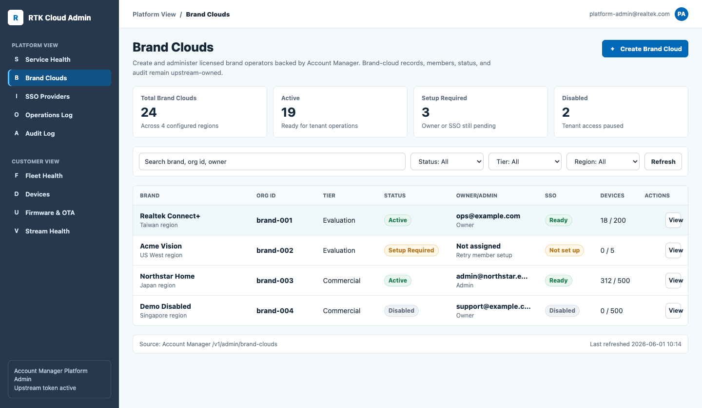
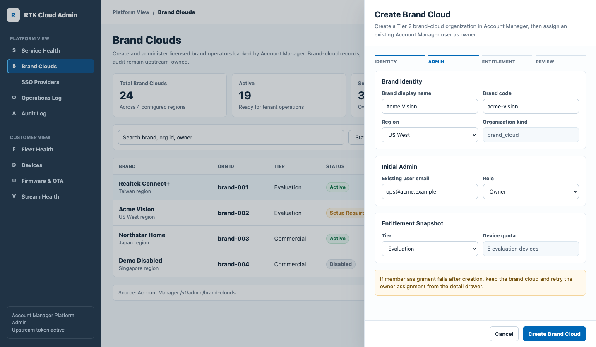
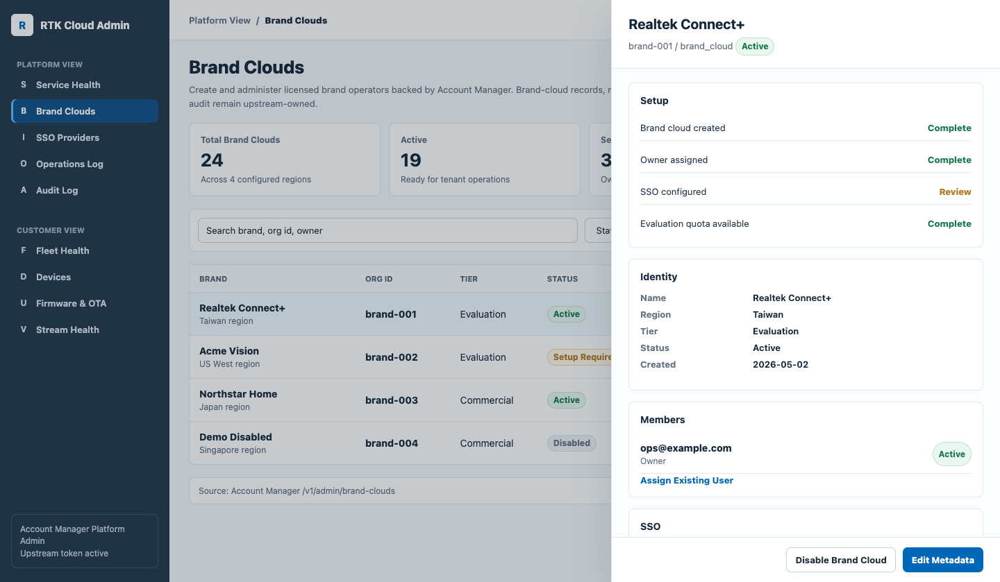

# Platform Brand Cloud Management Design

Status: draft for product, UX, and developer review.

Date: 2026-06-01

Audience:

- `rtk_cloud_admin` frontend and backend developers
- `rtk_account_manager` backend developers
- product / UX / QA reviewers for Platform View

Related documents:

- [SPEC.md](SPEC.md)
- [ROLES.md](ROLES.md)
- [admin-dashboard-redesign.md](admin-dashboard-redesign.md)
- [sso-oidc-design.md](sso-oidc-design.md)
- [backend-api-gap-audit.md](backend-api-gap-audit.md)

GUI draft assets:

- [Static HTML mock](assets/webui-design/platform-brand-clouds-mock.html)
- [Brand Clouds list](assets/webui-design/platform-brand-clouds-list.png)
- [Create Brand Cloud drawer](assets/webui-design/platform-brand-clouds-create.png)
- [Brand Cloud detail drawer](assets/webui-design/platform-brand-clouds-detail.png)

## Summary

This document defines the first Platform View design for Brand Cloud
management in `rtk_cloud_admin`.

`rtk_account_manager` remains the source of truth for brand-cloud
organizations, membership, status, audit, entitlement, and user identity.
`rtk_cloud_admin` owns the Platform Admin WebUI and BFF surface. The WebUI
therefore provides a controlled operational workspace for Platform Admins to
list, create, inspect, update, and assign existing Account Manager users to
brand-cloud organizations without storing authoritative brand-cloud records in
Admin Console SQLite.

The working product name in the UI is **Brand Clouds**. It represents
`organization_kind=brand_cloud` records and should not be presented as a
generic customer organization table.

## GUI Draft

The GUI draft is a code-native static mock so table labels, form fields,
drawer copy, and state language remain readable during review. It is not an
implementation of the React application.

### Brand Clouds List



### Create Brand Cloud Drawer



### Brand Cloud Detail Drawer



## Design Goals

- Let Tier 1 Platform Admins create a brand cloud from the Admin Console after
  Account Manager SSO login.
- Make brand setup state visible: owner/admin assigned, SSO status, quota or
  tier, region, status, and recent activity.
- Keep the workflow safe by showing validation, partial failure, and upstream
  unavailable states before and after writes.
- Keep Customer View isolated. Brand Clouds appears only in Platform View and
  only for Account Manager-backed Platform Admin sessions.
- Reuse the existing Realtek Ops Console direction: dense, calm, table-first,
  operational, and consistent with the current Platform View.

## Non-Goals

- Replacing Account Manager as source of truth for organizations, users,
  membership, or audit.
- Directly editing Account Manager database records from this repo.
- Tenant impersonation or read-only Customer View impersonation.
- Billing, contracts, commercial order management, or entitlement approval
  flows.
- SAML configuration UI. SSO display should remain OIDC-first and link to the
  existing SSO Providers surface.
- Brand-owned customer device management inside Platform View.
- Delete brand cloud. The first UI supports disable/enable status only when
  backed by Account Manager.

## Platform View Information Architecture

Brand Clouds should be a first-class Platform View section because it creates
and administers Tier 2 tenants.

Recommended Platform View nav order:

1. Service Health
2. Brand Clouds
3. SSO Providers
4. Operations Log
5. Audit Log

The Brand Clouds item is hidden from Customer View and from Platform View
sessions that do not carry an Account Manager-backed `platform_admin` identity.
Local Cloud Admin break-glass admins are not supported; rescue operations are
handled through Linode, SSH, and deployment tooling.

## Permissions And Route Guards

| Session type | Brand Clouds nav | Read | Create/update/member assign |
| --- | --- | --- | --- |
| Account Manager Platform Admin | Visible | Allowed | Allowed when capability is present |
| Local Cloud Admin break-glass admin | Not supported | Blocked | Blocked |
| Tier 2 customer user | Hidden | Blocked | Blocked |
| Unauthenticated user | Hidden | Blocked | Blocked |

Frontend guards are only usability hints. Backend route handlers must enforce
the same role and capability checks and must preserve upstream Account Manager
authorization failures.

Required capability names should follow Account Manager contracts when they
exist. Until the exact names are finalized, the UI should model these as:

- `platform.brand_clouds.read`
- `platform.brand_clouds.create`
- `platform.brand_clouds.update`
- `platform.brand_clouds.members.assign`

## Page 1: Brand Clouds List

The list is the default Brand Clouds route. It should feel like the existing
Platform View tables, not a marketing or onboarding page.

### Layout

```
Platform View / Brand Clouds
Manage licensed brand operators backed by Account Manager.

[Total 24] [Active 19] [Setup Required 3] [Disabled 2]

[Search brand, org id, owner] [Status v] [Tier v] [Region v] [Create Brand Cloud]

| Brand              | Org ID     | Tier       | Status         | Owner/Admin        | SSO        | Devices | Created    | Actions |
| Realtek Connect+   | brand-001  | Evaluation | Active         | ops@example.com    | Ready      | 18/200  | 2026-05-02 | View    |
| Acme Vision        | brand-002  | Evaluation | Setup Required | Not assigned       | Not set up | 0/5     | 2026-05-18 | View    |
| Demo Disabled      | brand-003  | Commercial | Disabled       | admin@example.com  | Disabled   | 0/500   | 2026-04-20 | View    |
```

### Required Content

- KPI strip:
  - Total Brand Clouds
  - Active
  - Setup Required
  - Disabled
- Toolbar:
  - text search across brand name, organization id, and owner/admin email
  - status filter
  - tier filter
  - region filter when Account Manager exposes region metadata
  - primary `Create Brand Cloud` button
- Table columns:
  - Brand
  - Organization ID
  - Tier
  - Status
  - Owner/Admin
  - SSO
  - Device Quota or Device Usage
  - Created
  - Actions

### Status Labels

Use concise labels with direct operational meaning:

- Active
- Setup Required
- Pending Verification
- Disabled
- Error

If Account Manager returns lower-level status values, map them to these labels
and show the raw value only in developer/support metadata inside the detail
drawer, not as the primary table label.

### Source States

- Loading: skeleton KPI boxes and table rows.
- Empty: "No brand clouds have been created." Include `Create Brand Cloud`
  when the session has create capability.
- No create permission: list remains readable, but primary action is absent.
- Source unavailable: show a gateway error band with retry. Do not silently
  fall back to SQLite seed data.
- Missing upstream token: show a gated state explaining that Brand Clouds
  requires Account Manager Platform Admin login.

## Flow 1: Create Brand Cloud

Use a right-side drawer with a compact stepper. A drawer keeps the operator in
the list context and matches existing operational UI patterns.

### Step 1: Brand Identity

Fields:

- Brand display name
- Brand slug or code, if Account Manager exposes it
- Region, if Account Manager requires or exposes it
- Organization kind, fixed as `brand_cloud` and shown read-only
- Tier, defaulting to Evaluation unless Account Manager requires another value

Validation:

- display name is required
- slug/code must be unique when provided
- region must be one of the Account Manager-supported values

### Step 2: Initial Admin

Fields:

- Existing Account Manager user email or user id
- Initial role, default `owner`
- Optional note for audit/support context, only if Account Manager accepts it

The UI must make it clear that this flow assigns an existing Account Manager
user. Inviting or creating a new user is out of scope for the first pass unless
Account Manager exposes a supported API.

### Step 3: Entitlement Snapshot

Fields:

- Device quota or evaluation quota, read-only if Account Manager owns the value
- Commercial tier metadata, read-only unless Account Manager exposes update
  support
- SSO setup later checkbox or informational state

This step should not imply that billing or contract approval is handled in
Admin Console.

### Step 4: Review And Create

Show:

- Brand name
- organization kind
- tier/quota summary
- region
- initial admin assignment
- expected post-create status

Primary action: `Create Brand Cloud`

Secondary action: `Save Draft` must not appear unless Account Manager supports
draft records. The first design assumes no draft support.

### Success State

After successful create:

- close or collapse the create drawer into the new brand detail drawer
- show a success toast with the brand name
- refresh the list from Account Manager
- show next actions:
  - assign or review admin
  - configure SSO
  - open detail drawer

### Partial Failure

If the brand cloud is created but member assignment fails:

- show success for the brand-cloud record
- keep the detail drawer open
- show the member assignment failure as a recoverable callout
- provide retry for assigning the initial admin
- do not retry brand creation automatically

## Page 2: Brand Detail Drawer

The detail drawer opens from the list row and after successful create.

```
Brand Cloud
Realtek Connect+
brand-001 / brand_cloud
[Active]

Setup
[x] Brand cloud created
[x] Owner assigned
[ ] SSO configured
[x] Evaluation quota available

Identity
Name                Realtek Connect+
Region              Taiwan
Tier                Evaluation
Status              Active
Created             2026-05-02

Members
Owner               ops@example.com
[Assign Existing User]

SSO
Status              Ready
[Open SSO Provider]

Recent Activity
2026-05-18          owner assigned
2026-05-17          SSO provider updated
```

### Required Panels

- Header:
  - brand display name
  - organization id
  - organization kind
  - status label
  - action menu
- Setup checklist:
  - brand cloud created
  - owner/admin assigned
  - SSO configured
  - quota/tier available
- Identity:
  - display name
  - region
  - tier
  - status
  - created/updated timestamps when available
- Members:
  - assigned owner/admin users exposed by Account Manager
  - `Assign Existing User` action when capability is present
- SSO:
  - SSO status summary
  - link to SSO Providers filtered to this organization
- Recent activity:
  - Account Manager audit events when available
  - otherwise a clear unavailable state

### Update Actions

The action menu should include only Account Manager-backed actions:

- Edit display name or metadata
- Disable brand cloud
- Re-enable brand cloud

Disable and re-enable require confirmation because they affect a tenant-level
organization. The confirmation copy must say what remains visible and what is
blocked. Delete is intentionally absent.

## Flow 2: Assign Existing Member

Use a small drawer section or modal launched from the detail drawer.

Fields:

- Account Manager user email or user id
- Role, default `owner` or `admin` depending on Account Manager contract

Behavior:

- validate required input locally
- submit to `POST /api/admin/brand-clouds/{id}/members`
- show success inline in the Members panel
- show duplicate member as a non-destructive warning
- preserve Account Manager authorization and validation messages in user-safe
  language

## Flow 3: Review And Manage Brand Users

The detail drawer includes a Brand Users section backed by Account Manager,
not by Admin Console SQLite. It lists brand-scoped users for the selected
brand cloud and highlights pending activation users so Platform Admins can see
which email addresses have been created but not activated.

Filters:

- All users
- Active
- Pending activation
- Disabled

Rows show email, display name or user id, activation status, last update time,
and lifecycle actions. Pending activation rows expose `Approve`, active rows
expose `Disable`, disabled rows expose `Enable`, and all rows expose `Delete`.
Delete is a soft-delete operation that removes brand-cloud access by disabling
the brand-scoped user; it must not hard-delete Account Manager audit history.

Behavior:

- load users from `GET /api/admin/brand-clouds/{id}/users`
- use `status=pending_verification` for the pending activation dashboard filter
- submit approve to
  `POST /api/admin/brand-clouds/{id}/users/{brandCloudUserId}/approve`
- submit disable to
  `POST /api/admin/brand-clouds/{id}/users/{brandCloudUserId}/disable`
- submit enable to
  `POST /api/admin/brand-clouds/{id}/users/{brandCloudUserId}/enable`
- submit soft-delete to
  `DELETE /api/admin/brand-clouds/{id}/users/{brandCloudUserId}`
- refresh the Brand Users section after each successful lifecycle action

## Error And Edge States

| Scenario | UI behavior |
| --- | --- |
| Account Manager unavailable | Gateway error band with retry; no SQLite fallback |
| Missing upstream token | Gated state requiring Account Manager Platform Admin login |
| Unauthorized capability | Hide write actions and show read-only state if list access is allowed |
| Duplicate brand name or slug | Field-level error in create drawer |
| Invalid owner/admin email | Field-level error in initial admin step |
| Brand created, member failed | Detail drawer stays open with retryable member callout |
| Stale detail after update | Refresh drawer and show latest Account Manager state |
| Pending activation users exist | Show count in detail summary and make the pending filter one click away |
| Brand user lifecycle action fails | Keep drawer open, keep current rows, and show a user-safe upstream error |
| Unknown upstream status | Show `Error` or `Unknown` only with support metadata in detail drawer |

## API Mapping

| UI operation | BFF route | Source of truth |
| --- | --- | --- |
| List brand clouds | `GET /api/admin/brand-clouds` | Account Manager |
| Create brand cloud | `POST /api/admin/brand-clouds` | Account Manager |
| Read detail | `GET /api/admin/brand-clouds/{id}` | Account Manager |
| Update metadata/status | `PATCH /api/admin/brand-clouds/{id}` | Account Manager |
| Assign member | `POST /api/admin/brand-clouds/{id}/members` | Account Manager |
| List brand users | `GET /api/admin/brand-clouds/{id}/users` | Account Manager |
| Approve pending brand user | `POST /api/admin/brand-clouds/{id}/users/{brandCloudUserId}/approve` | Account Manager |
| Disable brand user | `POST /api/admin/brand-clouds/{id}/users/{brandCloudUserId}/disable` | Account Manager |
| Enable brand user | `POST /api/admin/brand-clouds/{id}/users/{brandCloudUserId}/enable` | Account Manager |
| Soft-delete brand user | `DELETE /api/admin/brand-clouds/{id}/users/{brandCloudUserId}` | Account Manager |

The BFF may normalize response shape for the React UI, but it must not create
authoritative brand-cloud rows in SQLite. Local audit may record forwarding
attempts, but authoritative brand-cloud audit remains in Account Manager.

### Brand Clouds List Density And Pagination

The Brand Clouds list is an operational table, not a card list. It must fit many
tenants without forcing long vertical scrolling.

- `GET /api/admin/brand-clouds` accepts `limit`, `offset`, `q`, `status`, and
  `tier`.
- The default page size is 25 rows. The BFF caps `limit` at 100.
- The response includes:
  - `brand_clouds`: current page rows only.
  - `pagination.limit`, `pagination.offset`, and `pagination.total`.
- Search and filters reset `offset` to `0`.
- The WebUI renders a compact table with the organization id as secondary text
  under the Brand column. It does not render separate `Org ID` or `Created`
  columns in the default list view.
- The list footer shows the visible range and Previous/Next controls. Detail
  drawers remain the place for full metadata and lifecycle actions.

### Brand Cloud Detail Drawer Layout

The detail drawer is a management surface. It must not use decorative blobs,
oversized status shapes, or prose blocks that concatenate labels and values.

- Header: brand name, organization id, organization kind, close button.
- Hero summary: compact status badge, region, tier, owner/admin, and device
  quota in a structured grid with Font Awesome icons.
- Setup checklist: one row of small status chips for created, owner/admin, SSO,
  and device quota. Use green for complete, amber for attention, and neutral
  for unavailable/not configured.
- Primary actions: enable/disable Brand Cloud and open SSO providers as
  adjacent icon buttons.
- Brand Users: compact table with Email, Status, Updated, and Actions. Row
  actions must use icon+text buttons and preserve disabled/pending state
  contrast.
- Forms: assign-existing-user and create/reactivate-user forms are separate
  two-column form blocks below the user table.

## Visual Consistency Rules

- Use the same left sidebar, top context area, page shell, table density, and
  drawer behavior as the existing Platform View.
- Use 8px or smaller border radius for cards, drawers, inputs, and buttons.
- Use a restrained neutral page background with blue/teal accents for selected
  and healthy states.
- Use status badges sparingly; the table should remain readable when many rows
  are in warning/error states.
- Do not introduce hero sections, marketing panels, decorative illustrations,
  gradient backgrounds, or nested cards.
- Prefer icon-only controls with accessible labels for row actions when the
  existing icon set is available; otherwise use concise text actions.

## Developer Issue Breakdown

The implementation can be split into developer-ready issues:

1. **Brand Clouds contract and route guard alignment**
   - finalize capability names and DTO fields with Account Manager
   - confirm Account Manager-backed platform-admin route guards
   - update backend route tests for allowed/blocked sessions
2. **Platform Brand Clouds list**
   - add route and nav item
   - render KPI strip, filters, table, source states, and read-only states
3. **Create Brand Cloud drawer**
   - implement stepper, local validation, submit, success, and partial failure
4. **Brand detail drawer**
   - render identity, setup checklist, members, SSO handoff, and activity
   - implement status/metadata update when Account Manager supports it
5. **Assign existing member**
   - implement member assignment UI and retry/error states
6. **Review and manage brand users**
   - implement Brand Users list, pending activation filter, approve, disable,
     enable, and soft-delete actions
7. **Browser QA and documentation signoff**
   - verify Platform View isolation, source unavailable states, responsive
     layout, and copy consistency

## Acceptance Criteria

- Brand Clouds is visible only in Platform View for Account Manager-backed
  Platform Admin sessions.
- Customer View users cannot see or navigate to Brand Clouds routes.
- Only Account Manager-backed platform-admin sessions can call brand-cloud
  APIs.
- List, empty, loading, source unavailable, and missing upstream token states
  are defined and implemented.
- Create flow supports validation, success, Account Manager failure, and
  created-but-member-failed recovery.
- Detail drawer exposes identity, status, setup checklist, members, SSO
  handoff, and recent activity/unavailable state.
- Detail drawer exposes Brand Users with pending activation count, status
  filter, approve, disable, enable, and soft-delete actions.
- No authoritative brand-cloud records are stored in Admin Console SQLite.
- No secrets, upstream tokens, raw IdP claims, or raw private upstream payloads
  are displayed.
- UI copy consistently uses `Brand Clouds` for the feature and
  `organization_kind=brand_cloud` only in technical/support context.

## Required Tests

Implementation PRs should include the relevant subset of:

- `cd web && npm test`
- `cd web && npm run build`
- `cd web && npm run browser:smoke`
- backend route guard tests for brand-cloud routes when backend behavior is
  touched
- `go test ./...` when backend code changes

Manual browser QA should cover:

- Platform Admin with Account Manager token
- customer user
- source unavailable response
- create success
- create validation failure
- created-but-member-failed partial failure
- mobile-width drawer/table behavior

## Open Design Questions

These should be resolved before implementation starts:

1. Should the visible product label be `Brand Clouds`, `Brands`, or
   `Organizations`?
2. Which fields are required by Account Manager for `POST /brand-clouds`:
   name only, slug/code, region, tier, quota, or metadata?
3. Is initial owner/admin assignment required during creation, or can a brand
   cloud exist in `Setup Required` without an assigned owner?
4. What are the final Account Manager capability names for read, create,
   update, and member assignment?
5. Which status enum values can Account Manager return, and which ones block
   downstream customer/device operations?
6. Does Account Manager expose authoritative audit events for brand-cloud
   changes in a read API, or should the first UI show "activity unavailable"?
7. Should SSO Providers be filtered by brand-cloud organization id through URL
   state, query params, or an in-page filter selection?
