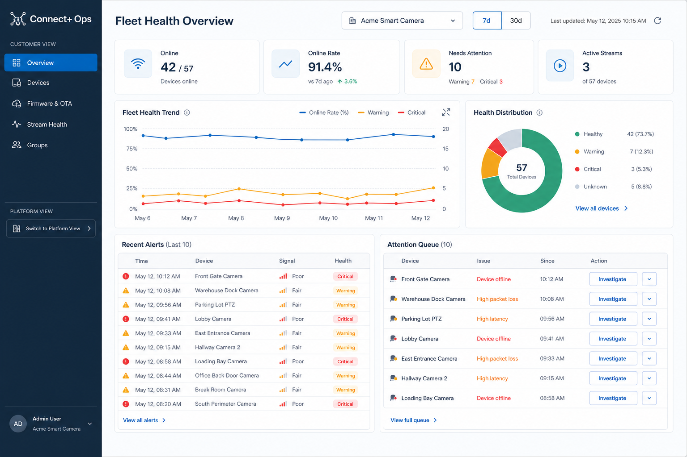
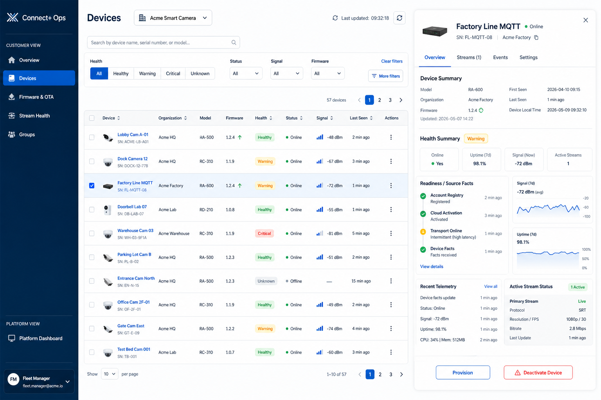
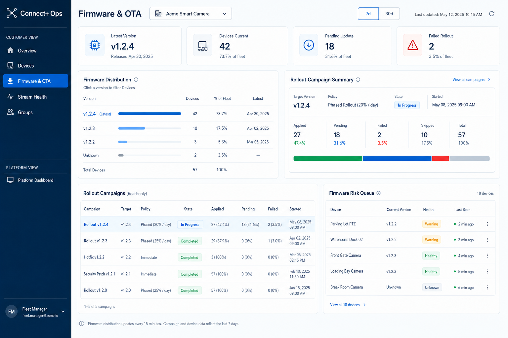
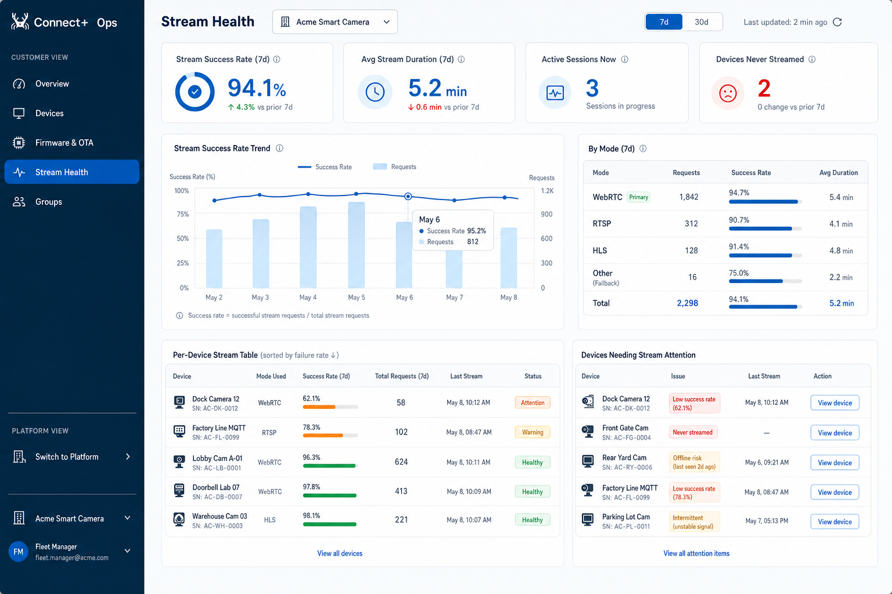

# Customer View WebUI Design

Status: approved concept with coverage addendum.

Date: 2026-05-09

Audience:

- `rtk_cloud_admin` frontend developers
- product / QA reviewers for Customer View

Related documents:

- [SPEC.md](SPEC.md)
- [ROLES.md](ROLES.md)
- [admin-dashboard-redesign.md](admin-dashboard-redesign.md)
- [backend-api-gap-audit.md](backend-api-gap-audit.md)
- [sso-oidc-design.md](sso-oidc-design.md)

## Summary

This document records the approved Customer View WebUI design direction for
RTK Cloud Admin. The visual direction is **Realtek Ops Console**: a dense,
calm B2B operations console based on the Realtek Connect+ palette from
`webtest.mgmeet.io`.

The approved Customer View concept batch covers:

- Fleet Health Overview
- Devices with Detail Drawer
- Firmware & OTA
- Stream Health

Platform View pages, auth pages, and signup pages are required WebUI surfaces,
but they are not part of the four Customer View PNG concepts. Device Groups are
deferred and must not appear in the first-batch Customer View sidebar.

The approved images are visual concepts for the Customer View work area, not a
complete application-state inventory. The implementation must also satisfy the
coverage addendum below for auth, quota, capability, error, and source-state
requirements from `SPEC.md`, `ROLES.md`, and `backend-api-gap-audit.md`.

## Design Coverage Matrix

| Surface | Required for v0.1 | Visual source | Status in this design |
| --- | --- | --- | --- |
| Customer View shell | Yes | Customer View concept PNGs plus this document | Approved, with Groups removed from nav |
| Fleet Health Overview | Yes | `customer-overview.png` | Approved |
| Devices + Detail Drawer | Yes | `customer-devices.png` | Approved, with unsupported Settings writes removed |
| Firmware & OTA | Yes | `customer-firmware-ota.png` | Approved, read-only campaign scope |
| Stream Health | Yes | `customer-stream-health.png` | Approved, source-backed modes only |
| Signup / check-email / verify | Yes | Text requirements in this document and `SPEC.md` | Required, no PNG concept |
| SSO login and route gates | Yes | Text requirements in this document and `sso-oidc-design.md` | Required, no PNG concept |
| Platform View: Service Health | Yes | `admin-dashboard-redesign.md` | Required outside Customer View PNG batch |
| Platform View: SSO Providers | Yes | `admin-dashboard-redesign.md` and `sso-oidc-design.md` | Required outside Customer View PNG batch |
| Platform View: Operations Log | Yes | `admin-dashboard-redesign.md` | Required outside Customer View PNG batch |
| Platform View: Audit Log | Yes | `admin-dashboard-redesign.md` | Required outside Customer View PNG batch |
| Brand-cloud management UI | No | [platform-brand-cloud-management-design.md](platform-brand-cloud-management-design.md) plus backend/BFF contract | Platform View draft, outside Customer View |
| Device Groups | No | None for v0.1 | Deferred and hidden |

## Approved Concepts

### Fleet Health Overview

### Devices + Detail Drawer

### Firmware & OTA

### Stream Health

### Known Asset Differences

The concept images show a `Groups` sidebar item. This is a stale visual detail.
`Groups` is deferred for v0.1 and must not appear in the first-batch Customer
View sidebar, route list, empty placeholder, or mobile navigation until the
device group API and UI design are approved.

The concept images also show secondary drawer tabs and stream mode examples.
Those are treated as layout examples only. The authoritative scope is:

- Drawer `Overview` is required.
- Drawer `Streams` and `Events` are read-only only when backed by documented
  source data.
- Drawer `Settings` must not expose unsupported customer write controls.
- Stream modes beyond WebRTC appear only when the upstream source reports them.

## Design Goals

Customer View is for Tier 2 Fleet Managers and Read-only Observers. It should
help users answer operational questions quickly:

- Is the fleet healthy now?
- Which devices need attention?
- Which devices are behind on firmware?
- Are video streams working for end users?

The UI must feel like a daily operations tool, not a marketing page. Prioritize
scan speed, comparison, filtering, and drill-down paths.

## Design Tokens

Use the existing React/Vite frontend and CSS. Do not add a new design system
package for this design pass.

| Token | Value | Usage |
| --- | --- | --- |
| Primary blue | `#0068B7` | Selected nav, active segmented controls, primary links, chart lines, focused states |
| Navy | `#25384C` | Sidebar background, headings, high-emphasis text |
| Pale blue | `#E4F4FA` | Selected row backgrounds, quiet highlights, icon tiles |
| Page wash | `#F4F9FB` | App background and low-emphasis panels |
| Border | `#E5E9EF` | Panels, tables, filter controls, dividers |
| Muted text | `#5F6B78` | Labels, helper text, secondary metadata |
| White | `#FFFFFF` | Main cards, tables, drawer panels |

Typography:

- Use Inter first, then system sans-serif fallback.
- Keep headings compact and work-focused.
- Avoid oversized hero-scale type inside dashboard panels.
- Table and control text must be deliberately sized, not browser-default.

Shape and surface:

- Use 8px radius for cards, filters, buttons, segmented controls, and panels.
- Use fine borders over heavy shadows.
- Avoid nested cards unless the inner surface is a genuine table, drawer block,
  chart area, or repeated row group.

Status color usage:

- Healthy / success: green badge or indicator.
- Warning / pending / attention: amber badge or indicator.
- Critical / failed / destructive: red badge or indicator.
- Unknown / unavailable: neutral gray badge or indicator.

## App Shell

The Customer View shell uses a fixed left sidebar and a full-height work area.

Sidebar:

- Brand label: `Connect+ Ops`.
- Customer View nav items: `Overview`, `Devices`, `Firmware & OTA`,
  `Stream Health`.
- Active nav item uses primary blue fill.
- Platform View switcher is visually separated from Customer View navigation and
  routes only to role-gated Platform View pages.
- Platform View content must not appear inside Customer View pages.
- Sidebar account summary shows the signed-in role and email only. It does not
  repeat the active organization name.

Main header:

- Page title at the top-left of the content area.
- Organization selector only when the customer session has multiple
  memberships.
- Window controls where relevant, usually `7d` / `30d`.
- Refresh affordance and signed-in actions on the right.
- Do not show a passive active-organization label or global last-updated
  timestamp in the header.

Login page:

- Use the Realtek logo asset, followed by the `Connect+ Ops` product label.
- The default login mode is email sign-in: one `Email` field and a primary
  `Continue` action that calls `POST /api/auth/sign-in`.
- Password login is a secondary fallback exposed as `Use password instead`.
  It keeps the existing platform/customer password login behavior during the
  migration period, but it is not the primary first-viewport action.
- The email field label is `Email`; do not use `Work email`.
- Do not show a top-right `Need help?` link on the login page.
- Keep login copy short and operational. Avoid support, marketing, or
  instructional links in the first viewport.
- `/login/check-email` confirms that a sign-in request was accepted. The copy
  must be enumeration-safe and must not reveal whether the account exists,
  is disabled, or was rate limited.
- `/login/activate` consumes a login activation token and creates the Admin
  Console session only after Account Manager returns successful credentials.
  Invalid, expired, or replayed tokens show a compact failure state with a
  route back to `/login`.
- `/forgot-password` requests a password reset token by email and returns the
  same accepted UI for known, unknown, disabled, or throttled accounts.
- `/reset-password` consumes a reset token, writes the new password through
  Account Manager, and returns to `/login` after success. The reset flow uses
  the same server-side token delivery lifecycle as email sign-in.

Organization selector:

- Customer sessions with multiple memberships can switch only to organizations
  returned by `/api/me.memberships`.
- Switching organization calls `POST /api/me/active-org`, refreshes all
  page-level data, and clears page filters that reference org-specific values
  such as firmware versions or device IDs.
- The selector must not offer cross-tenant search, platform customer browsing,
  or tenant impersonation. Platform Admin impersonation is deferred.
- If switching fails, keep the previous active organization visible and show a
  concise retryable error near the selector.

Customer-safe field policy:

- Customer View API payloads must not include `video_cloud_devid`.
- Customer View API payloads must not include raw upstream payloads.
- Customer View API payloads must not include operation IDs or internal
  upstream operation IDs.
- Customer View API payloads must not include `dead_lettered` or platform-only
  lifecycle vocabulary.
- Use customer-readable labels and contract-backed display names.

Capability and role behavior:

- Fleet Managers can see and execute `Provision` and `Deactivate` when the
  active membership includes `customer.devices.provision` or
  `customer.devices.deactivate`.
- Read-only Observers see the same Customer View data as Fleet Managers, but
  write actions are disabled or hidden with clear read-only affordance text.
- Frontend affordances are usability only. Backend route guards remain the
  enforcement boundary for provision, deactivate, quota, and any future tenant
  write action.
- Customer sessions must not receive Platform View data. If they open a
  Platform View route or switcher target, the UI shows a role/access gate rather
  than platform content.
- Platform Admin sessions must see a guard if they open Customer View directly,
  with a route back to Platform View rather than customer data.

Auth and access states:

- Unauthenticated users see the standalone Admin Console login page with email
  sign-in as the default and password login as a secondary fallback.
- Signup entry points route to the self-service evaluation flow documented in
  `SPEC.md`; commercial brand-cloud user creation is separate and platform
  admin-owned.
- SSO callback, verification, expired-token, and gateway-error states need
  dedicated copy. Do not leave users on a blank dashboard shell while auth state
  is pending.
- Local demo mode is development-only. Customer View can use demo data locally,
  but production/server validation must show source-unavailable states instead
  of silently substituting demo trends.

## Fleet Health Overview

Purpose: give the operator a single-glance answer to whether the fleet is
healthy now and whether it has been healthy recently.

Required layout:

- KPI strip with `Online`, `Online Rate`, `Needs Attention`, and
  `Active Streams`.
- Large fleet health trend chart with online rate plus warning / critical
  trend lines.
- Health distribution panel with Healthy, Warning, Critical, Unknown.
- Recent Alerts table with Time, Device, Signal, Health.
- Attention Queue panel sorted by operational impact.

Behavior notes:

- `7d` is the default time window; `30d` is available.
- Production data must come from authoritative telemetry/read-model APIs. Do
  not ship demo-derived or readiness-derived trend data for server validation.
- Health distribution segments and alert rows should navigate to a filtered
  Devices view when the backend/frontend path supports it.
- Service health, open platform operations, and platform audit content stay out
  of this page.
- Evaluation-tier organizations show a compact quota indicator when device usage
  approaches or reaches `evaluation_device_quota`. The quota callout belongs
  below the operational panels so it does not displace Fleet Health KPIs.
- The quota callout includes current usage, current quota, a requested quota
  input, and a submit action backed by
  `POST /api/orgs/{orgId}/quota-raise-requests`. It appears only for the active
  organization and never for Platform Admin sessions.
- Quota request errors must distinguish validation errors from Account Manager
  gateway failures with stable, user-facing messages.

## Devices + Detail Drawer

Purpose: provide the daily scan, filter, and drill-down workflow for device
fleet issues.

Required layout:

- Search input for device name, serial number, or model.
- Filter controls for Health, Status, Signal, and Firmware.
- High-density table with columns:
  - Device
  - Organization
  - Model
  - Firmware
  - Health
  - Status
  - Signal
  - Last Seen
  - Actions
- Selected row uses a pale blue highlight.
- Right-side detail drawer opens from a selected row.

Detail drawer content:

- Device identity: name, serial number, model, organization.
- Current health summary and contributing signals.
- Firmware version and updated timestamp.
- Readiness / source facts timeline, including account registry, cloud
  activation, transport online, and device facts where available.
- RSSI 7d sparkline.
- Uptime 7d sparkline.
- Recent telemetry events.
- Active stream status.
- `Provision` and `Deactivate` actions, with destructive styling only for
  deactivate.

Drawer tabs and states:

- The concept image includes Overview, Streams, Events, and Settings tabs. For
  v0.1, Overview is required; Streams and Events may be implemented as
  read-only drill-downs when backed by the documented telemetry and stream
  endpoints; Settings must not expose unsupported customer write controls.
- Telemetry loading, unavailable-source, empty-data, and unexpected-schema
  states are first-class drawer states. Show the affected panel as unavailable
  while preserving the rest of the drawer.
- Provision and Deactivate actions require confirmation or clear action
  feedback when they create a lifecycle operation. Deactivate uses destructive
  color and copy; Provision stays secondary.

Behavior notes:

- Customer users must not see out-of-org devices.
- Platform admin data must not leak through the Customer View device drawer or
  customer API payloads.
- In production mode, readiness badges and fleet counts must use the API's
  source-attributed readiness projection: Account Manager owns registry and
  lifecycle operations, while Video Cloud owns activation and current transport.
  Demo/cache facts must remain visibly local projections.
- Filters must preserve table scan speed and avoid card-wall layouts.
- Read-only Observer sessions must be enforced by the backend before any
  provision or deactivate action is accepted.
- Device action menus must not expose operation IDs, raw upstream errors,
  `video_cloud_devid`, or platform-only lifecycle states in Customer View.

## Firmware & OTA

Purpose: show firmware distribution, rollout progress, and devices at firmware
risk without introducing platform-only write workflows.

Required layout:

- KPI strip with `Latest Version`, `Devices Current`, `Pending Update`, and
  `Failed Rollout`.
- Firmware distribution panel with version rows, count, percent of fleet, and
  latest marker.
- Rollout Campaign Summary with target version, policy, state, applied,
  pending, failed, skipped, total, and start timestamp.
- Read-only campaign table.
- Firmware Risk Queue with device, current version, health, and last seen.

Behavior notes:

- Clicking a firmware version should navigate to the Devices page with that
  firmware pre-filtered when supported.
- Campaign creation, tenant-wide write actions, and policy editing are not part
  of this Customer View design batch.
- Unknown firmware should be visible and sortable as an operational risk.
- Production firmware distribution must use observed firmware and rollout facts
  from Video Cloud or the normalized telemetry read model, not generated sample
  versions.
- Campaign drill-down is read-only. It may show device rollout status, reason,
  and last updated values from the documented rollout facts, but it must not
  introduce campaign create, pause, resume, cancel, or policy-edit workflows.
- Unsupported policy values should be shown explicitly as unsupported rather
  than silently mapped to an implemented policy.

## Stream Health

Purpose: answer whether device video streams are working for end users.

Required layout:

- KPI strip with `Stream Success Rate`, `Avg Stream Duration`,
  `Active Sessions Now`, and `Devices Never Streamed`.
- `7d` / `30d` window control.
- Main trend chart showing stream success rate and request volume.
- By Mode summary, initially focused on WebRTC.
- Per-device stream table sorted by failure rate descending.
- Devices Needing Stream Attention panel with concise issue labels.

Per-device stream table columns:

- Device
- Mode Used
- Success Rate
- Total Requests
- Last Stream
- Status

Behavior notes:

- Attention items should use customer-readable causes such as low success rate,
  never streamed, offline risk, or intermittent signal.
- The design should support opening the selected device in the Devices detail
  drawer once route/state wiring is implemented.
- Production stream metrics must use WebRTC session event data from Video Cloud
  or an equivalent normalized read model, not local demo-derived estimates.
- The By Mode panel can show non-WebRTC rows only when backed by source data.
  Do not imply RTSP/HLS production support from sample rows if the upstream
  source reports WebRTC-only stream facts.
- Stream attention rows must link to the Devices drawer or to a filtered Devices
  route. They must not open a live viewer; stream preview/player is out of scope.

## Complementary WebUI Surfaces

The Customer View image batch does not cover every WebUI surface required by
`SPEC.md`. The following surfaces are required for v0.1 but are governed by
separate designs or by the app shell rules in this document.

### Self-Service Signup And Verification

Required routes:

- `/signup`
- `/signup/check-email`
- `/verify`

Design requirements:

- Signup is for public evaluation-tier onboarding only. It creates a pending
  Account Manager signup and must not be used for commercial brand-cloud user
  creation.
- The signup form collects the minimum Account Manager fields needed to start
  evaluation onboarding and shows that verification email is required before
  account use.
- The check-email state explains that the user must verify email before signing
  in. It may offer resend only through the Account Manager-backed API.
- The verification landing state handles success, expired token, invalid token,
  already verified, and service-unavailable outcomes. Success routes users
  toward the email/password login flow for the newly verified account.
- Evaluation-tier quota copy uses the Account Manager quota fields
  `tier=evaluation` and `evaluation_device_quota`; it must not imply commercial
  entitlement or automatic quota approval.

### SSO Login And Session Gates

Required behavior:

- The primary sign-in panel posts email and password credentials to Account
  Manager through the Admin Console BFF.
- The UI displays submitting, denied access, source-unavailable, and retry
  states.
- Platform password login is Account Manager-backed and visually secondary to
  the customer login path unless the requested route is a Platform View route.
- Route gates distinguish unauthenticated, wrong-role, and missing-capability
  states. A missing Customer View membership should not render empty fleet data.

### Platform View Coverage Boundary

The approved Customer View concepts do not complete Platform View design. The
Platform View still requires implementation-aligned UI treatment for:

- Service Health
- SSO Providers
- Operations Log
- Audit Log

Those pages use the same Realtek Ops Console shell and density, but they are
Tier 1 only. Customer View must not show service health, audit data, raw
operation payloads, `dead_lettered`, or platform customer browsing.
Brand-cloud management belongs in Platform View only and is covered by
[platform-brand-cloud-management-design.md](platform-brand-cloud-management-design.md).

## Required Page States

Each Customer View page and complementary auth surface must define these states
before implementation is considered complete:

- Loading: preserve the app shell and show panel-level loading text or skeletons.
- Empty: explain that no source data exists for the current org/filter/window.
- Filtered empty: identify that filters, not fleet absence, produced no rows.
- Source unavailable: name the unavailable source category without leaking raw
  upstream payloads.
- Gateway error: show a retryable message and keep the last safe context when
  possible.
- Read-only: expose data normally and remove or disable write controls.
- Mobile/tablet: keep the sidebar and tables usable; tables may scroll
  horizontally rather than dropping required columns.

## Implementation Notes

- Keep the implementation inside the existing React/Vite app.
- Reuse current API contracts and the backend fields already documented in
  `backend-api-gap-audit.md`.
- Backend API scope must be tightened where needed to return customer-safe DTOs
  for Customer View routes.
- Do not add a new UI component framework.
- Preserve URL-backed routes for directly linkable console views.
- Do not include Groups in the first-batch sidebar or page set.
- Treat the four approved images in this document as the visual source of truth
  for Customer View work-area layout, density, and visual hierarchy.
- When the images conflict with text requirements, the text requirements in
  this document, `SPEC.md`, `ROLES.md`, and `admin-dashboard-redesign.md` win.

## Review Checklist

- Customer View pages use the Realtek Ops Console palette and density.
- All pages keep the left sidebar + main work area structure.
- Customer View does not contain Platform View content.
- Customer View navigation does not show Groups.
- Auth, signup, verification, and route-gate states are covered.
- Active organization switching is scoped to `/api/me.memberships`.
- Evaluation quota display and quota raise request states are covered.
- Read-only Observer sessions show read-only action behavior.
- Source-unavailable, loading, empty, filtered-empty, and gateway-error states
  are covered per panel.
- Customer-safe field policy is followed.
- Customer View network payloads are customer-safe, not just visually hidden in
  the React components.
- The four designed pages map to existing or planned Customer View API
  contracts.
- No WebUI implementation is included in this design-spec change.
