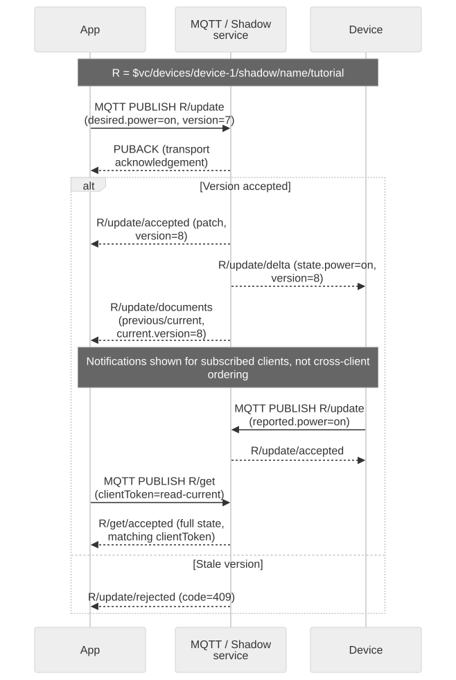

# API and Message Examples

## Purpose and prerequisites

Use these fixtures to build parsers after completing [token setup](authentication.en.md) and [the Shadow interface tutorial](shadow-interfaces.en.md). All identifiers, token strings and timestamps below are illustrative, not captured credentials. Use device `device-1`, named Shadow `tutorial`, and power `off` → `on`. The [reference](shadow-reference.en.md) owns route, validation and size limits.



[Full-size diagram](assets/message-shapes.svg) · [Mermaid source](assets/message-shapes.mmd)

## Token success and failure

An illustrative HTTP 200 response to `POST /request_token` with `scope:app`, `devid:device-1` and `aws_iot_data:true`:

```json
{
  "token_type": "Bearer",
  "access_token": "REPLACE_WITH_ISSUED_JWT",
  "scope": "app",
  "mqtt": {
    "username": "RETURNED_BRAND_ID",
    "client_id": "RETURNED_CLIENT_ID"
  },
  "aws_credentials": {
    "accessKeyId": "EXAMPLE_ONLY",
    "secretAccessKey": "EXAMPLE_ONLY",
    "sessionToken": "REPLACE_WITH_ISSUED_JWT",
    "expiration": "2026-09-04T09:00:00Z",
    "region": "RETURNED_REGION",
    "iotDataEndpoint": "https://api.example.test",
    "allowedThings": [
      "device-1"
    ],
    "allowedActions": [
      "iot:GetThingShadow",
      "iot:UpdateThingShadow",
      "iot:DeleteThingShadow",
      "iot:ListNamedShadowsForThing"
    ],
    "tenantId": "RETURNED_BRAND_ID"
  }
}
```

Do not copy these placeholders into a client. `mqtt` is conditional metadata; require it before attempting MQTT. `aws_credentials` is returned when requested in the reviewed implementation; its token schema is not yet fully reflected in the canonical OpenAPI. `tenantId` can be omitted. `refresh_token` can be absent and is not a separate OAuth grant. There is no public `expires_in` or serialized `expiry` field in the inspected token response. Schedule JWT renewal from `exp` (Unix seconds); SigV4 `expiration` is an RFC 3339 UTC string.

An illustrative HTTP 401 token issuance failure:

```json
{
  "status": "fail",
  "reason": "token issuance not allowed"
}
```

Token failures use `status`/`reason`, not the Shadow error schema. TLS failures produce no HTTP JSON. Classify the status and operation first; do not branch on prose in `reason`. The Account Manager login response is a different schema containing `user`, `tokens` and `app_certificate`; see [Credential Setup](credential-setup.en.md).

## Read the current document

Publish `{"clientToken":"read-7"}` to `$vc/devices/device-1/shadow/name/tutorial/get`, or perform a signed HTTP GET. An MQTT accepted response before the requested power change:

```json
{
  "state": {
    "desired": {
      "power": "off"
    },
    "reported": {
      "power": "off"
    }
  },
  "metadata": {
    "desired": {
      "power": {
        "timestamp": 1788480000
      }
    },
    "reported": {
      "power": {
        "timestamp": 1788480000
      }
    }
  },
  "version": 7,
  "timestamp": 1788480000,
  "clientToken": "read-7"
}
```

GET returns the complete current state. Empty delta is omitted. HTTP GET has no MQTT request token to echo. State/property metadata timestamps and envelope timestamps are Unix seconds, not milliseconds. `version` is a server-owned integer per Shadow lifecycle, not a clock or a version shared across devices.

## Update and observe three distinct messages

Publish this patch to the same root's `/update` or use signed HTTP POST:

```json
{
  "state": {
    "desired": {
      "power": "on"
    }
  },
  "version": 7,
  "clientToken": "power-on-8"
}
```

An `/update/accepted` message (or successful HTTP update body) contains the accepted patch, not the full state:

```json
{
  "state": {
    "desired": {
      "power": "on"
    }
  },
  "metadata": {
    "desired": {
      "power": {
        "timestamp": 1788480001
      }
    }
  },
  "version": 8,
  "timestamp": 1788480001,
  "clientToken": "power-on-8"
}
```

The `/update/delta` message places differences directly inside `state`:

```json
{
  "state": {
    "power": "on"
  },
  "metadata": {
    "power": {
      "timestamp": 1788480001
    }
  },
  "version": 8,
  "timestamp": 1788480001,
  "clientToken": "power-on-8"
}
```

`/update/documents` contains snapshots and an envelope timestamp. Snapshot objects do not contain delta, timestamp or clientToken:

```json
{
  "previous": {
    "state": {
      "desired": {
        "power": "off"
      },
      "reported": {
        "power": "off"
      }
    },
    "metadata": {
      "desired": {
        "power": {
          "timestamp": 1788480000
        }
      },
      "reported": {
        "power": {
          "timestamp": 1788480000
        }
      }
    },
    "version": 7
  },
  "current": {
    "state": {
      "desired": {
        "power": "on"
      },
      "reported": {
        "power": "off"
      }
    },
    "metadata": {
      "desired": {
        "power": {
          "timestamp": 1788480001
        }
      },
      "reported": {
        "power": {
          "timestamp": 1788480000
        }
      }
    },
    "version": 8
  },
  "timestamp": 1788480001,
  "clientToken": "power-on-8"
}
```

The inspected serializers may include a nonempty mutation token on delta/documents; do not require one on unsolicited notifications. Correlate request completion using accepted/rejected, and process notification state independently. Events may duplicate and arrive at different clients at different times. The `previous` object has no state/metadata when no previous state exists; do not demand nonempty sections.

## Report actual state, remove a field and handle errors

After applying power, the device submits:

```json
{
  "state": {
    "reported": {
      "power": "on"
    }
  },
  "clientToken": "device-on"
}
```

Once accepted, a fresh GET shows desired and reported power `on` and omits empty delta. Device execution is only established by your firmware's actual operation/readback; neither PUBACK nor desired accepted proves it.

A removal patch explicitly uses null; omission leaves an existing property unchanged:

```json
{
  "state": {
    "desired": {
      "power": null
    }
  },
  "clientToken": "remove-power"
}
```

The corresponding accepted patch preserves `power:null`; property metadata for a removed value is omitted. Arrays replace atomically, and null array elements are invalid. DELETE accepted is `{}`; MQTT DELETE ignores its payload, so do not wait for an echoed clientToken.

A stale-version MQTT rejection:

```json
{
  "code": 409,
  "message": "Version conflict",
  "timestamp": 1788480002,
  "clientToken": "power-on-8"
}
```

HTTP uses its status and the Shadow error body; inspect [error actions](shadow-reference.en.md). A malformed or invalid correlation value need not be echoed. An HTTP named-list response can be:

```json
{
  "results": [
    "tutorial"
  ],
  "timestamp": 1788480002
}
```

`nextToken` is optional and opaque; never derive it from a name. Use the real nextToken until absent, without assuming a stable snapshot under concurrent creates/deletes.

## Field presence and units

| Field | Presence / ownership | Unit or omission rule |
| --- | --- | --- |
| Update `state` | Request container | Desired/reported patch; omitted properties are unchanged |
| Request `version` | Optional compare-and-update guard | Server integer from the current GET; never a timestamp |
| Request `clientToken` | Optional caller correlation | At most 64 UTF-8 bytes; not a retry-deduplication key |
| Response `version` | Server-owned on state responses | Per-Shadow lifecycle; DELETE accepted has none |
| Response `timestamp` | Server-owned where defined | Unix seconds; absent inside documents snapshots |
| Property metadata `timestamp` | Server-owned property update time | Unix seconds; nested like state, removed-property metadata omitted |
| GET `state.delta` | Only when differences exist | Delta notification instead uses top-level `state` |
| `previous` / `current` | Documents notification snapshots | Only state, metadata and version; empty sections omitted |
| Error `code` / `message` | Shadow rejection | Numeric status-like code and diagnostic prose; token errors use a different schema |
| List `nextToken` | Optional continuation | Opaque; absence means no next page |

## Parser acceptance checklist

Accept omitted empty state sections, optional correlation, and additional fields; reject invalid shapes where your application depends on them. Keep Unix seconds separate from RFC 3339 expiry. Never interpret an update patch as a replacement snapshot. Test missing Shadow, deletion, null removal, duplicate events and version conflict. Next: [state design](state-model.en.md) and [integration debugging](debugging.en.md).
