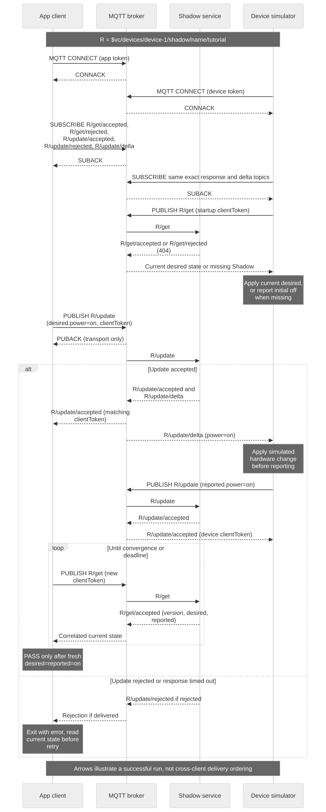

# End-to-End App and Device Example

## Goal and prerequisites

Run an application and a simulated device as two independent authenticated MQTT clients. The application requests power on; the device applies the simulated change and reports it; the application checks convergence through GET. This example is a protocol client, not a replacement for firmware hardware verification or the device-owner transport protocol.

Complete [Cloud/device setup](setup-cloud-device.en.md), [credential setup](credential-setup.en.md), and [token issuance](authentication.en.md). You need current **separate** app/device runtime token files, `mqtt` and `iot_shadow`, an authorized test device, Python 3.10+, and access to the pinned dependency. Keep credential files outside the example directory.



[Open full-size diagram](assets/two-principal-demo.svg) · [Mermaid source](assets/two-principal-demo.mmd)

## 1. Install the example

[Download the complete Python example](assets/shadow-demo.zip). Extract it to a private working directory; the archive includes `demo.py`, `recover.py`, `verify.py`, `requirements.txt` and `README.md` and contains no credentials.

```bash
unzip shadow-demo.zip -d shadow-demo
cd shadow-demo
python3 -m venv .venv
. .venv/bin/activate
python -m pip install -r requirements.txt
python demo.py --help
```

The pinned dependency is `paho-mqtt==2.1.0`. The sample uses its callback API version 2 and MQTT 3.1.1. Obtain the endpoint, CA and device ID from [Before You Start](before-you-start.en.md); both terminals need the same `MQTT_HOST`, `MQTT_PORT`, `CA_FILE`, `DEVICE_ID`, `SHADOW_NAME` and `TUTORIAL_DIR`. Use the dedicated named Shadow `tutorial` on an otherwise idle test device.

## 2. Start the simulated device

```bash
python demo.py device --token-file "$TUTORIAL_DIR/device-token.json" --seconds 120
```

The client waits for successful CONNECT and SUBACK, then GETs the Shadow. A missing Shadow is handled by reporting initial simulated power `off`. On reconnect/restart, it reads current desired state and applies supported values. It accepts only `power=on` or `power=off`; duplicates do not repeat the simulated hardware transition. It reports state only after applying the change.

## 3. Run the application in another terminal

Activate the same virtual environment and export the same settings, then run:

```bash
python demo.py app --token-file "$TUTORIAL_DIR/app-token.json" --power on --seconds 45
```

Expected application output:

```text
APP desired accepted; waiting for reported state
PASS: desired=reported=on
```

Expected device output includes:

```text
DEVICE ready: simulated power=off
DEVICE applied power=on
DEVICE reported accepted
```

A previously existing desired value may be applied during the initial GET. Do not require a fixed line order across the two processes. The app exits with status 0 only after its update is accepted and a later, sufficiently new GET shows both desired and reported equal to the requested power. PUBACK alone does not print PASS.

## 4. Exercise offline recovery and failures

Stop the device process, request the opposite state with the app, then restart the device before the app's deadline. The device GETs current desired state; the example does not depend on replay of offline deltas. If no device returns before the deadline, the app exits nonzero with an unknown-convergence timeout. Read current state before deciding whether to repeat a mutation.

Try a device without `iot_shadow`, an unauthorized app/device pairing, or expired test tokens only in a dedicated test environment. The required policy outcome is denial. Missing-capability enforcement is not yet qualified across the reviewed service paths; record this negative test as a release gate, not a proven result. An unexpectedly successful request is an authorization defect to report, not permission to rely on that behavior. The exact layer of denial can differ: TLS, CONNECT, SUBACK or a Shadow rejected response. The sample exits on disconnect, malformed messages or a full receive queue; it does not implement automatic token renewal or unlimited reconnect retries.

## 5. Finish and adapt

Stop the simulator and use the [explicit Shadow deletion steps](shadow-interfaces.en.md) to remove only tutorial state. For hardware integration, replace the simulated assignment with the actual operation and readback. For a long-running product, add the bounded recovery and renewal behavior in [MQTT Connection Guide](mqtt-connection.en.md) and [Integration Recipes](integration-recipes.en.md).

Validation of the downloadable client is recorded separately from production qualification. Local automated tests cover response correlation, rejected requests, stale reads, duplicate events and timeout behavior. This does not certify an arbitrary environment's credentials or entitlements.

Architecture: [App, device and test-tool architecture](integration-test-kit.en.md).
