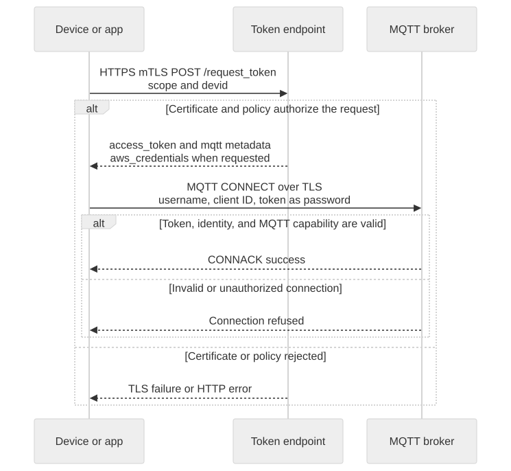

# Authentication and Access Control

A verified device certificate identifies the device. An app certificate identifies the application user; an app runtime token is additionally bound to the requested device. Keep these two identities separate when testing.



[Open full-size diagram](assets/authentication.svg) · [Mermaid source](assets/authentication.mmd)

## Authentication boundaries

Use each credential at its own boundary. An Account Manager bearer is not an MQTT password; a runtime JWT is not an AWS account credential. The shared map below complements the token exchange sequence and the detailed credential setup guide.


[Full-size block diagram](assets/credential-uses.svg) · [Mermaid source](assets/credential-uses.mmd)

## Obtain runtime credentials

After completing [the prerequisites](before-you-start.en.md), run the following in your private working directory. `aws_iot_data` requests the short-lived credential bundle used by the HTTP examples.

```bash
jq -n --arg devid "$DEVICE_ID" \
  '{scope:"device",devid:$devid,aws_iot_data:true}' > "$TUTORIAL_DIR/device-request.json"
curl --fail-with-body --silent --show-error \
  --cacert "$CA_FILE" --cert "$DEVICE_CERT" --key "$DEVICE_KEY" \
  -H 'Content-Type: application/json' \
  --data-binary @"$TUTORIAL_DIR/device-request.json" \
  "$DEVICE_TOKEN_BASE/request_token" > "$TUTORIAL_DIR/device-token.json"

jq -n --arg devid "$DEVICE_ID" \
  '{scope:"app",devid:$devid,aws_iot_data:true}' > "$TUTORIAL_DIR/app-request.json"
curl --fail-with-body --silent --show-error \
  --cacert "$CA_FILE" --cert "$APP_CERT" --key "$APP_KEY" \
  -H 'Content-Type: application/json' \
  --data-binary @"$TUTORIAL_DIR/app-request.json" \
  "$APP_TOKEN_BASE/request_token" > "$TUTORIAL_DIR/app-token.json"
```

Do not continue after an HTTP error. Confirm each file has a nonempty `access_token`, `mqtt.username`, and `mqtt.client_id` without printing their values. HTTP Shadow examples additionally require the `aws_credentials` object. Missing fields are not values to invent: check capability enablement, endpoint version, and issuance policy.

## Map credentials to the protocol

| Connection field | Value |
| --- | --- |
| MQTT username | Response `mqtt.username` |
| MQTT password | Response `access_token` |
| MQTT Client ID | Response `mqtt.client_id`, optionally followed by an allowed role suffix |
| HTTP Shadow access key | `aws_credentials.accessKeyId` |
| HTTP Shadow secret key | `aws_credentials.secretAccessKey` |
| HTTP Shadow session token | `aws_credentials.sessionToken` |
| HTTP Shadow region and endpoint | `aws_credentials.region`, `aws_credentials.iotDataEndpoint` |

The MQTT username must match the signed Brand Cloud identity. Do not prepend the Brand Cloud ID to topics. Concurrent MQTT connections need distinct Client IDs. These tutorials append `-watch` and `-send` to the returned base. The inspected implementation permits suffixes of 1–64 ASCII letters, digits, underscores, or hyphens; use short fixed roles.

Normal protected service HTTP APIs commonly use Bearer authorization. The public Shadow HTTP contract uses SigV4 with service name `iotdevicegateway`; use the returned credential bundle rather than assuming a Bearer example applies.

## Renew before expiry

Schedule token renewal from the signed JWT `exp`, not a requested `expiry` duration. Treat decoded claims as scheduling data, not as locally verified authorization. `/refresh_token` takes a still-valid signed token in its historically named `refresh_token` field; it is not an opaque refresh grant.

```bash
jq '{refresh_token:.access_token}' "$TUTORIAL_DIR/device-token.json" \
  > "$TUTORIAL_DIR/reissue-request.json"
curl --fail-with-body --silent --show-error --cacert "$CA_FILE" \
  -H 'Content-Type: application/json' \
  --data-binary @"$TUTORIAL_DIR/reissue-request.json" \
  "$API_BASE/refresh_token" > "$TUTORIAL_DIR/device-token-next.json"
```

Validate the response before replacing the current token file. Reconnect MQTT using its new password and returned metadata. If the old token has expired or reissue fails, obtain a new token through the certificate bootstrap flow. To renew HTTP Shadow credentials, repeat `/request_token` with `aws_iot_data:true`; do not assume reissue returns that bundle.

## Failure checks

TLS failures occur before an HTTP response. Check the server trust chain, certificate validity, private key, and endpoint. HTTP token rejection can indicate a device identity mismatch, inactive device, missing permission, or unavailable device projection. MQTT rejection after successful issuance calls for checking username, Client ID, token expiry, and the `mqtt` capability.

Next: [MQTT Quickstart](mqtt-quickstart.en.md) or [signed HTTP Shadow requests](shadow-interfaces.en.md).

Continue: [Credential renewal and recovery](credential-recovery.en.md).
