# 身分驗證與存取控制

裝置憑證通過驗證後，用來識別裝置；App 憑證則用來識別應用程式使用者。App 的執行階段 token 還會綁定請求中指定的裝置。測試時，請分別使用這兩種身分。

[開啟驗證流程時序圖](assets/authentication.zh-TW.html)

## 各類驗證資訊的適用範圍

各類驗證資訊都有各自的用途。Account Manager 的 Bearer token 不能作為 MQTT 密碼；執行階段 JWT 也不是 AWS 帳號的驗證資訊。下圖整理各種驗證資訊的用途，可搭配 token 交換時序圖與憑證設定指南閱讀。



[檢視完整架構圖](assets/credential-uses.zh-TW.svg) · [Mermaid 原始碼](assets/credential-uses.zh-TW.mmd)

## 取得執行階段驗證資訊

完成[事前準備](before-you-start.zh-TW.md)後，在私人工作目錄中執行以下指令。`aws_iot_data` 用來請求 HTTP 範例所需的短期憑證包。

```bash
jq -n --arg devid "$DEVICE_ID" \
  '{scope:"device",devid:$devid,aws_iot_data:true}' > "$TUTORIAL_DIR/device-request.json"
curl --fail-with-body --silent --show-error \
  --cacert "$CA_FILE" --cert "$DEVICE_CERT" --key "$DEVICE_KEY" \
  -H 'Content-Type: application/json' \
  --data-binary @"$TUTORIAL_DIR/device-request.json" \
  "$DEVICE_TOKEN_BASE/request_token" > "$TUTORIAL_DIR/device-token.json"

jq -n --arg devid "$DEVICE_ID" \
  '{scope:"app",devid:$devid,aws_iot_data:true}' > "$TUTORIAL_DIR/app-request.json"
curl --fail-with-body --silent --show-error \
  --cacert "$CA_FILE" --cert "$APP_CERT" --key "$APP_KEY" \
  -H 'Content-Type: application/json' \
  --data-binary @"$TUTORIAL_DIR/app-request.json" \
  "$APP_TOKEN_BASE/request_token" > "$TUTORIAL_DIR/app-token.json"
```

若收到 HTTP 錯誤，請先停止。確認每個檔案都包含非空的 `access_token`、`mqtt.username` 與 `mqtt.client_id`，但不要印出這些值。HTTP Shadow 範例還需要 `aws_credentials` 物件。若缺少欄位，請檢查服務功能是否已啟用、端點版本與簽發政策，不要自行填入值。

## 將驗證資訊填入協定欄位

| 連線欄位 | 填入的值 |
| --- | --- |
| MQTT 使用者名稱 | 回應中的 `mqtt.username` |
| MQTT 密碼 | 回應中的 `access_token` |
| MQTT Client ID | 回應中的 `mqtt.client_id`，可加上允許的角色後綴 |
| HTTP Shadow 存取金鑰 | `aws_credentials.accessKeyId` |
| HTTP Shadow 秘密金鑰 | `aws_credentials.secretAccessKey` |
| HTTP Shadow 工作階段 token | `aws_credentials.sessionToken` |
| HTTP Shadow 區域與端點 | `aws_credentials.region`, `aws_credentials.iotDataEndpoint` |

MQTT 使用者名稱必須符合已簽署的 Brand Cloud 身分。不要在主題前加上 Brand Cloud ID。同時存在的 MQTT 連線必須使用不同的 Client ID；本教學會在回傳的基礎 ID 後加上 `-watch` 或 `-send`。經檢查的實作允許後綴使用 1–64 個 ASCII 字母、數字、底線或連字號；建議使用簡短且固定的角色名稱。

一般受保護的服務 HTTP API 通常使用 Bearer 驗證。公開的 Shadow HTTP 介面規格則要求使用 SigV4，服務名稱為 `iotdevicegateway`。請使用回傳的憑證包，不要直接套用 Bearer 範例。

## 在到期前更新 token

請依已簽署 JWT 中的 `exp` 安排 token 更新時間，不要依請求中的 `expiry` 時長推算。解碼後的 JWT 宣告只供排程使用，不代表已在本機驗證授權。`/refresh_token` 的 `refresh_token` 欄位沿用既有命名，實際接收的是仍有效的已簽署 token，並非獨立的不透明更新授權。

```bash
jq '{refresh_token:.access_token}' "$TUTORIAL_DIR/device-token.json" \
  > "$TUTORIAL_DIR/reissue-request.json"
curl --fail-with-body --silent --show-error --cacert "$CA_FILE" \
  -H 'Content-Type: application/json' \
  --data-binary @"$TUTORIAL_DIR/reissue-request.json" \
  "$API_BASE/refresh_token" > "$TUTORIAL_DIR/device-token-next.json"
```

先驗證回應，再替換目前的 token 檔案。使用新密碼與回傳資訊重新建立 MQTT 連線。若舊 token 已到期或重新簽發失敗，請透過憑證驗證流程取得新 token。若要更新 HTTP Shadow 驗證資訊，請再次呼叫 `/request_token` 並帶入 `aws_iot_data:true`；不要假設 token 重新簽發時也會回傳該憑證包。

## 失敗時的檢查項目

TLS 錯誤發生在收到 HTTP 回應之前。請檢查伺服器信任鏈、憑證效期、私鑰與端點。HTTP token 請求遭拒可能是裝置身分不符、裝置尚未啟用、權限不足，或裝置資料投影不可用。若 token 已成功簽發，但 MQTT 連線遭拒，請檢查使用者名稱、Client ID、token 到期時間與 `mqtt` 功能。

下一步：[MQTT 快速入門](mqtt-quickstart.zh-TW.md)或[使用簽章的 HTTP Shadow 請求](shadow-interfaces.zh-TW.md)。

延伸閱讀：[驗證資訊更新與連線復原](credential-recovery.zh-TW.md)。
