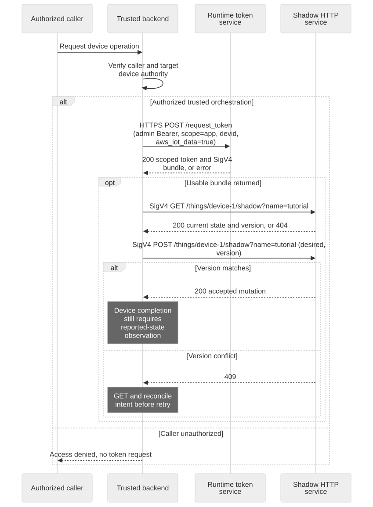

# Backend Integration Guide

## Backend responsibility boundary

The backend first checks its caller and target. It then uses only an approved identity or delegation path. The privileged token-issuance branch is for trusted platform orchestration; the diagram does not introduce a public customer delegation API. Observe device-reported completion separately from a successful Shadow mutation.



[Full-size block diagram](assets/backend-boundary.svg) · [Mermaid source](assets/backend-boundary.mmd)

## Goal and prerequisites

Read or update a device Shadow from a backend that already has authority for the target device. You need the target device/Shadow identifiers, `iot_shadow`, and an approved credential acquisition path. Server-side code must check its own user's/tenant's device authorization before acquiring or using service credentials.

## Choose an identity before choosing an HTTP client

| Scenario | Supported integration boundary |
| --- | --- |
| User's application | App-local certificate bootstrap and a device-bound app token; retain the private key on that application |
| Backend using a delegated short-lived Shadow bundle | Use a bundle only when the deployment's approved delegation boundary provides it for the requested device; this edition does not define a generic delegation API |
| Trusted platform/service orchestration | A separately provisioned Video Cloud admin bearer can call `/request_token` for a subject-bound token; this is privileged integration, not self-service customer access |
| Customer backend seeking an OAuth client-credentials grant | No public self-service grant is established by the reviewed contract; do not invent `/oauth/token` or reuse an Account Manager token |

An Account Manager admin role and a Video Cloud runtime admin token are different authorities. Do not copy app/device private keys, scrape browser cookies, or expose privileged orchestration tokens to a frontend. If your backend has no approved identity/delegation path, obtain that service integration from the operator before starting; the API examples cannot manufacture authorization.



[Open full-size diagram](assets/backend-shadow.svg) · [Mermaid source](assets/backend-shadow.mmd)

## 1. Trusted orchestration: acquire a device-bound bundle

Run this section only for an explicitly authorized trusted backend with a Video Cloud admin bearer already provisioned by its operator. The file below is operator-supplied secret material, not an Account Manager login response. Verify that its tenant/device authority matches the request. An ordinary customer integration must use its approved path instead.

```bash
export ADMIN_TOKEN_FILE='/private/path/video-runtime-admin-token'
export API_BASE='https://api.example.test'
jq -n --arg devid "$DEVICE_ID" \
  '{scope:"app",devid:$devid,aws_iot_data:true}' > "$TUTORIAL_DIR/backend-token-request.json"
curl --fail-with-body --silent --show-error --cacert "$CA_FILE" \
  -H "Authorization: Bearer $(cat "$ADMIN_TOKEN_FILE")" \
  -H 'Content-Type: application/json' --data-binary @"$TUTORIAL_DIR/backend-token-request.json" \
  "$API_BASE/request_token" > "$TUTORIAL_DIR/backend-token.json"
jq -e '.aws_credentials | .accessKeyId != null and .secretAccessKey != null and .sessionToken != null' \
  "$TUTORIAL_DIR/backend-token.json"
```

HTTP 200 and a usable returned bundle are required. Token issuance can still be denied for an inactive device, wrong scope, missing entitlement or policy. Never broaden permissions automatically after a 403. Some deployments do not expose privileged issuance to your backend network; that is an integration boundary to resolve with the operator.

## 2. Read and conditionally update Shadow

Follow the complete [signed HTTP helper](shadow-interfaces.en.md), setting `TOKEN_FILE` to `backend-token.json` before loading its credential fields. Always use the returned `iotDataEndpoint`, region and session token with signing service `iotdevicegateway`; these are RTK endpoint credentials, not credentials for an AWS account.

```bash
# After configuring shadow_http and SHADOW_URL from the interface guide:
shadow_http "$SHADOW_URL" > "$TUTORIAL_DIR/backend-state.json"
CURRENT_VERSION="$(jq -er '.version' "$TUTORIAL_DIR/backend-state.json")"
PATCH="$(jq -nc --argjson version "$CURRENT_VERSION" \
  '{state:{desired:{power:"on"}},version:$version,clientToken:"backend-power-on"}')"
shadow_http -X POST -H 'Content-Type: application/json' --data-binary "$PATCH" "$SHADOW_URL"
```

For an intentionally new Shadow, handle GET 404 explicitly and omit the version for its first update. POST success means the Shadow mutation committed; use later GETs or authorized MQTT subscriptions to observe device-reported convergence. Do not return a hardware-completed response merely because POST succeeded.

## 3. Bound concurrency and renew safely

Cache credentials by principal, device and expiry, never just by hostname. Obtain a new SigV4 bundle before its returned expiration; `/refresh_token` is not a guaranteed SigV4-bundle refresh. Keep the clock synchronized and avoid concurrent refresh storms. Evict cached authorization after revocation or access denial.

On 409, GET and reconcile the caller's current intent. On 429 or transient service errors, back off with a bounded budget. After a timeout, GET before replacing a mutation whose outcome is unknown. Use a unique `clientToken` for each pending request; it is correlation, not an idempotency guarantee. For multiple devices, authorize and scope each device separately rather than extending a token from one device to an entire fleet.

## Expected result and diagnostics

A read returns the target Shadow state; a conditional update returns the accepted patch or a conflict. Record request time, operation, status/code and correlation ID without logging secrets or private state. Confirm a negative test for a different device/Cloud fails through the intended authorization boundary before releasing your integration.

Next: [Shadow API Reference](shadow-reference.en.md) and [Connection Settings and Service Limits](connection-settings.en.md).
