# 后端整合指南

## 后端责任界限

后端首先检查其呼叫者和目标。然后，它只使用经过批准的身份或委派路径。特权令牌发行分支用于受信任的平台协调；图表没有引入公共客户委派API。请单独观察装置报告的完成情况，与成功的光影变异分开。



[全尺寸方块图](assets/backend-boundary.zh-CN.svg) · [Mermaid 原始档](assets/backend-boundary.zh-CN.mmd)

## 目标和先决条件

从已经对目标装置具有许可权的后端读取或更新装置影子。您需要目标装置/影子识别符号，`iot_shadow`，以及一个经过批准的认证获取路径。伺服器端程式在获取或使用服务认证之前必须检查其自己的使用者/租户的装置授权。

## 在选择HTTP客户端之前，请选择一个身份

|场景|支援的整合边界|
| --- | --- |
|使用者的应用程式|应用程式本地证书引导和装置系结的应用程式令牌；保留该应用程式上的私钥|
|使用委派的短命影子捆绑包的后端|只有在部署的批准委派边界为请求的装置提供时才使用捆绑包；本版本不定义通用委派API|
|值得信赖的平台/服务协调|单独配置的影片云管理员持有人可以拨打`/request_token`对于受主题约束的令牌；这是一种特权整合，而不是自助服务客户访问|
|客户后端正在寻找OAuth客户端凭据授予|审查的契约没有设立公共自助赠款；不要编造`/oauth/token`或重新使用帐户经理令牌|

帐户经理管理员角色和影片云执行时管理员令牌是不同的授权。请勿复制应用程式/装置的私钥、抓取浏览器cookie，或将特权协调令牌暴露给前端。如果您的后端没有经过批准的身份/委派路径，请在开始之前从运营商那里获取该服务整合；API示例无法制造授权。

[开启重新设计的序列图](assets/backend-shadow.zh-CN.html)

## 1. 值得信赖的协调：获取装置系结的捆绑包

仅在运营商已经配置了影片云管理员持有人的情况下，在明确授权的受信任后端执行此部分。以下档案是运营商提供的机密材料，而不是帐户经理登入响应。请验证其租户/装置许可权是否与请求相符。普通客户整合必须使用其已批准的路径。

```bash
export ADMIN_TOKEN_FILE='/private/path/video-runtime-admin-token'
export API_BASE='https://api.example.test'
jq -n --arg devid "$DEVICE_ID" \
  '{scope:"app",devid:$devid,aws_iot_data:true}' > "$TUTORIAL_DIR/backend-token-request.json"
curl --fail-with-body --silent --show-error --cacert "$CA_FILE" \
  -H "Authorization: Bearer $(cat "$ADMIN_TOKEN_FILE")" \
  -H 'Content-Type: application/json' --data-binary @"$TUTORIAL_DIR/backend-token-request.json" \
  "$API_BASE/request_token" > "$TUTORIAL_DIR/backend-token.json"
jq -e '.aws_credentials | .accessKeyId != null and .secretAccessKey != null and .sessionToken != null' \
  "$TUTORIAL_DIR/backend-token.json"
```

需要HTTP 200和一个可用返回的捆绑包。对于未活动的装置、范围错误、权利或策略缺失，仍然可以拒绝发行令牌。在403之后，切勿自动扩充套件许可权。某些部署不会向您的后端网路暴露特权发行；这是一个与运营商协商解决的整合边界。

## 2. 阅读并条件更新Shadow

关注完整的[签名的HTTP助手](shadow-interfaces.zh-CN.md)，设定`TOKEN_FILE`到`backend-token.json`在载入其凭证栏位之前。始终使用返回的`iotDataEndpoint`，带有签名服务的区域和会话令牌`iotdevicegateway`; 这些是RTK端点凭据，不是AWS帐户的凭据。

```bash
# After configuring shadow_http and SHADOW_URL from the interface guide:
shadow_http "$SHADOW_URL" > "$TUTORIAL_DIR/backend-state.json"
CURRENT_VERSION="$(jq -er '.version' "$TUTORIAL_DIR/backend-state.json")"
PATCH="$(jq -nc --argjson version "$CURRENT_VERSION" \
  '{state:{desired:{power:"on"}},version:$version,clientToken:"backend-power-on"}')"
shadow_http -X POST -H 'Content-Type: application/json' --data-binary "$PATCH" "$SHADOW_URL"
```

对于一个故意新的Shadow，请明确处理GET 404，并在第一次更新时省略版本。POST成功意味著Shadow突变已提交；请使用后续的GET或授权的MQTT订阅来观察装置报告的收敛。仅仅因为POST成功而不返回硬体完成的响应是不合适的。

## 3. 受限并行和安全更新

按主机、装置和到期日储存暂存资料凭据，永远不要仅仅按主机名称。在SigV4捆绑包返回到期前获取一个新的SigV4捆绑包；`/refresh_token`不保证SigV4捆绑包的重新整理。保持时钟同步，避免同时进行重新整理。在撤销或拒绝访问后，驱逐快取授权。

在409上，获取并对话询问者的当前意图进行核对。在429或临时服务错误时，在有限的预算内退缩。在超时后，在替换结果未知的突变之前获取。使用唯一的`clientToken`对于每个待处理的请求；这是相关性，而不是同值性保证。对于多个装置，请单独授权和限定每个装置的范围，而不是将令牌从一个装置扩充套件到整个车队。

## 预期结果和诊断

读取返回目标影子状态；条件更新返回接受的补丁程式或冲突。记录请求时间、操作、状态/程式和相关性ID，而不会记录秘密或私有状态。在释出整合之前，请透过预期的授权边界确认不同装置/云端的负面测试失败。

下一个：[影子API参考](shadow-reference.zh-CN.md)与[连线设定与服务限制](connection-settings.zh-CN.md).
