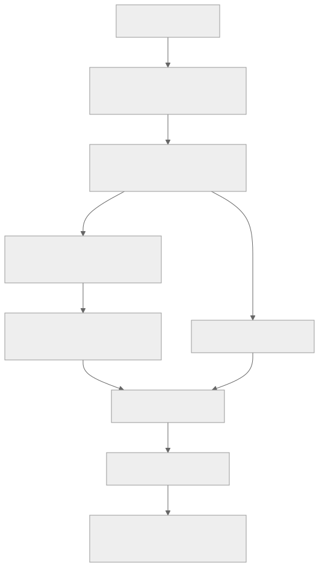

# 后端集成指南

## 后端的职责范围

后端先检查调用方与目标，再使用获准的身份或委派授权流程。具有管理权限的令牌签发流程仅供受信任的平台编排使用；图中并未定义公开的客户委派授权 API。Shadow 变更成功与设备上报执行完成，必须分别确认。



[查看完整架构图](assets/backend-boundary.zh-CN.svg) · [Mermaid 源码](assets/backend-boundary.zh-CN.mmd)

## 目标与准备工作

使用已获得目标设备访问权限的后端，读取或更新设备影子。你需要目标设备与 Shadow 的标识符、`iot_shadow` 功能，以及获准的凭证获取流程。服务器端代码在获取或使用服务凭证前，必须先检查自己的用户或租户是否有权访问该设备。

## 先确认身份，再选择 HTTP 客户端

| 场景 | 支持的集成方式与限制 |
| --- | --- |
| 用户的应用 | 使用 App 本地证书获取绑定设备的 App 令牌；私钥须留在该应用中 |
| 后端使用委派的短期 Shadow 凭证包 | 仅能使用部署环境获准的委派授权流程，为指定设备提供的凭证包；本版未定义通用委派授权 API |
| 受信任的平台或服务编排 | 单独授予的 Video Cloud 管理员 Bearer 令牌可调用 `/request_token`，获取绑定特定主体的令牌；这是特权集成，不是客户自助功能 |
| 客户后端希望使用 OAuth client-credentials 授权 | 已审查的规范未定义公开自助授权流程；不要自行假设存在 `/oauth/token`，或复用 Account Manager 令牌 |

Account Manager 管理员角色与 Video Cloud 运行时管理员令牌是不同的权限。不要复制 App 或设备私钥、提取浏览器 cookie，或将编排使用的特权令牌暴露给前端。如果后端没有获准的身份或委派授权流程，请先向运维人员获取服务集成方式；API 示例无法自行产生授权。

[打开后端 Shadow 操作时序图](assets/backend-shadow.zh-CN.html)

## 1. 受信任后端：获取绑定设备的凭证包

只有明确获授权，且已由运维人员提供 Video Cloud 管理员 Bearer 令牌的受信任后端，才能执行本节。下方文件是运维人员提供的机密资料，不是 Account Manager 登录响应。请确认其中的租户与设备权限符合请求。普通客户集成应使用自己的获准流程。

```bash
export ADMIN_TOKEN_FILE='/private/path/video-runtime-admin-token'
export API_BASE='https://api.example.test'
jq -n --arg devid "$DEVICE_ID" \
  '{scope:"app",devid:$devid,aws_iot_data:true}' > "$TUTORIAL_DIR/backend-token-request.json"
curl --fail-with-body --silent --show-error --cacert "$CA_FILE" \
  -H "Authorization: Bearer $(cat "$ADMIN_TOKEN_FILE")" \
  -H 'Content-Type: application/json' --data-binary @"$TUTORIAL_DIR/backend-token-request.json" \
  "$API_BASE/request_token" > "$TUTORIAL_DIR/backend-token.json"
jq -e '.aws_credentials | .accessKeyId != null and .secretAccessKey != null and .sessionToken != null' \
  "$TUTORIAL_DIR/backend-token.json"
```

必须收到 HTTP 200，且返回的凭证包可用，才能继续。设备未激活、授权范围错误、服务使用权不足或策略限制，都可能导致令牌签发被拒绝。收到 403 后，绝不可自动扩大权限。有些部署不允许后端所在网络访问特权签发接口；这需要与运维人员确认集成范围。

## 2. 读取并按版本条件更新 Shadow

请使用完整的 [HTTP 签名辅助函数](shadow-interfaces.zh-CN.md)，在加载凭证字段前，将 `TOKEN_FILE` 设为 `backend-token.json`。始终使用返回的 `iotDataEndpoint`、区域与会话令牌，签名服务名称使用 `iotdevicegateway`。这些是 RTK 端点凭证，不是 AWS 账号凭证。

```bash
# After configuring shadow_http and SHADOW_URL from the interface guide:
shadow_http "$SHADOW_URL" > "$TUTORIAL_DIR/backend-state.json"
CURRENT_VERSION="$(jq -er '.version' "$TUTORIAL_DIR/backend-state.json")"
PATCH="$(jq -nc --argjson version "$CURRENT_VERSION" \
  '{state:{desired:{power:"on"}},version:$version,clientToken:"backend-power-on"}')"
shadow_http -X POST -H 'Content-Type: application/json' --data-binary "$PATCH" "$SHADOW_URL"
```

如果有意创建新 Shadow，请明确处理 GET 404，并在首次更新时省略版本。POST 成功表示 Shadow 状态变更已提交；设备是否已达到期望状态，仍须通过后续 GET 或已授权的 MQTT 订阅，观察设备上报。**不可仅因 POST 成功，就响应硬件已执行完成。**

## 3. 限制并发请求并安全更新凭证

缓存凭证时，应按身份主体、设备与过期时间区分，不可仅按主机名区分。在返回的有效期到期前获取新的 SigV4 凭证包；`/refresh_token` 不保证刷新 SigV4 凭证包。请保持系统时间同步，避免大量并发刷新请求。身份被吊销或访问被拒绝后，应移除缓存的授权信息。

收到 409 时，先执行 GET，再按调用方当前意图调整更新。收到 429 或暂时性服务错误时，采用设有上限的退避重试。状态变更结果不确定而超时时，重新写入前先执行 GET。每条待处理请求都应使用唯一的 `clientToken`；它用于关联请求与响应，不提供幂等性保证。操作多个设备时，须分别授权并限定每个设备的范围，不能将单个设备令牌扩用至整个设备群。

## 预期结果与诊断

读取操作会返回目标 Shadow 状态；附带版本条件的更新会返回已接受的局部更新内容，或版本冲突。请记录请求时间、操作、状态／错误码与关联 ID，不要记录机密或私有状态。发布集成前，请使用不同设备或 Cloud 执行拒绝访问测试，确认预期的授权检查确实阻止请求。

下一步：[Shadow API 参考](shadow-reference.zh-CN.md)和[连接配置与服务限制](connection-settings.zh-CN.md)。
