# 後端整合指南

## 後端責任界限

後端首先檢查其呼叫者和目標。然後，它只使用經過批准的身份或委派路徑。特權令牌發行分支用於受信任的平臺協調；圖表沒有引入公共客戶委派API。請單獨觀察裝置報告的完成情況，與成功的光影變異分開。



[全尺寸方塊圖](assets/backend-boundary.zh-TW.svg) · [Mermaid 原始檔](assets/backend-boundary.zh-TW.mmd)

## 目標和先決條件

從已經對目標裝置具有許可權的後端讀取或更新裝置影子。您需要目標裝置/影子識別符號，`iot_shadow`，以及一個經過批准的認證獲取路徑。伺服器端程式在獲取或使用服務認證之前必須檢查其自己的使用者/租戶的裝置授權。

## 在選擇HTTP客戶端之前，請選擇一個身份

|場景|支援的整合邊界|
| --- | --- |
|使用者的應用程式|應用程式本地證書引導和裝置繫結的應用程式令牌；保留該應用程式上的私鑰|
|使用委派的短命影子捆綁包的後端|只有在部署的批准委派邊界為請求的裝置提供時才使用捆綁包；本版本不定義通用委派API|
|值得信賴的平臺/服務協調|單獨配置的影片雲管理員持有人可以撥打`/request_token`對於受主題約束的令牌；這是一種特權整合，而不是自助服務客戶訪問|
|客戶後端正在尋找OAuth客戶端憑據授予|審查的契約沒有設立公共自助贈款；不要編造`/oauth/token`或重新使用帳戶經理令牌|

帳戶經理管理員角色和影片雲執行時管理員令牌是不同的授權。請勿複製應用程式/裝置的私鑰、抓取瀏覽器cookie，或將特權協調令牌暴露給前端。如果您的後端沒有經過批准的身份/委派路徑，請在開始之前從運營商那裡獲取該服務整合；API示例無法製造授權。

[開啟重新設計的序列圖](assets/backend-shadow.zh-TW.html)

## 1. 值得信賴的協調：獲取裝置繫結的捆綁包

僅在運營商已經配置了影片雲管理員持有人的情況下，在明確授權的受信任後端執行此部分。以下檔案是運營商提供的機密材料，而不是帳戶經理登入響應。請驗證其租戶/裝置許可權是否與請求相符。普通客戶整合必須使用其已批准的路徑。

```bash
export ADMIN_TOKEN_FILE='/private/path/video-runtime-admin-token'
export API_BASE='https://api.example.test'
jq -n --arg devid "$DEVICE_ID" \
  '{scope:"app",devid:$devid,aws_iot_data:true}' > "$TUTORIAL_DIR/backend-token-request.json"
curl --fail-with-body --silent --show-error --cacert "$CA_FILE" \
  -H "Authorization: Bearer $(cat "$ADMIN_TOKEN_FILE")" \
  -H 'Content-Type: application/json' --data-binary @"$TUTORIAL_DIR/backend-token-request.json" \
  "$API_BASE/request_token" > "$TUTORIAL_DIR/backend-token.json"
jq -e '.aws_credentials | .accessKeyId != null and .secretAccessKey != null and .sessionToken != null' \
  "$TUTORIAL_DIR/backend-token.json"
```

需要HTTP 200和一個可用返回的捆綁包。對於未活動的裝置、範圍錯誤、權利或策略缺失，仍然可以拒絕發行令牌。在403之後，切勿自動擴充套件許可權。某些部署不會向您的後端網路暴露特權發行；這是一個與運營商協商解決的整合邊界。

## 2. 閱讀並條件更新Shadow

關注完整的[簽名的HTTP助手](shadow-interfaces.zh-TW.md)，設定`TOKEN_FILE`到`backend-token.json`在載入其憑證欄位之前。始終使用返回的`iotDataEndpoint`，帶有簽名服務的區域和會話令牌`iotdevicegateway`; 這些是RTK端點憑據，不是AWS帳戶的憑據。

```bash
# After configuring shadow_http and SHADOW_URL from the interface guide:
shadow_http "$SHADOW_URL" > "$TUTORIAL_DIR/backend-state.json"
CURRENT_VERSION="$(jq -er '.version' "$TUTORIAL_DIR/backend-state.json")"
PATCH="$(jq -nc --argjson version "$CURRENT_VERSION" \
  '{state:{desired:{power:"on"}},version:$version,clientToken:"backend-power-on"}')"
shadow_http -X POST -H 'Content-Type: application/json' --data-binary "$PATCH" "$SHADOW_URL"
```

對於一個故意新的Shadow，請明確處理GET 404，並在第一次更新時省略版本。POST成功意味著Shadow突變已提交；請使用後續的GET或授權的MQTT訂閱來觀察裝置報告的收斂。僅僅因為POST成功而不返回硬體完成的響應是不合適的。

## 3. 受限並行和安全更新

按主機、裝置和到期日儲存暫存資料憑據，永遠不要僅僅按主機名稱。在SigV4捆綁包返回到期前獲取一個新的SigV4捆綁包；`/refresh_token`不保證SigV4捆綁包的重新整理。保持時鐘同步，避免同時進行重新整理。在撤銷或拒絕訪問後，驅逐快取授權。

在409上，獲取並對話詢問者的當前意圖進行核對。在429或臨時服務錯誤時，在有限的預算內退縮。在超時後，在替換結果未知的突變之前獲取。使用唯一的`clientToken`對於每個待處理的請求；這是相關性，而不是同值性保證。對於多個裝置，請單獨授權和限定每個裝置的範圍，而不是將令牌從一個裝置擴充套件到整個車隊。

## 預期結果和診斷

讀取返回目標影子狀態；條件更新返回接受的補丁程式或衝突。記錄請求時間、操作、狀態/程式和相關性ID，而不會記錄秘密或私有狀態。在釋出整合之前，請透過預期的授權邊界確認不同裝置/雲端的負面測試失敗。

下一個：[影子API參考](shadow-reference.zh-TW.md)與[連線設定與服務限制](connection-settings.zh-TW.md).
