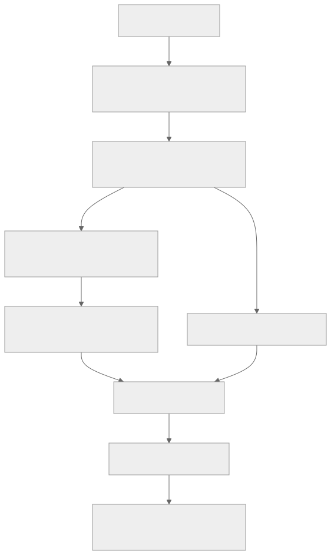

# 後端整合指南

## 後端的責任範圍

後端先檢查呼叫者與目標，再使用核准的身分或委派授權流程。具管理權限的 token 簽發流程僅供受信任的平台流程協調使用；圖中並未定義公開的客戶委派授權 API。Shadow 變更成功與裝置回報執行完成，必須分別確認。



[檢視完整架構圖](assets/backend-boundary.zh-TW.svg) · [Mermaid 原始碼](assets/backend-boundary.zh-TW.mmd)

## 目標與事前準備

使用已獲得目標裝置存取權的後端，讀取或更新裝置影子。你需要目標裝置與 Shadow 的識別碼、`iot_shadow` 功能，以及經核准的驗證資訊取得流程。伺服器端程式在取得或使用服務驗證資訊前，必須先檢查自己的使用者或租戶是否有權存取該裝置。

## 先確認身分，再選擇 HTTP 用戶端

| 情境 | 支援的整合方式與限制 |
| --- | --- |
| 使用者的應用程式 | 使用 App 本機憑證取得綁定裝置的 App token；私鑰須留在該應用程式中 |
| 後端使用委派的短期 Shadow 憑證包 | 僅能使用部署環境經核准的委派授權流程，為指定裝置提供的資訊包；本版未定義通用委派授權 API |
| 受信任的平台或服務流程協調 | 另外授予的 Video Cloud 管理員 Bearer token 可呼叫 `/request_token`，取得綁定特定主體的 token；這是特權整合，不是客戶自助功能 |
| 客戶後端想使用 OAuth client-credentials 授權 | 已審查的規格未定義公開自助授權流程；不要自行假設存在 `/oauth/token`，或重用 Account Manager token |

Account Manager 管理員角色與 Video Cloud 執行階段管理員 token 是不同的權限。不要複製 App 或裝置私鑰、擷取瀏覽器 cookie，或將流程協調使用的特權 token 暴露給前端。若後端沒有核准的身分或委派授權流程，請先向維運人員取得服務整合方式；API 範例無法自行產生授權。

[開啟後端 Shadow 操作時序圖](assets/backend-shadow.zh-TW.html)

## 1. 受信任後端：取得綁定裝置的憑證包

只有明確獲授權，且已由維運人員提供 Video Cloud 管理員 Bearer token 的受信任後端，才能執行本節。下方檔案是維運人員提供的機密資料，不是 Account Manager 登入回應。請確認其中的租戶與裝置權限符合請求。一般客戶整合應使用自己的核准流程。

```bash
export ADMIN_TOKEN_FILE='/private/path/video-runtime-admin-token'
export API_BASE='https://api.example.test'
jq -n --arg devid "$DEVICE_ID" \
  '{scope:"app",devid:$devid,aws_iot_data:true}' > "$TUTORIAL_DIR/backend-token-request.json"
curl --fail-with-body --silent --show-error --cacert "$CA_FILE" \
  -H "Authorization: Bearer $(cat "$ADMIN_TOKEN_FILE")" \
  -H 'Content-Type: application/json' --data-binary @"$TUTORIAL_DIR/backend-token-request.json" \
  "$API_BASE/request_token" > "$TUTORIAL_DIR/backend-token.json"
jq -e '.aws_credentials | .accessKeyId != null and .secretAccessKey != null and .sessionToken != null' \
  "$TUTORIAL_DIR/backend-token.json"
```

必須收到 HTTP 200，且回傳的憑證包可用，才能繼續。裝置未啟用、授權範圍錯誤、服務使用權不足或政策限制，都可能導致 token 簽發遭拒。收到 403 後，絕不可自動擴大權限。有些部署不允許後端所在網路存取特權簽發介面；這需要與維運人員確認整合範圍。

## 2. 讀取並依版本條件更新 Shadow

請使用完整的 [HTTP 簽章輔助函式](shadow-interfaces.zh-TW.md)，在載入驗證欄位前，將 `TOKEN_FILE` 設為 `backend-token.json`。一律使用回傳的 `iotDataEndpoint`、區域與工作階段 token，簽章服務名稱使用 `iotdevicegateway`。這些是 RTK 端點的驗證資訊，不是 AWS 帳號驗證資訊。

```bash
# After configuring shadow_http and SHADOW_URL from the interface guide:
shadow_http "$SHADOW_URL" > "$TUTORIAL_DIR/backend-state.json"
CURRENT_VERSION="$(jq -er '.version' "$TUTORIAL_DIR/backend-state.json")"
PATCH="$(jq -nc --argjson version "$CURRENT_VERSION" \
  '{state:{desired:{power:"on"}},version:$version,clientToken:"backend-power-on"}')"
shadow_http -X POST -H 'Content-Type: application/json' --data-binary "$PATCH" "$SHADOW_URL"
```

若刻意建立新 Shadow，請明確處理 GET 404，並在首次更新時省略版本。POST 成功代表 Shadow 狀態變更已提交；裝置是否已達到預期狀態，仍須透過後續 GET 或已授權的 MQTT 訂閱，觀察裝置回報。**不可僅因 POST 成功，就回應硬體已執行完成。**

## 3. 限制並行請求並安全更新驗證資訊

快取驗證資訊時，應依身分主體、裝置與到期時間區分，不可只按主機名稱區分。在回傳的有效期限到期前取得新的 SigV4 憑證包；`/refresh_token` 不保證更新 SigV4 資訊包。請保持系統時間同步，避免大量並行更新請求。身分撤銷或存取遭拒後，應移除快取的授權資訊。

收到 409 時，先執行 GET，再依呼叫者目前的意圖調整更新。收到 429 或暫時性服務錯誤時，採用設有上限的退避重試。狀態變更結果不確定而逾時時，重新寫入前先執行 GET。每筆待處理請求都應使用唯一的 `clientToken`；它用來關聯請求與回應，不提供冪等性保證。操作多個裝置時，須分別授權並限定每個裝置的範圍，不能將單一裝置 token 擴用至整個裝置群。

## 預期結果與診斷

讀取操作會回傳目標 Shadow 狀態；附帶版本條件的更新會回傳已接受的局部更新內容，或版本衝突。請記錄請求時間、操作、狀態／錯誤碼與關聯 ID，不要記錄機密或私人狀態。發布整合前，請用不同裝置或 Cloud 執行拒絕存取測試，確認預期的授權檢查確實阻擋請求。

下一步：[Shadow API 參考](shadow-reference.zh-TW.md)與[連線設定及服務限制](connection-settings.zh-TW.md)。
