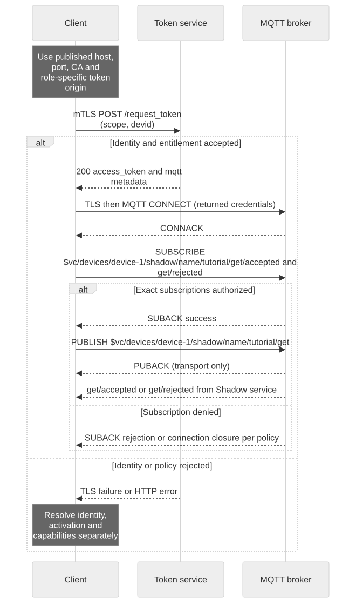

# Connection Settings and Service Limits

## Goal and prerequisites

Select client settings from the target environment's connection handoff and understand which limits are contractual. The observed values below were read from the existing dev broker on **2026-09-04**. They are configuration evidence, not a production capacity guarantee or proof of end-to-end delivery for every MQTT feature.

[Open full-size diagram](assets/connection-check.svg) · [Mermaid source](assets/connection-check.mmd)

## Required connection handoff

Record these values in your project's environment configuration, not in source code:

| Value | Source and verification |
| --- | --- |
| Account Manager HTTPS origin | Account/project environment configuration; verify normal server TLS |
| App and device token mTLS origins | Environment's role-specific published origins; verify client-certificate authentication |
| MQTT hostname and TLS port | Published MQTT connection settings; token metadata does not contain these |
| Server CA trust bundle | Environment trust distribution; verify hostname and certificate validity |
| MQTT username and Client ID base | Current token response `mqtt` fields |
| MQTT password | Current runtime `access_token` |
| HTTP Shadow endpoint, region, keys and session token | Current `aws_credentials` response |

The tutorials use port 8883 as a replaceable example. Do not infer MQTT over WebSocket from the separate device WebSocket transport or from an internal broker listener. A browser needs a specifically published, authenticated WSS endpoint and supported client flow; this edition has not qualified that path. Use the SDK's supported transport for your platform until that endpoint is confirmed.

## Contract limits

| Item | Confirmed contract |
| --- | --- |
| MQTT tutorial protocol | MQTT 3.1.1; other versions require target-environment qualification |
| Client ID | Returned signed base plus an allowed role suffix; suffix 1–64 ASCII letters/digits/underscore/hyphen |
| Topic isolation | Authenticated Brand Cloud namespace; an arbitrary device ID in a general topic is not per-device access control |
| MQTT Shadow authorization | Both `mqtt` and `iot_shadow`, authorized principal/device and exact permitted topics |
| HTTP Shadow authorization | `iot_shadow` plus authorized identity and signed request |
| Shadow state size | 8 KiB desired/reported state, excluding generated metadata; merged stored state is checked |
| Shadow nesting | At most eight levels |
| Shadow `clientToken` | At most 64 UTF-8 bytes |
| Named Shadow list page size | 1–100 |
| Delivery | Shadow notifications may duplicate; see the per-Shadow ordering scope in the reference |

## Observed dev broker profile

| Broker setting | Observed value | Developer consequence |
| --- | --- | --- |
| Maximum MQTT packet | `1MB` | Broker packet ceiling, including protocol overhead; the smaller Shadow state limit still applies |
| Maximum QoS | 2 | Broker accepts up to this setting; tutorials use QoS 1 and do not promise exactly-once device execution |
| Retain available | `true` | Broker setting only; service topic policy and feature qualification still apply; never retain Shadow requests |
| Maximum in-flight MQTT messages | 32 | Transport flow-control setting, not a Shadow request concurrency allowance |
| Maximum session message queue | 1000 | A bounded broker queue; not proof of offline Shadow notification replay |
| Session expiry interval | `2h` | Broker configuration; not applicable as a durable-session promise for the tutorials' clean sessions |
| Keep Alive multiplier / check interval | 1.5 / `30s` | Broker liveness settings, not a precise client disconnect deadline |
| Server Keep Alive override | Disabled | Tutorials request 60 seconds; network and proxy idle timeouts also matter |
| Maximum topic levels | 128 | Broker ceiling; clients must still use authorized exact topics |
| Wildcard subscriptions | Enabled at broker level | Shadow ACL can deny broad wildcards even when this broker setting is enabled |

Configuration readback does not verify reconnect persistence, retained replay, MQTT 5 features, shared subscriptions, or WebSocket access for your account. Qualify those scenarios before relying on them. A production deployment may use different limits; publish a new environment profile rather than copying these dev values as a universal contract.

## Rate, connection and retry budgets

The reviewed public contract does not establish a universal per-account connection quota, requests-per-second quota or Shadow in-flight limit. This is an explicit contract/qualification gap. Obtain the target environment's published quota before capacity planning; an internal queue length or broker maximum is not that quota. A token cannot raise an entitlement or quota.

Start with one outstanding Shadow mutation per device/Shadow in your integration. This is a conservative client strategy, not a server limit. Bound pending requests, apply backoff with jitter for transient failures, and surface 429 without endless retries. Reconnect with current credentials, wait for SUBACK, then GET Shadow state. See [connection recovery](mqtt-connection.en.md).

## Acceptance checklist

Before shipping, record the endpoint/profile version and verify: wrong CA fails TLS; expired/wrong-device credentials fail; exact subscriptions succeed; unauthorized topics fail; HTTP and MQTT reach the same named Shadow; reconnect recovers through GET; oversized state and stale versions return the documented errors. Record untested features as unqualified, not supported-by-assumption.

Next: [End-to-End App and Device Example](app-device-example.en.md) and [Troubleshooting](troubleshooting.en.md).
