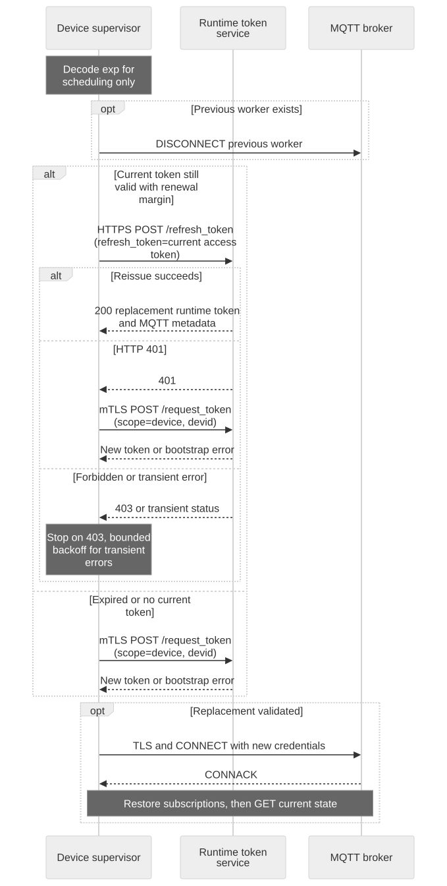
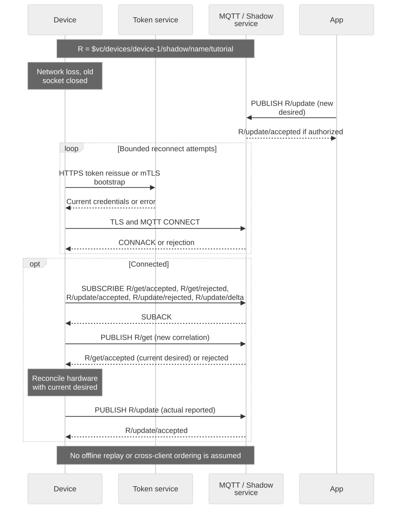

# Credential Renewal and Connection Recovery

## Recovery example components

The supervisor owns credential lifetime, retry budgets and worker cleanup. The worker owns MQTT subscriptions and Shadow reconciliation. The private temporary token file connects these local processes and is removed at exit; no cloud message history is stored there. These are sample components, not additional server services.



[Full-size block diagram](assets/recovery-components.svg) · [Mermaid source](assets/recovery-components.mmd)

## Goal and prerequisites

Keep a device integration working beyond one token lifetime. Prepare the certificate, private key, server CA and role-specific mTLS endpoint through [Credential Setup](credential-setup.en.md). Use the [downloadable simulator](app-device-example.en.md) as the worker; the recovery runner below supervises that simulated device. Production firmware must preserve its real hardware state rather than resetting simulated power at process startup.



[Full-size diagram](assets/credential-renewal.svg) · [Mermaid source](assets/credential-renewal.mmd)

## Credential lifetime rules

| Credential | Renewal action |
| --- | --- |
| Account Manager login token | Use its own account authentication flow; never pass it to Video Cloud refresh |
| Runtime MQTT JWT | Reissue before signed `exp`, reconnect with returned metadata/password |
| Expired runtime JWT | Repeat verified certificate bootstrap at `/request_token` |
| HTTP SigV4 bundle | Request a new bundle with `aws_iot_data:true`; refresh is not a bundle-renewal contract |
| Expiring/revoked certificate | Use authorized certificate enrollment/rotation; token refresh cannot repair it |

Decode `exp` only to schedule work, not to authorize locally. A requested TTL is not the issued lifetime. Refresh takes the still-valid access token in the historically named `refresh_token` field. Validate the replacement before replacing the local file. Avoid simultaneous refresh workers for the same identity.

## Run the bounded recovery supervisor

[Download the Python example](assets/shadow-demo.zip), install its pinned dependency, and use Bash with the settings from [Before You Start](before-you-start.en.md). The archive includes `recover.py` and `demo.py`.

```bash
python recover.py --duration 3600 --attempts 6
```

The supervisor uses `DEVICE_TOKEN_BASE`, `API_BASE`, `DEVICE_CERT`, `DEVICE_KEY`, `CA_FILE`, `DEVICE_ID`, `MQTT_HOST` and optional `MQTT_PORT`/`SHADOW_NAME`. It creates a private temporary token file and removes it on exit. Each worker connection subscribes before GET. It renews early, stops the old worker before starting the next, and backs off within a fixed attempt budget on temporary errors. This is a configurable tutorial policy, not a service SLA. Ctrl-C stops both processes.

Expected progress messages include:

```text
RECOVERY bootstrap succeeded
DEVICE ready: simulated power=off
RECOVERY reissue succeeded
DEVICE ready: simulated power=off
```

For a short run no renewal may occur. Let it run past the returned lifetime to qualify renewal; do not rewrite JWT claims or disable expiry checks. The demo does not claim uninterrupted MQTT delivery during reconnection.

## Network changes and reconnect reconciliation



[Full-size diagram](assets/network-recovery.svg) · [Mermaid source](assets/network-recovery.mmd)

A DNS change, Wi-Fi switch or socket close requires a fresh transport connection. Use current endpoint settings and TLS verification, allow DNS to resolve again, and avoid concurrent clients using one Client ID. After CONNACK, wait for SUBACK, GET and establish a fresh state baseline, then consume deltas. Do not assume clean-session offline delivery or replay every missed delta.

Stop the network temporarily in a dedicated test environment, change desired while the device is absent, then restore connectivity before the supervisor deadline. Expected outcome: reconnect, GET current desired, apply/read back, report actual state. If the worker repeatedly exits or receives invalid application state, the bounded failure budget ends the run for diagnosis rather than hiding the failure indefinitely.

## Expiry and revocation branches

Refresh 401 falls back to certificate bootstrap once per attempt; an expired certificate or failed bootstrap stops progress. A 403 is terminal in this example: check scope, device activation, membership, certificate status and entitlements. Do not increase privileges, rotate certificates repeatedly, or keep using a rejected cached credential.

Revocation propagation and forced disconnection timing are not established as a universal deployment guarantee. Qualify both an already connected client and a new token/connection attempt. If existing traffic remains possible after revocation, report that observed boundary rather than claiming immediate enforcement. Certificate rotation can affect other installations of the same global user.

## Failure and qualification checklist

Test valid reissue, expired-token bootstrap, wrong CA, revoked identity, denied target, temporary HTTP 503, network loss and exhausted retry budget. A timeout after a mutation leaves outcome unknown: GET before replacement. The runner's policy tests do not establish live enforcement or continuous service availability. Next: [Debugging an Integration](debugging.en.md), [Connection Settings](connection-settings.en.md).
