# 凭证更新与连接恢复

## 恢复示例的组成

监控进程负责凭证的有效期、重试上限以及工作进程清理。工作进程负责 MQTT 订阅与 Shadow 状态同步。这些本地进程通过私有临时令牌文件交换信息，并在退出时删除文件；文件中不会存储云端消息历史。这些只是示例程序组件，不是额外的服务器服务。



[查看完整架构图](assets/recovery-components.zh-CN.svg) · [Mermaid 源码](assets/recovery-components.zh-CN.mmd)

## 目标与准备工作

本示例让设备集成在第一个令牌过期后仍能持续运行。请按照[证书配置](credential-setup.zh-CN.md)准备证书、私钥、服务器 CA，以及对应角色的 mTLS 端点。以下恢复程序会监控[可下载的模拟器](app-device-example.zh-CN.md)，以模拟设备作为工作进程。生产固件必须保留真实硬件状态，不应像示例一样在进程启动时重置模拟电源状态。

[打开凭证更新时序图](assets/credential-renewal.zh-CN.html)

## 凭证的有效期与更新规则

| 凭证 | 更新方式 |
| --- | --- |
| Account Manager 登录令牌 | 使用 Account Manager 自己的账号验证流程，不可提交到 Video Cloud 刷新 |
| 运行时 MQTT JWT | 在已签名的 `exp` 到期前重新签发，再使用返回信息与密码重新连接 |
| 已过期的运行时 JWT | 使用已验证的证书，再次通过 `/request_token` 获取令牌 |
| HTTP SigV4 凭证包 | 以 `aws_iot_data:true` 请求新的凭证包；令牌刷新接口不保证同时更新此凭证包 |
| 即将过期或已吊销的证书 | 使用经授权的证书注册或轮换流程；刷新令牌无法解决证书问题 |

解码 `exp` 仅用于安排更新时间，不能据此在本地授权。请求的 TTL 不代表实际签发的有效期。刷新时，须在沿用历史命名的 `refresh_token` 字段中传入仍有效的访问令牌。替换本地文件前，先验证新获取的信息。避免多个工作进程同时为同一身份刷新令牌。

## 运行设有重试上限的恢复监控进程

[下载 Python 示例](assets/shadow-demo.zip)，安装指定版本的依赖包，并在 Bash 中使用[开始之前](before-you-start.zh-CN.md)的配置。压缩包包含 `recover.py` 和 `demo.py`。

```bash
python recover.py --duration 3600 --attempts 6
```

监控进程使用 `DEVICE_TOKEN_BASE`、`API_BASE`、`DEVICE_CERT`、`DEVICE_KEY`、`CA_FILE`、`DEVICE_ID`、`MQTT_HOST`，以及可选的 `MQTT_PORT`／`SHADOW_NAME`。它会创建私有临时令牌文件，并在退出时删除。每个工作进程连接后，会先订阅再执行 GET。监控进程会提前刷新令牌，在启动下一个工作进程前停止旧进程，并在出现暂时性错误时，在固定重试次数上限内执行退避重试。这是可调整的教程策略，不是服务 SLA。Ctrl-C 会停止两个进程。

预期会看到以下进度消息：

```text
RECOVERY bootstrap succeeded
DEVICE ready: simulated power=off
RECOVERY reissue succeeded
DEVICE ready: simulated power=off
```

运行时间太短时，可能不会触发刷新。请让示例持续运行至超过返回的有效期，以验证刷新流程；不要修改 JWT 声明或禁用过期检查。本示例不保证重新连接期间 MQTT 消息传递不中断。

## 网络变更与重连后的状态同步

[打开网络恢复时序图](assets/network-recovery.zh-CN.html)

DNS 变更、切换 Wi-Fi 网络或 socket 连接关闭后，都需要重新建立传输连接。请使用当前端点配置并验证 TLS，让 DNS 重新解析，并避免多个客户端同时使用同一个 Client ID。收到 CONNACK 后，先等待 SUBACK，再执行 GET，获取最新状态作为基准，然后才处理 delta。不要假设 Clean Session 会保存离线消息，或重放所有错过的 delta。

在专用测试环境中暂时断网，在设备离线时修改期望状态，再在监控进程的期限内恢复连接。预期流程是：重新连接、GET 当前期望状态、应用变更并读回结果，最后上报实际状态。如果工作进程反复退出或收到无效的应用状态，达到失败次数上限后就会停止，以便诊断，不会无限重试而掩盖错误。

## 过期与吊销的处理流程

刷新请求收到 401 时，每次尝试最多回到证书验证流程一次；如果证书已过期或该流程失败，就停止。此示例收到 403 时也会停止：请检查授权范围、设备激活状态、成员资格、证书状态和服务使用权。不要自行提高权限、反复轮换证书，或继续使用已被拒绝的缓存凭证。

吊销信息生效与强制断开连接的时间，尚未确立为所有部署的通用保证。请分别验证已有连接，以及新令牌请求或新连接的行为。如果吊销后已有连接仍能传输数据，应如实记录观察到的限制，不要宣称吊销立即生效。证书轮换可能影响同一全局用户在其他设备上的 App 安装。

## 失败场景与验证检查表

请测试有效令牌重新签发、令牌过期后使用证书重新获取令牌、错误 CA、已吊销身份、无权访问的目标、暂时性 HTTP 503、网络中断，以及重试次数用尽。状态变更请求超时时，结果仍不确定：重新写入前先执行 GET。恢复程序的策略测试不能证明实际环境中的限制已生效，也不能证明服务持续可用。下一步：[集成调试](debugging.zh-CN.md)、[连接配置](connection-settings.zh-CN.md)。
