# 驗證資訊更新與連線復原

## 復原範例的組成

監控程序負責驗證資訊的有效期限、重試上限及工作程序清理。工作程序負責 MQTT 訂閱與 Shadow 狀態同步。這些本機程序透過私人暫存 token 檔案交換資訊，並在結束時刪除檔案；檔案中不會儲存雲端訊息歷史。這些只是範例程式元件，不是額外的伺服器服務。



[檢視完整架構圖](assets/recovery-components.zh-TW.svg) · [Mermaid 原始碼](assets/recovery-components.zh-TW.mmd)

## 目標與事前準備

本範例讓裝置整合在第一個 token 到期後仍能持續運作。請依[憑證設定](credential-setup.zh-TW.md)準備憑證、私鑰、伺服器 CA，以及對應角色的 mTLS 端點。以下復原程式會監控[可下載的模擬器](app-device-example.zh-TW.md)，以模擬裝置作為工作程序。正式韌體必須保留真實硬體狀態，不應像範例一樣在程序啟動時重設模擬電源狀態。

[開啟驗證資訊更新時序圖](assets/credential-renewal.zh-TW.html)

## 驗證資訊的有效期限與更新規則

| 驗證資訊 | 更新方式 |
| --- | --- |
| Account Manager 登入 token | 使用 Account Manager 自己的帳號驗證流程，不可送至 Video Cloud 更新 |
| 執行階段 MQTT JWT | 在已簽署的 `exp` 到期前重新簽發，再使用回傳資訊與密碼重新連線 |
| 已到期的執行階段 JWT | 使用經驗證的憑證，再次透過 `/request_token` 取得 token |
| HTTP SigV4 憑證包 | 以 `aws_iot_data:true` 請求新的憑證包；token 更新介面不保證一併更新此資訊包 |
| 即將到期或已撤銷的憑證 | 使用經授權的憑證註冊或輪替流程；更新 token 無法解決憑證問題 |

解碼 `exp` 只用來安排更新時間，不能據此在本機授權。請求的 TTL 不代表實際簽發的有效期限。更新時，須在沿用既有命名的 `refresh_token` 欄位中傳入仍有效的存取 token。替換本機檔案前，先驗證新取得的資訊。避免多個工作程序同時為同一身分更新 token。

## 執行設有重試上限的復原監控程序

[下載 Python 範例](assets/shadow-demo.zip)，安裝指定版本的相依套件，並在 Bash 中套用[開始之前](before-you-start.zh-TW.md)的設定。壓縮檔包含 `recover.py` 與 `demo.py`。

```bash
python recover.py --duration 3600 --attempts 6
```

監控程序使用 `DEVICE_TOKEN_BASE`、`API_BASE`、`DEVICE_CERT`、`DEVICE_KEY`、`CA_FILE`、`DEVICE_ID`、`MQTT_HOST`，以及選用的 `MQTT_PORT`／`SHADOW_NAME`。它會建立私人暫存 token 檔案，並在結束時刪除。每個工作程序連線後，會先訂閱再執行 GET。監控程序會提前更新 token，在啟動下一個工作程序前停止舊程序，並在暫時性錯誤發生時，以固定重試次數上限進行退避重試。這是可調整的教學策略，不是服務 SLA。Ctrl-C 會停止兩個程序。

預期會看到以下進度訊息：

```text
RECOVERY bootstrap succeeded
DEVICE ready: simulated power=off
RECOVERY reissue succeeded
DEVICE ready: simulated power=off
```

執行時間太短時，可能不會觸發更新。請讓範例持續執行至超過回傳的有效期限，以驗證更新流程；不要修改 JWT 宣告或停用到期檢查。本範例不保證重新連線期間 MQTT 訊息傳遞不中斷。

## 網路變更與重新連線後的狀態同步

[開啟網路復原時序圖](assets/network-recovery.zh-TW.html)

DNS 變更、切換 Wi-Fi 網路或 socket 連線關閉後，都需要重新建立傳輸連線。請使用目前的端點設定並驗證 TLS，讓 DNS 重新解析，且避免多個用戶端同時使用同一個 Client ID。收到 CONNACK 後，先等待 SUBACK，再執行 GET，取得最新狀態作為基準，然後才處理 delta。不要假設 Clean Session 會保存離線訊息，或重播所有錯過的 delta。

在專用測試環境中暫時中斷網路，於裝置離線時修改預期狀態，再於監控程序的期限內恢復連線。預期流程是：重新連線、GET 目前的預期狀態、套用變更並讀回結果，最後回報實際狀態。若工作程序反覆結束或收到無效的應用程式狀態，達到失敗次數上限後就會停止，以供診斷，不會無限重試而掩蓋錯誤。

## 到期與撤銷的處理流程

更新請求收到 401 時，每次嘗試最多回到憑證驗證流程一次；若憑證已到期或該流程失敗，就停止。此範例收到 403 時也會停止：請檢查授權範圍、裝置啟用狀態、成員資格、憑證狀態與服務使用權。不要自行提高權限、反覆輪替憑證，或繼續使用已遭拒的快取驗證資訊。

撤銷資訊生效與強制斷線的時間，尚未確立為所有部署共通的保證。請分別驗證既有連線，以及新 token 請求或新連線的行為。若撤銷後既有連線仍能傳送資料，應如實記錄觀察到的限制，不要宣稱撤銷立即生效。憑證輪替可能影響同一全域使用者在其他裝置上的 App 安裝。

## 失敗案例與驗證檢查表

請測試有效 token 重新簽發、token 到期後使用憑證重新取得 token、錯誤 CA、已撤銷身分、無權存取的目標、暫時性 HTTP 503、網路中斷，以及重試次數用盡。狀態變更請求逾時時，結果仍不確定：重新寫入前先執行 GET。復原程式的策略測試不能證明正式環境中的限制已生效，也不能證明服務持續可用。下一步：[整合除錯](debugging.zh-TW.md)、[連線設定](connection-settings.zh-TW.md)。
