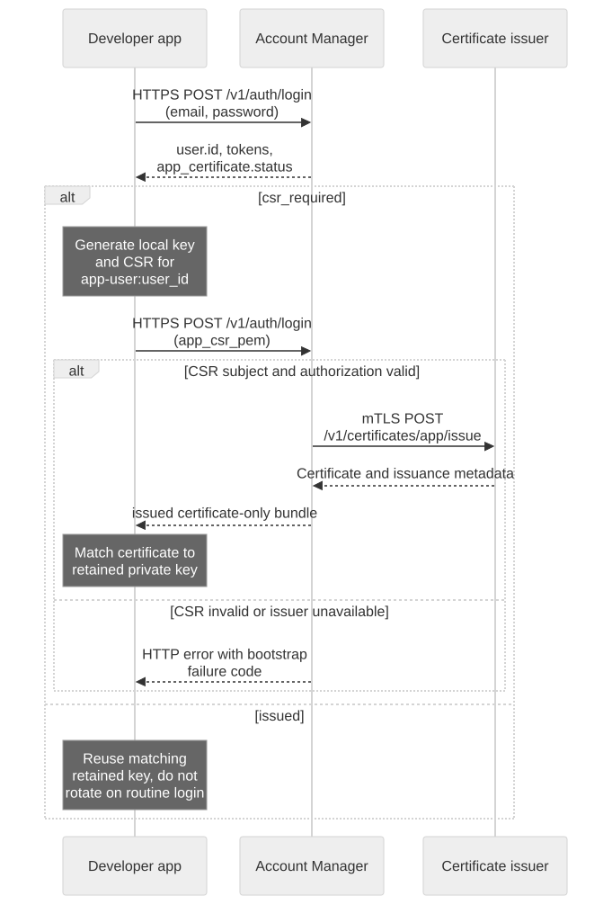
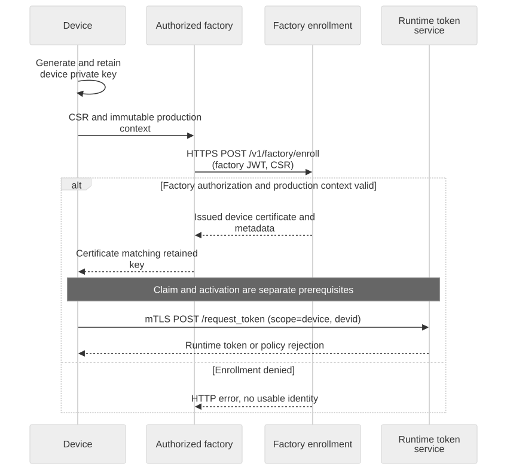

# Device and App Credential Setup

## Credential types and their destinations

Account access tokens serve Account Manager APIs. Device/app certificates bootstrap scoped runtime credentials; MQTT uses the runtime JWT, while signed HTTP Shadow uses its requested SigV4 bundle. The private keys remain on their owning clients. This diagram maps credential use, not the order of enrollment.



[Full-size block diagram](assets/credential-uses.svg) · [Mermaid source](assets/credential-uses.mmd)

## Goal and prerequisites

Prepare independent device and app credentials for the same authorized test device. You need a verified developer account with a password sign-in method, the Account Manager HTTPS origin, its CA trust chain, and a private tutorial directory from [Before You Start](before-you-start.en.md). SSO-only accounts should use their approved SDK/SSO bootstrap; this password example does not replace that flow.



[Open full-size diagram](assets/app-enrollment.svg) · [Mermaid source](assets/app-enrollment.mmd)

## Choose the correct identity

| Client | Bootstrap identity | Required handling |
| --- | --- | --- |
| Device firmware | Factory/device-enrolled certificate matching runtime `devid` | Retain the corresponding device private key; activation is a separate prerequisite |
| Developer's app simulation | Global user certificate with subject `app-user:<user_id>` | Follow the login/CSR steps below; roles are memberships, not certificate subjects |
| Consumer APP | APP end-user certificate, `app-end-user:<end_user_id>` | Use the APP end-user login/binding workflow; do not substitute a console user's identity |
| Trusted orchestration backend | Explicitly provisioned Video Cloud admin authority | See [Backend Integration](backend-integration.en.md); do not extract console session credentials |

## 1. Sign in and inspect the bootstrap status

This command-line exercise uses exportable local PEM files solely on a private development machine. Production mobile apps must use their platform key provider and certificate-only bundle, retaining a non-exportable key.

```bash
export ACCOUNT_BASE='https://accounts.example.test'
read -r -p 'Developer email: ' LOGIN_EMAIL
read -r -s -p 'Password: ' LOGIN_PASSWORD; printf '\n'
jq -n --arg email "$LOGIN_EMAIL" --arg password "$LOGIN_PASSWORD" \
  '{email:$email,password:$password}' > "$TUTORIAL_DIR/login-request.json"
unset LOGIN_PASSWORD
curl --fail-with-body --silent --show-error --cacert "$CA_FILE" \
  -H 'Content-Type: application/json' --data-binary @"$TUTORIAL_DIR/login-request.json" \
  "$ACCOUNT_BASE/v1/auth/login" > "$TUTORIAL_DIR/account-login.json"
export USER_ID="$(jq -er '.user.id' "$TUTORIAL_DIR/account-login.json")"
jq -er '.app_certificate.status' "$TUTORIAL_DIR/account-login.json"
```

`csr_required` means that login succeeded but no usable app certificate has been returned. It is not a runtime-token response. If the status is `issued`, reuse the matching locally retained key; verify its public key matches the returned leaf certificate. Do not generate a replacement key and silently pair it with an old certificate.

## 2. Generate a key and CSR when required

Run this step only for the first bootstrap when `csr_required` was returned and you have no existing matching key. OpenSSL must support EC P-256.

```bash
export APP_KEY="$TUTORIAL_DIR/app-key.pem"
openssl genpkey -algorithm EC -pkeyopt ec_paramgen_curve:P-256 -out "$APP_KEY"
openssl req -new -key "$APP_KEY" -subj "/CN=app-user:$USER_ID" \
  -out "$TUTORIAL_DIR/app.csr.pem"
jq --rawfile csr "$TUTORIAL_DIR/app.csr.pem" '. + {app_csr_pem:$csr}' \
  "$TUTORIAL_DIR/login-request.json" > "$TUTORIAL_DIR/login-csr-request.json"
curl --fail-with-body --silent --show-error --cacert "$CA_FILE" \
  -H 'Content-Type: application/json' --data-binary @"$TUTORIAL_DIR/login-csr-request.json" \
  "$ACCOUNT_BASE/v1/auth/login" > "$TUTORIAL_DIR/account-login.json"
jq -e '.app_certificate.status == "issued"' "$TUTORIAL_DIR/account-login.json"
export APP_CERT="$TUTORIAL_DIR/app-cert.pem"
jq -er '.app_certificate.certificate_pem' "$TUTORIAL_DIR/account-login.json" > "$APP_CERT"
jq -er '.app_certificate.certificate_chain_pem' "$TUTORIAL_DIR/account-login.json" \
  > "$TUTORIAL_DIR/app-chain.pem"
openssl pkey -in "$APP_KEY" -pubout -outform DER | openssl dgst -sha256
openssl x509 -in "$APP_CERT" -pubkey -noout | openssl pkey -pubin -outform DER | openssl dgst -sha256
```

The two public-key hashes must match. Verify the returned subject, certificate validity and issuance metadata. New SDK integrations should parse `certificate_bundle` and verify its identity/SPKI rather than reconstructing identity from filenames. The PEM fields above remain useful for the command-line tutorial. If the client needs an intermediate chain, supply the leaf followed by the returned intermediates as its client certificate file; keep the environment's server CA trust bundle separate.

Account Manager calls `POST /v1/certificates/app/issue` internally over service mTLS. Applications must not call the issuer directly. A CSR does not authorize choosing another user's subject or a signing CA.

## 3. Obtain the device credential through enrollment

Use the device certificate and matching private key already provisioned by the approved factory workflow, or an authorized short-lived test device bundle for a development exercise. A fresh hardware device generates/retains its key and supplies a CSR through the authenticated factory boundary `POST /v1/factory/enroll`. Factory authorization, production context and entitlement checks belong to that workflow; there is no unauthenticated developer certificate-minting endpoint.



[Open full-size diagram](assets/device-enrollment.svg) · [Mermaid source](assets/device-enrollment.mmd)

Set `DEVICE_CERT` and `DEVICE_KEY` to the supplied test PEM paths. Validate their matching public keys using the same OpenSSL comparison as above, and verify the certificate-derived identity matches `DEVICE_ID`. Do not make a self-signed certificate and assume the cloud trusts it. Do not copy a production device private key to an app or backend.

## 4. Exchange certificates for runtime credentials

Follow [Authentication and Access Control](authentication.en.md) to call the role-specific verified mTLS origins at `POST /request_token`, producing separate `device-token.json` and `app-token.json`. Request `aws_iot_data:true` for HTTP Shadow. Use the Account Manager token only for Account Manager APIs; use the issued runtime token for MQTT, and the returned SigV4 bundle for HTTP Shadow.

## Renewal, rotation and failures

A valid certificate can bootstrap another short-lived runtime token. Runtime token renewal does not renew an expiring certificate. When a global user's local key was deliberately replaced, the login contract supports `rotate_app_certificate:true` with a new valid `app_csr_pem`; this revokes previous active certificates for that global user, potentially affecting other app installations. Do not set rotation on routine login or retry.

A wrong CSR subject returns `app_certificate_csr_invalid`; an unavailable issuer may return `app_certificate_issuer_unavailable`. Resolve the underlying cause before retrying. For TLS failure verify hostname, trust chain, clock and key pairing; for runtime 403 verify device binding and service capabilities. Keep login/CSR response files private and delete the tutorial credentials when the exercise is over.

Next: [Set Up Your First Cloud and Device](setup-cloud-device.en.md) if activation is incomplete, otherwise [End-to-End App and Device Example](app-device-example.en.md).

For an architectural view of identity, account binding and runtime credentials, see [Ownership and Sharing](ownership-sharing.en.md).
