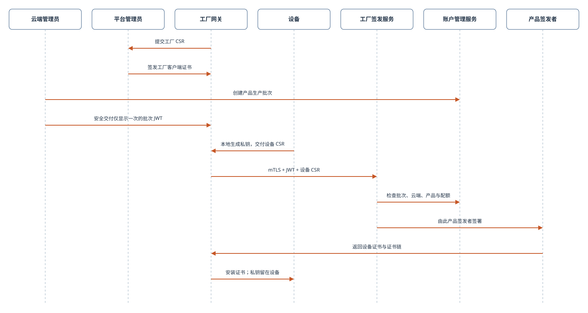

# 设定装置与应用程式凭证

## 凭证型别及其目的地

帐户访问令牌用于帐户管理器API。装置/应用程式证书引导范围内的执行时凭据；MQTT使用执行时JWT，而已签名的HTTP Shadow使用其请求的SigV4捆绑包。私钥仍然留在其所有者客户端上。此图表对映的是凭据的使用情况，而不是注册的顺序。



[全尺寸方块图](assets/credential-uses.zh-CN.svg) · [Mermaid 原始档](assets/credential-uses.zh-CN.mmd)

## 目标和先决条件

为同一授权测试装置准备独立装置和应用程式凭据。您需要一个具有密码登入方法的已验证开发者帐户、帐户管理器HTTPS来源、其CA信任链以及来自的私人教学目录。[开始之前](before-you-start.zh-CN.md).仅限SSO帐户应使用其已批准的SDK/SSO启动程式；此密码示例不能取代该流程。

[开启重新设计的序列图](assets/app-enrollment.zh-CN.html)

## 选择正确的身份

|客户|启动身份|所需处理|
| --- | --- | --- |
|装置韧体|工厂/装置注册证书匹配执行时`devid` |保留相应的装置私钥；启动是一个单独的先决条件|
|开发人员的应用程式模拟|带有主题的全球使用者证书`app-user:<user_id>` |请按照以下登入/CSR步骤操作；角色是会员资格，而不是证书主题|
|消费者应用程式|APP终端使用者证书，`app-end-user:<end_user_id>` |使用APP终端使用者登入/系结工作流程；不要替换控制台使用者的身份|
|值得信赖的协调后端|明确规定的影片云管理员许可权|看到[后端整合](backend-integration.zh-CN.md)；不要提取控制台会话凭据|

## 1. 登入并检查引导状态

此命令列练习仅在私人开发机器上使用可汇出的本地PEM档案。生产移动应用程式必须使用其平台金钥提供商和仅限证书的捆绑包，保留不可汇出的金钥。

```bash
export ACCOUNT_BASE='https://accounts.example.test'
read -r -p 'Developer email: ' LOGIN_EMAIL
read -r -s -p 'Password: ' LOGIN_PASSWORD; printf '\n'
jq -n --arg email "$LOGIN_EMAIL" --arg password "$LOGIN_PASSWORD" \
  '{email:$email,password:$password}' > "$TUTORIAL_DIR/login-request.json"
unset LOGIN_PASSWORD
curl --fail-with-body --silent --show-error --cacert "$CA_FILE" \
  -H 'Content-Type: application/json' --data-binary @"$TUTORIAL_DIR/login-request.json" \
  "$ACCOUNT_BASE/v1/auth/login" > "$TUTORIAL_DIR/account-login.json"
export USER_ID="$(jq -er '.user.id' "$TUTORIAL_DIR/account-login.json")"
jq -er '.app_certificate.status' "$TUTORIAL_DIR/account-login.json"
```

`csr_required`表示登入成功，但没有返回可用应用程式证书。这不是执行时令牌响应。如果状态是`issued`，重复使用本地保留的匹配金钥；验证其公钥是否与返回的叶子证书匹配。不要生成替换金钥，并静默地将其与旧证书配对。

## 2. 根据需要生成金钥和CSR

仅在第一次引导时执行此步骤，当`csr_required`已返回，您没有现有的匹配金钥。OpenSSL必须支援EC P-256。

```bash
export APP_KEY="$TUTORIAL_DIR/app-key.pem"
openssl genpkey -algorithm EC -pkeyopt ec_paramgen_curve:P-256 -out "$APP_KEY"
openssl req -new -key "$APP_KEY" -subj "/CN=app-user:$USER_ID" \
  -out "$TUTORIAL_DIR/app.csr.pem"
jq --rawfile csr "$TUTORIAL_DIR/app.csr.pem" '. + {app_csr_pem:$csr}' \
  "$TUTORIAL_DIR/login-request.json" > "$TUTORIAL_DIR/login-csr-request.json"
curl --fail-with-body --silent --show-error --cacert "$CA_FILE" \
  -H 'Content-Type: application/json' --data-binary @"$TUTORIAL_DIR/login-csr-request.json" \
  "$ACCOUNT_BASE/v1/auth/login" > "$TUTORIAL_DIR/account-login.json"
jq -e '.app_certificate.status == "issued"' "$TUTORIAL_DIR/account-login.json"
export APP_CERT="$TUTORIAL_DIR/app-cert.pem"
jq -er '.app_certificate.certificate_pem' "$TUTORIAL_DIR/account-login.json" > "$APP_CERT"
jq -er '.app_certificate.certificate_chain_pem' "$TUTORIAL_DIR/account-login.json" \
  > "$TUTORIAL_DIR/app-chain.pem"
openssl pkey -in "$APP_KEY" -pubout -outform DER | openssl dgst -sha256
openssl x509 -in "$APP_CERT" -pubkey -noout | openssl pkey -pubin -outform DER | openssl dgst -sha256
```

两个公共金钥杂凑值必须匹配。验证返回的主体、证书有效期和发行元资料。新的SDK整合应解析`certificate_bundle`并验证其身份/SPKI，而不是从档名中重建身份。上述PEM栏位仍然对命令列教学有用。如果客户端需要一个中间链，请将叶节尾随返回的中间链作为其客户端证书档案提供；请将环境的伺服器CA信任捆绑单独保留。

客户经理致电`POST /v1/certificates/app/issue`在服务mTLS内部。应用程式不得直接呼叫发布端。CSR不授权选择另一个使用者的主体或签名CA。

## 3.透过注册获得装置凭证

**正式量产流程：**[查看工厂签发时序图](assets/factory-enrollment-formal.zh-CN.html)。图中分别标示工厂 mTLS 证书、产品生产批次 JWT、设备 CSR、配额检查及产品专属签发者。Cloud Test Lab 是简化的开发测试流程，**不可用于量产**。



正式设备应使用经授权工厂流程签发的设备证书与对应私钥。开发测试则可使用短期测试设备证书。新设备通过受保护的工厂注册服务提交 CSR；单凭 CSR 不能取得证书。

工厂设备的签发流程：

1. 由对目标云和产品具有设备管理权限的用户，通过 Account Manager 创建生产批次。取得有期限的生产批次授权 JWT 后，应安全地交给获准的工厂网关，不可写入设备固件。
2. 在设备上生成私钥与 CSR，私钥保留在设备内。CSR 的主体 CN 必须与设备 ID（`devid`）相同。
3. 获准的工厂网关须使用平台签发的工厂客户端证书及私钥，调用 `POST {FACTORY_ENROLL_URL}/v1/factory/enroll`，以 `Authorization: Bearer <生产批次 JWT>` 传入授权，并在 JSON 中提供 `request_id`、`devid` 与 `csr_pem`。若另提供 `service_options`，其内容必须与生产批次一致。各产品共用服务入口；JWT 将请求绑定到特定云和产品，由该产品的证书签发者处理。公开入口启用后，可在产品页面获取完整 HTTPS 网址；管理后台网址不是签发入口。
4. 将返回的设备证书和证书链安装到持有对应私钥的设备。设备激活与账户绑定仍须另外完成。

成功时，服务会返回已签发的证书与证书包；安装前请核对设备身份及证书链。开发测试设备请使用 Cloud Test Lab，无须走工厂生产流程。

经授权的工厂网关可依下例提交单台设备 CSR。`FACTORY_ENROLL_ENDPOINT` 应填写产品页面显示的完整网址。工厂客户端私钥与批次 JWT 应留在网关；重试同一设备请求时请沿用相同的 `request_id`。

```bash
jq -n --arg request_id "$REQUEST_ID" --arg devid "$DEVICE_ID" \
  --rawfile csr_pem "$DEVICE_CSR" \
  '{request_id:$request_id,devid:$devid,csr_pem:$csr_pem}' > "$REQUEST_JSON"
curl --fail-with-body --silent --show-error \
  --cacert "$SERVER_CA" --cert "$FACTORY_CERT" --key "$FACTORY_KEY" \
  -H "Authorization: Bearer $PRODUCTION_RUN_JWT" \
  -H 'Content-Type: application/json' --data-binary @"$REQUEST_JSON" \
  "$FACTORY_ENROLL_ENDPOINT" > "$CERTIFICATE_RESPONSE"
```

[开启重新设计的序列图](assets/device-enrollment.zh-CN.html)

设定`DEVICE_CERT`与`DEVICE_KEY`到提供的测试PEM路径。使用与上述相同的OpenSSL比较验证它们的匹配公钥，并验证证书衍生的身份匹配`DEVICE_ID`。不要自签证书，并假设云信任它。不要将生产装置的私钥复制到应用程式或后端。

## 4. 交换证书以获得执行时凭据

关注[身分验证与存取控制](authentication.zh-CN.md)呼叫特定角色验证的mTLS来源`POST /request_token`，产生单独的`device-token.json`与`app-token.json`。 请求`aws_iot_data:true`对于HTTP Shadow。仅将帐户管理器令牌用于帐户管理器API；将发行的执行时令牌用于MQTT，并将返回的SigV4捆绑包用于HTTP Shadow。

## 续订、轮换和故障

有效的证书可以引导另一个短命的执行时令牌。执行时令牌续订不会续订到期证书。当全球使用者的本地金钥被故意替换时，登入契约支援`rotate_app_certificate:true`带有一个新的有效`app_csr_pem`；这会撤销该全球使用者的以前有效证书，可能会影响其他应用程式安装。请勿在例行登入或重试时设定轮换。

错误的CSR主题返回`app_certificate_csr_invalid`；不可用的发布端可能会退货`app_certificate_issuer_unavailable`. 在重试之前解决根本原因。对于TLS失败，请验证主机名、信任链、时钟和金钥配对；对于执行时403，请验证装置系结和服务功能。请将登入/CSR响应档案保密，并在练习结束后删除教学凭据。

下一个：[建立第一个云端与装置](setup-cloud-device.zh-CN.md)如果启动不完整，否则[端到端应用程式与装置范例](app-device-example.zh-CN.md).

有关身份、帐户系结和执行时凭证的体系结构检视，请参阅[所有权和共享](ownership-sharing.zh-CN.md).
