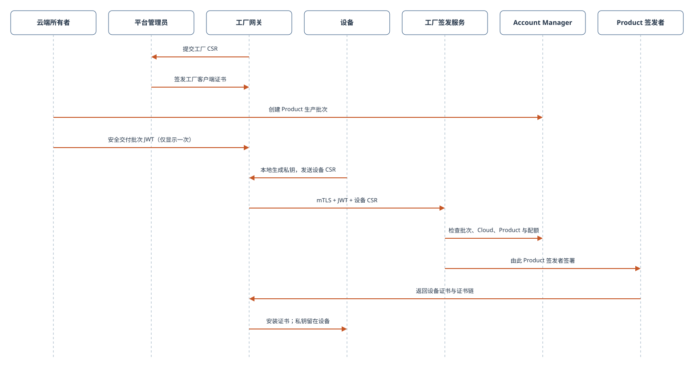

# 配置设备与 App 证书

## 凭证的类型与用途

账号访问令牌用于调用 Account Manager API。设备与 App 证书用于获取限定授权范围的运行时凭证；MQTT 使用运行时 JWT，HTTP Shadow 签名则使用请求获取的 SigV4 凭证包。私钥须保留在所属客户端。下图整理了各类凭证的用途，并非注册流程的先后顺序。



[查看完整架构图](assets/credential-uses.zh-CN.svg) · [Mermaid 源码](assets/credential-uses.zh-CN.mmd)

## 目标与准备工作

为同一个已授权测试设备，分别准备设备与 App 的凭证。你需要已完成验证、可使用密码登录的开发者账号、Account Manager 的 HTTPS 源地址和 CA 信任链，以及[开始之前](before-you-start.zh-CN.md)创建的私有教程目录。仅支持 SSO 的账号，应使用经批准的 SDK／SSO 初始化流程；本密码登录示例不能替代该流程。

[打开 App 证书注册时序图](assets/app-enrollment.zh-CN.html)

## 选择正确的身份

| 客户端 | 首次获取凭证时使用的身份 | 注意事项 |
| --- | --- | --- |
| 设备固件 | 通过工厂或设备注册获取，且与运行时 `devid` 一致的证书 | 保留对应设备私钥；设备激活是另一项必要条件 |
| 开发者模拟的 App | 主体为 `app-user:<user_id>` 的全局用户证书 | 按下列登录／CSR 步骤操作；角色由成员资格决定，不是证书主体 |
| 消费者 APP | APP 终端用户证书：`app-end-user:<end_user_id>` | 使用 APP 终端用户登录与绑定流程，不可用控制台用户身份代替 |
| 受信任的流程编排后端 | 明确授予的 Video Cloud 管理员权限 | 参阅[后端集成](backend-integration.zh-CN.md)；不要提取控制台会话凭证 |

## 1. 登录并检查证书初始化状态

本命令行练习仅在私有开发机器上使用可导出的本地 PEM 文件。生产移动 App 必须使用平台密钥提供程序以及仅含证书的证书包，并保留不可导出的私钥。

```bash
export ACCOUNT_BASE='https://accounts.example.test'
read -r -p 'Developer email: ' LOGIN_EMAIL
read -r -s -p 'Password: ' LOGIN_PASSWORD; printf '\n'
jq -n --arg email "$LOGIN_EMAIL" --arg password "$LOGIN_PASSWORD" \
  '{email:$email,password:$password}' > "$TUTORIAL_DIR/login-request.json"
unset LOGIN_PASSWORD
curl --fail-with-body --silent --show-error --cacert "$CA_FILE" \
  -H 'Content-Type: application/json' --data-binary @"$TUTORIAL_DIR/login-request.json" \
  "$ACCOUNT_BASE/v1/auth/login" > "$TUTORIAL_DIR/account-login.json"
export USER_ID="$(jq -er '.user.id' "$TUTORIAL_DIR/account-login.json")"
jq -er '.app_certificate.status' "$TUTORIAL_DIR/account-login.json"
```

`csr_required` 表示登录成功，但尚未返回可用的 App 证书；这不是运行时令牌的响应。如果状态为 `issued`，请复用本地保留的对应密钥，并确认其公钥与返回的终端证书一致。不要生成新密钥后，在未检查的情况下与旧证书配对。

## 2. 必要时生成密钥与 CSR

仅在首次初始化时收到 `csr_required`，且没有现有对应密钥的情况下，才执行此步骤。OpenSSL 必须支持 EC P-256。

```bash
export APP_KEY="$TUTORIAL_DIR/app-key.pem"
openssl genpkey -algorithm EC -pkeyopt ec_paramgen_curve:P-256 -out "$APP_KEY"
openssl req -new -key "$APP_KEY" -subj "/CN=app-user:$USER_ID" \
  -out "$TUTORIAL_DIR/app.csr.pem"
jq --rawfile csr "$TUTORIAL_DIR/app.csr.pem" '. + {app_csr_pem:$csr}' \
  "$TUTORIAL_DIR/login-request.json" > "$TUTORIAL_DIR/login-csr-request.json"
curl --fail-with-body --silent --show-error --cacert "$CA_FILE" \
  -H 'Content-Type: application/json' --data-binary @"$TUTORIAL_DIR/login-csr-request.json" \
  "$ACCOUNT_BASE/v1/auth/login" > "$TUTORIAL_DIR/account-login.json"
jq -e '.app_certificate.status == "issued"' "$TUTORIAL_DIR/account-login.json"
export APP_CERT="$TUTORIAL_DIR/app-cert.pem"
jq -er '.app_certificate.certificate_pem' "$TUTORIAL_DIR/account-login.json" > "$APP_CERT"
jq -er '.app_certificate.certificate_chain_pem' "$TUTORIAL_DIR/account-login.json" \
  > "$TUTORIAL_DIR/app-chain.pem"
openssl pkey -in "$APP_KEY" -pubout -outform DER | openssl dgst -sha256
openssl x509 -in "$APP_CERT" -pubkey -noout | openssl pkey -pubin -outform DER | openssl dgst -sha256
```

两个公钥的哈希值必须相同。请验证返回的证书主体、有效期和签发元数据。新的 SDK 集成应解析 `certificate_bundle` 并验证其中的身份与 SPKI，不要从文件名推导身份。上述 PEM 字段仍可用于命令行教程。如果客户端需要中间证书链，请将终端证书放在前面，再接上返回的中间证书，作为客户端证书文件；环境的服务器 CA 信任证书包须单独保留。

Account Manager 会在内部通过服务间 mTLS 调用 `POST /v1/certificates/app/issue`。应用不可直接调用证书签发服务。持有 CSR 并不代表有权指定其他用户的主体或选择签名 CA。

## 3. 通过注册获取设备证书

**正式量产流程：**[查看工厂签发时序图](assets/factory-enrollment-formal.zh-CN.html)。图中分别标示工厂 mTLS 证书、产品生产批次 JWT、设备 CSR、配额检查以及产品专属签发者。Cloud Test Lab 是简化的开发测试流程，**不可用于量产**。



请使用经批准工厂流程预配的设备证书与对应私钥；开发练习可使用经授权的短期测试设备证书包。新硬件设备应自行生成并保留密钥，通过受身份验证保护的工厂接口 `POST /v1/factory/enroll` 提交 CSR。工厂授权、生产批次信息和服务使用权检查都属于该流程；不存在供开发者未经验证即可签发证书的端点。

工厂设备的处理流程：

1. 具有目标 Cloud 与 Product 设备管理权限的用户，通过 Account Manager 创建生产批次。获取的短期生产批次 JWT 是工厂凭证，应安全交付经批准的工厂网关，不可放入设备固件。
2. 在设备上生成私钥与 CSR，并将私钥保留在设备内。CSR 主体的 CN 必须等于设备的 `devid`。
3. 从获准的网关使用平台签发的客户端证书与密钥，发送 `POST {FACTORY_ENROLL_URL}/v1/factory/enroll`。请求须携带 `Authorization: Bearer <production-run JWT>`，JSON 内容包含 `request_id`、`devid` 和 `csr_pem`。如果包含 `service_options`，必须与生产批次一致。各产品共用服务 URL；JWT 会将请求绑定至一个 Cloud 与 Product，并选定该产品的证书签发者。公开网关启用后，可在产品页面找到完整 HTTPS URL；Admin Console 的 URL 不是注册服务地址。
4. 安装返回的设备证书、证书链与对应私钥。设备激活与账号绑定须另行完成。

成功响应会包含已签名证书与证书包；安装前，请验证返回的设备身份与证书链。仅凭 CSR 不代表有权签发设备证书。仅用于开发的设备应使用 Cloud Test Lab，而非工厂流程。

经授权的工厂网关可按以下示例提交一个设备 CSR。请将 `FACTORY_ENROLL_ENDPOINT` 设为产品页面显示的完整 URL。工厂客户端私钥与批次 JWT 必须留在网关上；重试同一设备请求时，复用相同的 `request_id`。

```bash
jq -n --arg request_id "$REQUEST_ID" --arg devid "$DEVICE_ID" \
  --rawfile csr_pem "$DEVICE_CSR" \
  '{request_id:$request_id,devid:$devid,csr_pem:$csr_pem}' > "$REQUEST_JSON"
curl --fail-with-body --silent --show-error \
  --cacert "$SERVER_CA" --cert "$FACTORY_CERT" --key "$FACTORY_KEY" \
  -H "Authorization: Bearer $PRODUCTION_RUN_JWT" \
  -H 'Content-Type: application/json' --data-binary @"$REQUEST_JSON" \
  "$FACTORY_ENROLL_ENDPOINT" > "$CERTIFICATE_RESPONSE"
```

[打开设备注册时序图](assets/device-enrollment.zh-CN.html)

将 `DEVICE_CERT` 和 `DEVICE_KEY` 设为提供的测试 PEM 文件路径。使用上方相同的 OpenSSL 方法比对公钥，并确认从证书获取的身份与 `DEVICE_ID` 一致。不要自行创建自签名证书并假设云端会信任它，也不要将生产设备私钥复制到 App 或后端。

## 4. 使用证书获取运行时凭证

按照[身份验证与访问控制](authentication.zh-CN.md)，向对应角色且已确认的 mTLS 源地址调用 `POST /request_token`，分别获取 `device-token.json` 和 `app-token.json`。HTTP Shadow 需要传入 `aws_iot_data:true`。Account Manager 令牌仅用于 Account Manager API；MQTT 使用签发的运行时令牌，HTTP Shadow 则使用返回的 SigV4 凭证包。

## 更新、轮换与失败处理

有效证书可用于获取新的短期运行时令牌，但刷新令牌不会延长证书有效期。如果主动替换全局用户的本地密钥，登录接口支持传入 `rotate_app_certificate:true` 和新的有效 `app_csr_pem`。这会吊销该全局用户此前仍有效的证书，可能影响其他 App 安装。普通登录或重试时，不要启用证书轮换。

CSR 主体错误时会返回 `app_certificate_csr_invalid`；签发服务不可用时，可能返回 `app_certificate_issuer_unavailable`。请先排除原因再重试。TLS 失败时，检查主机名、信任链、系统时间与密钥配对；运行时收到 403 时，检查设备绑定与服务功能。登录与 CSR 响应文件应妥善保密，练习结束后删除教程使用的凭证。

下一步：如果设备尚未激活，请阅读[创建第一个云与设备](setup-cloud-device.zh-CN.md)；否则可运行 [App 与设备端到端示例](app-device-example.zh-CN.md)。

有关身份、账号绑定与运行时凭证的架构说明，请参阅[所有权与共享](ownership-sharing.zh-CN.md)。
