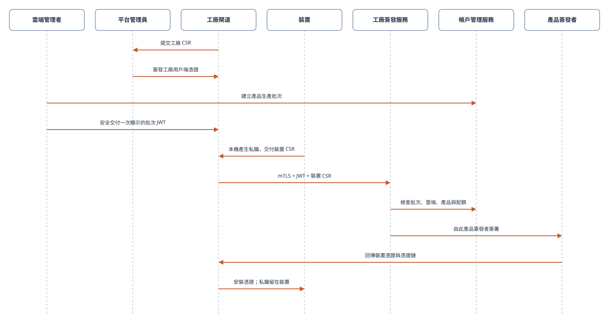

# 設定裝置與應用程式憑證

## 憑證型別及其目的地

帳戶訪問令牌用於帳戶管理器API。裝置/應用程式證書引導範圍內的執行時憑據；MQTT使用執行時JWT，而已簽名的HTTP Shadow使用其請求的SigV4捆綁包。私鑰仍然留在其所有者客戶端上。此圖表對映的是憑據的使用情況，而不是註冊的順序。



[全尺寸方塊圖](assets/credential-uses.zh-TW.svg) · [Mermaid 原始檔](assets/credential-uses.zh-TW.mmd)

## 目標和先決條件

為同一授權測試裝置準備獨立裝置和應用程式憑據。您需要一個具有密碼登入方法的已驗證開發者帳戶、帳戶管理器HTTPS來源、其CA信任鏈以及來自的私人教學目錄。[開始之前](before-you-start.zh-TW.md).僅限SSO帳戶應使用其已批准的SDK/SSO啟動程式；此密碼示例不能取代該流程。

[開啟重新設計的序列圖](assets/app-enrollment.zh-TW.html)

## 選擇正確的身份

|客戶|啟動身份|所需處理|
| --- | --- | --- |
|裝置韌體|工廠/裝置註冊證書匹配執行時`devid` |保留相應的裝置私鑰；啟動是一個單獨的先決條件|
|開發人員的應用程式模擬|帶有主題的全球使用者證書`app-user:<user_id>` |請按照以下登入/CSR步驟操作；角色是會員資格，而不是證書主題|
|消費者應用程式|APP終端使用者證書，`app-end-user:<end_user_id>` |使用APP終端使用者登入/繫結工作流程；不要替換控制檯使用者的身份|
|值得信賴的協調後端|明確規定的影片雲管理員許可權|看到[後端整合](backend-integration.zh-TW.md)；不要提取控制檯會話憑據|

## 1. 登入並檢查引導狀態

此命令列練習僅在私人開發機器上使用可匯出的本地PEM檔案。生產移動應用程式必須使用其平臺金鑰提供商和僅限證書的捆綁包，保留不可匯出的金鑰。

```bash
export ACCOUNT_BASE='https://accounts.example.test'
read -r -p 'Developer email: ' LOGIN_EMAIL
read -r -s -p 'Password: ' LOGIN_PASSWORD; printf '\n'
jq -n --arg email "$LOGIN_EMAIL" --arg password "$LOGIN_PASSWORD" \
  '{email:$email,password:$password}' > "$TUTORIAL_DIR/login-request.json"
unset LOGIN_PASSWORD
curl --fail-with-body --silent --show-error --cacert "$CA_FILE" \
  -H 'Content-Type: application/json' --data-binary @"$TUTORIAL_DIR/login-request.json" \
  "$ACCOUNT_BASE/v1/auth/login" > "$TUTORIAL_DIR/account-login.json"
export USER_ID="$(jq -er '.user.id' "$TUTORIAL_DIR/account-login.json")"
jq -er '.app_certificate.status' "$TUTORIAL_DIR/account-login.json"
```

`csr_required`表示登入成功，但沒有返回可用應用程式證書。這不是執行時令牌響應。如果狀態是`issued`，重複使用本地保留的匹配金鑰；驗證其公鑰是否與返回的葉子證書匹配。不要生成替換金鑰，並靜默地將其與舊證書配對。

## 2. 根據需要生成金鑰和CSR

僅在第一次引導時執行此步驟，當`csr_required`已返回，您沒有現有的匹配金鑰。OpenSSL必須支援EC P-256。

```bash
export APP_KEY="$TUTORIAL_DIR/app-key.pem"
openssl genpkey -algorithm EC -pkeyopt ec_paramgen_curve:P-256 -out "$APP_KEY"
openssl req -new -key "$APP_KEY" -subj "/CN=app-user:$USER_ID" \
  -out "$TUTORIAL_DIR/app.csr.pem"
jq --rawfile csr "$TUTORIAL_DIR/app.csr.pem" '. + {app_csr_pem:$csr}' \
  "$TUTORIAL_DIR/login-request.json" > "$TUTORIAL_DIR/login-csr-request.json"
curl --fail-with-body --silent --show-error --cacert "$CA_FILE" \
  -H 'Content-Type: application/json' --data-binary @"$TUTORIAL_DIR/login-csr-request.json" \
  "$ACCOUNT_BASE/v1/auth/login" > "$TUTORIAL_DIR/account-login.json"
jq -e '.app_certificate.status == "issued"' "$TUTORIAL_DIR/account-login.json"
export APP_CERT="$TUTORIAL_DIR/app-cert.pem"
jq -er '.app_certificate.certificate_pem' "$TUTORIAL_DIR/account-login.json" > "$APP_CERT"
jq -er '.app_certificate.certificate_chain_pem' "$TUTORIAL_DIR/account-login.json" \
  > "$TUTORIAL_DIR/app-chain.pem"
openssl pkey -in "$APP_KEY" -pubout -outform DER | openssl dgst -sha256
openssl x509 -in "$APP_CERT" -pubkey -noout | openssl pkey -pubin -outform DER | openssl dgst -sha256
```

兩個公共金鑰雜湊值必須匹配。驗證返回的主體、證書有效期和發行元資料。新的SDK整合應解析`certificate_bundle`並驗證其身份/SPKI，而不是從檔名中重建身份。上述PEM欄位仍然對命令列教學有用。如果客戶端需要一個中間鏈，請將葉節尾隨返回的中間鏈作為其客戶端證書檔案提供；請將環境的伺服器CA信任捆綁單獨保留。

客戶經理致電`POST /v1/certificates/app/issue`在服務mTLS內部。應用程式不得直接呼叫發布端。CSR不授權選擇另一個使用者的主體或簽名CA。

## 3.透過註冊獲得裝置憑證

**正式量產流程：**[查看工廠簽發時序圖](assets/factory-enrollment-formal.zh-TW.html)。圖中分別標示工廠 mTLS 憑證、產品生產批次 JWT、裝置 CSR、配額檢查及產品專屬簽發者。Cloud Test Lab 是簡化的開發測試流程，**不可用於量產**。



正式裝置應使用經授權工廠流程簽發的裝置憑證與對應私鑰。開發測試則可使用短期測試裝置憑證。新裝置透過受保護的工廠註冊服務提交 CSR；單憑 CSR 不能取得憑證。

工廠裝置的簽發流程：

1. 由對目標雲端與產品具有裝置管理權限的使用者，透過 Account Manager 建立生產批次。取得有期限的生產批次授權 JWT 後，應安全地交給核准的工廠閘道，不可寫入裝置韌體。
2. 在裝置上產生私鑰與 CSR，私鑰留在裝置內。CSR 的主體 CN 必須與裝置 ID（`devid`）相同。
3. 核准的工廠閘道須使用平台簽發的工廠用戶端憑證及私鑰，呼叫 `POST {FACTORY_ENROLL_URL}/v1/factory/enroll`，以 `Authorization: Bearer <生產批次 JWT>` 傳入授權，並在 JSON 中提供 `request_id`、`devid` 與 `csr_pem`。若另提供 `service_options`，其內容必須與生產批次相符。各產品共用服務入口；JWT 將請求綁定到特定雲端與產品，由該產品的憑證簽發者處理。公開入口啟用後，可在產品頁面取得完整 HTTPS 網址；管理後台網址不是簽發入口。
4. 將回傳的裝置憑證和憑證鏈安裝到持有對應私鑰的裝置。裝置啟用與帳戶綁定仍須另外完成。

成功時，服務會回傳已簽發的憑證與憑證組合；安裝前請核對裝置身分及憑證鏈。開發測試裝置請使用 Cloud Test Lab，不需走工廠生產流程。

經授權的工廠閘道可依下例提交單一裝置 CSR。`FACTORY_ENROLL_ENDPOINT` 應填入產品頁面顯示的完整網址。工廠用戶端私鑰與批次 JWT 應留在閘道；重試同一裝置請沿用相同的 `request_id`。

```bash
jq -n --arg request_id "$REQUEST_ID" --arg devid "$DEVICE_ID" \
  --rawfile csr_pem "$DEVICE_CSR" \
  '{request_id:$request_id,devid:$devid,csr_pem:$csr_pem}' > "$REQUEST_JSON"
curl --fail-with-body --silent --show-error \
  --cacert "$SERVER_CA" --cert "$FACTORY_CERT" --key "$FACTORY_KEY" \
  -H "Authorization: Bearer $PRODUCTION_RUN_JWT" \
  -H 'Content-Type: application/json' --data-binary @"$REQUEST_JSON" \
  "$FACTORY_ENROLL_ENDPOINT" > "$CERTIFICATE_RESPONSE"
```

[開啟重新設計的序列圖](assets/device-enrollment.zh-TW.html)

設定`DEVICE_CERT`與`DEVICE_KEY`到提供的測試PEM路徑。使用與上述相同的OpenSSL比較驗證它們的匹配公鑰，並驗證證書衍生的身份匹配`DEVICE_ID`。不要自簽證書，並假設雲信任它。不要將生產裝置的私鑰複製到應用程式或後端。

## 4. 交換證書以獲得執行時憑據

關注[身分驗證與存取控制](authentication.zh-TW.md)呼叫特定角色驗證的mTLS來源`POST /request_token`，產生單獨的`device-token.json`與`app-token.json`。 請求`aws_iot_data:true`對於HTTP Shadow。僅將帳戶管理器令牌用於帳戶管理器API；將發行的執行時令牌用於MQTT，並將返回的SigV4捆綁包用於HTTP Shadow。

## 續訂、輪換和故障

有效的證書可以引導另一個短命的執行時令牌。執行時令牌續訂不會續訂到期證書。當全球使用者的本地金鑰被故意替換時，登入契約支援`rotate_app_certificate:true`帶有一個新的有效`app_csr_pem`；這會撤銷該全球使用者的以前有效證書，可能會影響其他應用程式安裝。請勿在例行登入或重試時設定輪換。

錯誤的CSR主題返回`app_certificate_csr_invalid`；不可用的發布端可能會退貨`app_certificate_issuer_unavailable`. 在重試之前解決根本原因。對於TLS失敗，請驗證主機名、信任鏈、時鐘和金鑰配對；對於執行時403，請驗證裝置繫結和服務功能。請將登入/CSR響應檔案保密，並在練習結束後刪除教學憑據。

下一個：[建立第一個雲端與裝置](setup-cloud-device.zh-TW.md)如果啟動不完整，否則[端到端應用程式與裝置範例](app-device-example.zh-TW.md).

有關身份、帳戶繫結和執行時憑證的體系結構檢視，請參閱[所有權和共享](ownership-sharing.zh-TW.md).
