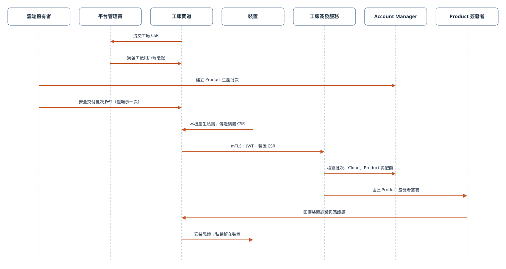

# 設定裝置與 App 憑證

## 驗證資訊的類型與用途

帳號存取 token 用於呼叫 Account Manager API。裝置與 App 憑證用來取得限定授權範圍的執行階段驗證資訊；MQTT 使用執行階段 JWT，HTTP Shadow 簽章則使用請求取得的 SigV4 憑證包。私鑰須保留在所屬用戶端。下圖整理各類驗證資訊的用途，並非註冊流程的先後順序。


[檢視完整架構圖](assets/credential-uses.zh-TW.svg) · [Mermaid 原始碼](assets/credential-uses.zh-TW.mmd)

## 目標與事前準備

為同一個已授權測試裝置，分別準備裝置與 App 的驗證資訊。你需要已完成驗證、可使用密碼登入的開發者帳號、Account Manager 的 HTTPS 來源位址及 CA 信任鏈，以及[開始之前](before-you-start.zh-TW.md)建立的私人教學目錄。只能使用 SSO 的帳號，應使用經核准的 SDK／SSO 初始化流程；本密碼登入範例不能取代該流程。

[開啟 App 憑證註冊時序圖](assets/app-enrollment.zh-TW.html)

## 選擇正確的身分

| 用戶端 | 初次取得驗證資訊時使用的身分 | 注意事項 |
| --- | --- | --- |
| 裝置韌體 | 透過工廠或裝置註冊取得，且符合執行階段 `devid` 的憑證 | 保留對應裝置私鑰；裝置啟用是另一項必要條件 |
| 開發者模擬的 App | 主體為 `app-user:<user_id>` 的全域使用者憑證 | 依下列登入／CSR 步驟操作；角色由成員資格決定，不是憑證主體 |
| 消費者 APP | APP 終端使用者憑證：`app-end-user:<end_user_id>` | 使用 APP 終端使用者登入與綁定流程，不可用控制台使用者身分代替 |
| 受信任的流程協調後端 | 明確授予的 Video Cloud 管理員權限 | 參閱[後端整合](backend-integration.zh-TW.md)；不要擷取控制台工作階段的驗證資訊 |

## 1. 登入並檢查憑證初始化狀態

本命令列練習只在私人開發機器上使用可匯出的本機 PEM 檔案。正式行動 App 必須使用平台金鑰提供者與僅含憑證的憑證包，並保留不可匯出的私鑰。

```bash
export ACCOUNT_BASE='https://accounts.example.test'
read -r -p 'Developer email: ' LOGIN_EMAIL
read -r -s -p 'Password: ' LOGIN_PASSWORD; printf '\n'
jq -n --arg email "$LOGIN_EMAIL" --arg password "$LOGIN_PASSWORD" \
  '{email:$email,password:$password}' > "$TUTORIAL_DIR/login-request.json"
unset LOGIN_PASSWORD
curl --fail-with-body --silent --show-error --cacert "$CA_FILE" \
  -H 'Content-Type: application/json' --data-binary @"$TUTORIAL_DIR/login-request.json" \
  "$ACCOUNT_BASE/v1/auth/login" > "$TUTORIAL_DIR/account-login.json"
export USER_ID="$(jq -er '.user.id' "$TUTORIAL_DIR/account-login.json")"
jq -er '.app_certificate.status' "$TUTORIAL_DIR/account-login.json"
```

`csr_required` 表示登入成功，但尚未回傳可用的 App 憑證；這不是執行階段 token 的回應。若狀態為 `issued`，請重用本機保留的對應金鑰，並確認其公鑰符合回傳的終端憑證。不要產生新金鑰後，在未檢查的情況下與舊憑證配對。

## 2. 必要時產生金鑰與 CSR

只有初次初始化時收到 `csr_required`，且沒有既有的對應金鑰，才執行此步驟。OpenSSL 必須支援 EC P-256。

```bash
export APP_KEY="$TUTORIAL_DIR/app-key.pem"
openssl genpkey -algorithm EC -pkeyopt ec_paramgen_curve:P-256 -out "$APP_KEY"
openssl req -new -key "$APP_KEY" -subj "/CN=app-user:$USER_ID" \
  -out "$TUTORIAL_DIR/app.csr.pem"
jq --rawfile csr "$TUTORIAL_DIR/app.csr.pem" '. + {app_csr_pem:$csr}' \
  "$TUTORIAL_DIR/login-request.json" > "$TUTORIAL_DIR/login-csr-request.json"
curl --fail-with-body --silent --show-error --cacert "$CA_FILE" \
  -H 'Content-Type: application/json' --data-binary @"$TUTORIAL_DIR/login-csr-request.json" \
  "$ACCOUNT_BASE/v1/auth/login" > "$TUTORIAL_DIR/account-login.json"
jq -e '.app_certificate.status == "issued"' "$TUTORIAL_DIR/account-login.json"
export APP_CERT="$TUTORIAL_DIR/app-cert.pem"
jq -er '.app_certificate.certificate_pem' "$TUTORIAL_DIR/account-login.json" > "$APP_CERT"
jq -er '.app_certificate.certificate_chain_pem' "$TUTORIAL_DIR/account-login.json" \
  > "$TUTORIAL_DIR/app-chain.pem"
openssl pkey -in "$APP_KEY" -pubout -outform DER | openssl dgst -sha256
openssl x509 -in "$APP_CERT" -pubkey -noout | openssl pkey -pubin -outform DER | openssl dgst -sha256
```

兩個公鑰的雜湊值必須相同。請驗證回傳的憑證主體、效期與簽發中繼資料。新的 SDK 整合應解析 `certificate_bundle` 並驗證其中的身分與 SPKI，不要從檔名推導身分。上述 PEM 欄位仍可用於命令列教學。若用戶端需要中繼憑證鏈，請將終端憑證放在前面，再接上回傳的中繼憑證，作為用戶端憑證檔案；環境的伺服器 CA 信任憑證包須另外保留。

Account Manager 會在內部透過服務間 mTLS 呼叫 `POST /v1/certificates/app/issue`。應用程式不可直接呼叫憑證簽發服務。持有 CSR 並不代表有權指定其他使用者的主體或選擇簽署 CA。

## 3. 透過註冊取得裝置憑證

**正式量產流程：**[檢視工廠簽發時序圖](assets/factory-enrollment-formal.zh-TW.html)。圖中分別標示工廠 mTLS 憑證、產品生產批次 JWT、裝置 CSR、配額檢查及產品專屬簽發者。Cloud Test Lab 是簡化的開發測試流程，**不可用於量產**。



請使用經核准工廠流程佈建的裝置憑證與對應私鑰；開發練習則可使用經授權的短期測試裝置憑證包。新硬體裝置應自行產生並保留金鑰，透過受身分驗證保護的工廠介面 `POST /v1/factory/enroll` 提交 CSR。工廠授權、生產批次資訊與服務使用權檢查都屬於該流程；不存在供開發者未經驗證就能簽發憑證的端點。

工廠裝置的處理流程：

1. 具有目標 Cloud 與 Product 裝置管理權限的使用者，透過 Account Manager 建立生產批次。取得的短期生產批次 JWT 是工廠驗證資訊，應安全交付經核准的工廠閘道，不可放進裝置韌體。
2. 在裝置上產生私鑰與 CSR，並將私鑰保留在裝置內。CSR 主體的 CN 必須等於裝置的 `devid`。
3. 從核准的閘道使用平台簽發的用戶端憑證與金鑰，送出 `POST {FACTORY_ENROLL_URL}/v1/factory/enroll`。請求須帶有 `Authorization: Bearer <production-run JWT>`，JSON 內容包含 `request_id`、`devid` 與 `csr_pem`。若包含 `service_options`，必須與生產批次一致。各產品共用服務 URL；JWT 會將請求綁定至一個 Cloud 與 Product，並選定該產品的憑證簽發者。公開閘道啟用後，可在產品頁找到完整 HTTPS URL；Admin Console 的 URL 不是註冊服務位址。
4. 安裝回傳的裝置憑證、憑證鏈與對應私鑰。裝置啟用與帳號綁定須另行完成。

成功回應會包含已簽署憑證與憑證包；安裝前，請驗證回傳的裝置身分與憑證鏈。單憑 CSR 不代表有權簽發裝置憑證。僅供開發的裝置應使用 Cloud Test Lab，而非工廠流程。

經授權的工廠閘道可依下例提交一個裝置 CSR。請將 `FACTORY_ENROLL_ENDPOINT` 設為產品頁顯示的完整 URL。工廠用戶端私鑰與批次 JWT 必須留在閘道上；重試同一裝置請求時，重用相同的 `request_id`。

```bash
jq -n --arg request_id "$REQUEST_ID" --arg devid "$DEVICE_ID" \
  --rawfile csr_pem "$DEVICE_CSR" \
  '{request_id:$request_id,devid:$devid,csr_pem:$csr_pem}' > "$REQUEST_JSON"
curl --fail-with-body --silent --show-error \
  --cacert "$SERVER_CA" --cert "$FACTORY_CERT" --key "$FACTORY_KEY" \
  -H "Authorization: Bearer $PRODUCTION_RUN_JWT" \
  -H 'Content-Type: application/json' --data-binary @"$REQUEST_JSON" \
  "$FACTORY_ENROLL_ENDPOINT" > "$CERTIFICATE_RESPONSE"
```

[開啟裝置註冊時序圖](assets/device-enrollment.zh-TW.html)

將 `DEVICE_CERT` 與 `DEVICE_KEY` 設為提供的測試 PEM 檔案路徑。使用上方相同的 OpenSSL 方法比對公鑰，並確認從憑證取得的身分符合 `DEVICE_ID`。不要自行建立自簽憑證並假設雲端會信任它，也不要將正式裝置私鑰複製到 App 或後端。

## 4. 使用憑證取得執行階段驗證資訊

依[身分驗證與存取控制](authentication.zh-TW.md)，向對應角色且已確認的 mTLS 來源位址呼叫 `POST /request_token`，分別取得 `device-token.json` 與 `app-token.json`。HTTP Shadow 需要帶入 `aws_iot_data:true`。Account Manager token 僅用於 Account Manager API；MQTT 使用簽發的執行階段 token，HTTP Shadow 則使用回傳的 SigV4 憑證包。

## 更新、輪替與失敗處理

有效憑證可用來取得新的短期執行階段 token，但更新 token 不會延長憑證效期。若刻意替換全域使用者的本機金鑰，登入介面支援帶入 `rotate_app_certificate:true` 與新的有效 `app_csr_pem`。這會撤銷該全域使用者先前仍有效的憑證，可能影響其他 App 安裝。一般登入或重試時，不要啟用憑證輪替。

CSR 主體錯誤時會回傳 `app_certificate_csr_invalid`；簽發服務不可用時，可能回傳 `app_certificate_issuer_unavailable`。請先排除原因再重試。TLS 失敗時，檢查主機名稱、信任鏈、系統時間與金鑰配對；執行階段收到 403 時，檢查裝置綁定與服務功能。登入與 CSR 回應檔案應妥善保密，練習結束後刪除教學使用的驗證資訊。

下一步：若裝置尚未啟用，請閱讀[建立第一個雲端與裝置](setup-cloud-device.zh-TW.md)；否則可執行 [App 與裝置端到端範例](app-device-example.zh-TW.md)。

身分、帳號綁定與執行階段驗證資訊的架構說明，請參閱[所有權與分享](ownership-sharing.zh-TW.md)。
