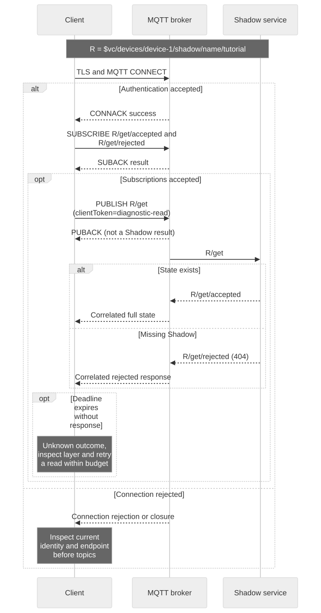

# Debugging an Integration

## Observable diagnostic boundaries

Read this as a dependency map for the MQTT path, not a guaranteed network timing sequence. Check the first failing boundary and keep its evidence separate from later layers. HTTP follows its own signed-request path, described in the HTTP case below. PUBACK does not establish Shadow acceptance or hardware execution.



[Full-size block diagram](assets/diagnostic-boundaries.svg) · [Mermaid source](assets/diagnostic-boundaries.mmd)

## Goal and prerequisites

Locate the first failed observable interaction using the same test device and named Shadow as the [two-principal example](app-device-example.en.md). Retain UTC timestamps and process roles. Use a private local working directory; do not enable verbose credential-bearing request logging in a shared console.



[Full-size diagram](assets/diagnostic-read.svg) · [Mermaid source](assets/diagnostic-read.mmd)

## Check configuration without printing secrets

```bash
date -u '+%Y-%m-%dT%H:%M:%SZ'
jq -e '(.access_token | type == "string" and length > 0) and (.mqtt.username | type == "string" and length > 0) and (.mqtt.client_id | type == "string" and length > 0)'   "$TUTORIAL_DIR/device-token.json" > /dev/null
openssl x509 -in "$DEVICE_CERT" -noout -dates
```

A zero exit code from the JSON check only proves fields exist, not that the signature, scope or expiry is valid. Certificate dates do not prove a matching key or trusted issuer; use [the key comparison](credential-setup.en.md). Verify real hostname, role-specific origin, CA and a synchronized clock before investigating topics.

## Case 1: login works but MQTT CONNECT fails

Account login success is not runtime authentication. Check that MQTT password came from `device-token.json` or `app-token.json`, username and Client ID came from the same response, and concurrent connections have distinct allowed suffixes. Normal progression is TLS → CONNACK success → SUBACK success. The demo reports `MQTT CONNECT rejected` when the connection is denied; TLS exceptions occur earlier.

Check device activation and `mqtt`; do not fix this by dropping TLS verification or changing a signed identity. An alternating disconnect pattern can indicate duplicate Client IDs. Capture disconnect reason/code where the client exposes it, but do not infer one universal broker error code across deployments.

## Case 2: PUBACK but no Shadow response

PUBACK confirms the broker transport exchange. It does not confirm the Shadow request was accepted. Verify exact `/get/accepted` and `/get/rejected` subscriptions and SUBACK before publishing. Compare the request's root and clientToken to the response, including the named Shadow. Broad wildcard access is not equivalent to exact subscriptions.

A normal GET on a new Shadow can yield code 404. No response by deadline is an unknown outcome, not a synthetic 404. Check target permission, `iot_shadow`, request JSON and broker/service diagnostics available to your operator. Missing capability enforcement remains a qualification gate; successful unauthorized traffic is a defect to report.

## Case 3: desired accepted but device does not converge

Expected App output first says `APP desired accepted; waiting for reported state`; only a fresh converged GET prints `PASS: desired=reported=on`. Inspect the actual GET:

```json
{
  "state": {
    "desired": {
      "power": "on"
    },
    "reported": {
      "power": "off"
    },
    "delta": {
      "power": "on"
    }
  },
  "version": 8,
  "timestamp": 1788480001
}
```

This is a valid illustrative state showing unfinished work, not a cloud update failure. Verify the device process is running, subscribes to `/update/delta`, reads current state after startup, understands `power`, and reports only after applying. Check firmware's application-defined failure status. If desired already equals reported, no new delta is required. Do not clear an error by falsifying reported state.

## Case 4: HTTP works differently from MQTT

Confirm both use the same runtime device and Shadow name. HTTP uses the returned custom endpoint, region, SigV4 service `iotdevicegateway` and session token. MQTT uses returned username/Client ID and runtime password. HTTP 401 suggests signature/identity failure; HTTP 409 means a stale conditional version and calls for GET/reconciliation. An HTTP 200 mutation still does not mean hardware finished.

Use [the signed helper](shadow-interfaces.en.md) for an independent read, saving response privately. Do not paste Authorization headers, a signed request dump, private key, token bundle, or full customer payload into a ticket.

## Support report template

Copy and fill this sanitized text. Replace identifiers with stable aliases when disclosure is not permitted; provide real identifiers through the approved private support channel if needed.

```text
Environment/profile and deployed version:
UTC start/end:
Client role and client/library version:
Device alias / Shadow name:
Operation, method/path or exact topic:
Last successful layer:
First failing layer and HTTP/MQTT/Shadow code:
Request correlation ID (non-secret):
Expected result / observed result:
Reproduction steps and frequency:
Recent network, permission or firmware changes:
Local validation performed:
Sanitized logs attached (no keys, tokens, passwords or private state):
```

No general customer-accessible server-log query API is promised here. Include the operation ID from onboarding when relevant and ask the operator to correlate service logs by time, target and request. A browser documentation error belongs to the website path and is separate from device MQTT.

Next: [symptom checklist](troubleshooting.en.md), [renewal and recovery](credential-recovery.en.md), [release compatibility](compatibility-releases.en.md).

Continue: [Run the integration probes](integration-test-kit.en.md).
