# 整合除错

## 可观察的诊断边界

请将此视为MQTT路径的依赖关系图，而不是保证的网路时间序列。检查第一个失败的边界，并将其证据与后续层分开。HTTP遵循其自己的已签名的请求路径，如下面的HTTP案例中描述。PUBACK不会建立影子接受或硬体执行。



[全尺寸方块图](assets/diagnostic-boundaries.zh-CN.svg) · [Mermaid 原始档](assets/diagnostic-boundaries.zh-CN.mmd)

## 目标和先决条件

使用相同的测试装置，将名为Shadow的影子定位到第一次失败的可观察互动中[两个主要示例](app-device-example.zh-CN.md)。保留UTC时间戳和处理角色。使用一个私人本地工作目录；不要在共享控制台中启用带有详细凭证的请求日志记录。

[开启重新设计的序列图](assets/diagnostic-read.zh-CN.html)

## 检查配置，无需列印秘密

```bash
date -u '+%Y-%m-%dT%H:%M:%SZ'
jq -e '(.access_token | type == "string" and length > 0) and (.mqtt.username | type == "string" and length > 0) and (.mqtt.client_id | type == "string" and length > 0)'   "$TUTORIAL_DIR/device-token.json" > /dev/null
openssl x509 -in "$DEVICE_CERT" -noout -dates
```

JSON检查中的零退出程式仅证明栏位存在，而不证明签名、范围或到期有效。证书日期不能证明匹配的金钥或受信任的发布端；使用[关键比较](credential-setup.zh-CN.md)在调查主题之前，请验证真实主机名称、特定角色来源、CA和同步时钟。

## 案例1：登入成功，但MQTT CONNECT失败

帐户登入成功不是执行时身份验证。请检查MQTT密码是否来自`device-token.json`或者`app-token.json`，使用者名称和客户端ID来自同一响应，并同时连线具有不同的允许字尾。正常进展是TLS→CONNACK成功→SUBACK成功。演示报告`MQTT CONNECT rejected`当连线被拒绝时；TLS例外情况会提前发生。

检查装置启动和`mqtt`；不要透过删除TLS验证或更改已签名身份来解决此问题。交替断开连线模式可能表明存在重复的客户端ID。捕获客户端暴露的断开连线原因/程式，但不要推断跨部署的通用代理服务错误程式。

## 案例2：PUBACK但没有影子响应

PUBACK确认了代理服务运输交换。它没有确认影子请求是否已接受。请核实准确性`/get/accepted`与`/get/rejected`在释出前进行订阅和SUBACK。将请求的根和clientToken与响应进行比较，包括名称中的Shadow。广泛的万用字元访问并不等同于精确的订阅。

在新Shadow上进行正常的GET可能会产生程式404。在截止日期前没有响应是未知的结果，而不是合成404。检查目标许可权，`iot_shadow`，请求向您的运营商提供JSON和代理服务/服务诊断。缺少能力执法仍然是一个资格门槛；成功未经授权的流量是一个需要报告的缺陷。

## 案例3：期望接受，但装置没有收敛

预期应用程式输出首先显示`APP desired accepted; waiting for reported state`；只有新鲜的聚合GET列印`PASS: desired=reported=on`.检查实际的GET：

```json
{
  "state": {
    "desired": {
      "power": "on"
    },
    "reported": {
      "power": "off"
    },
    "delta": {
      "power": "on"
    }
  },
  "version": 8,
  "timestamp": 1788480001
}
```

这是一个有效的说明状态，显示未完成的工作，而不是云更新失败。请验证装置流程是否正在执行，订阅`/update/delta`，在启动后读取当前状态，理解`power`，并仅在应用后报告。检查韧体的应用定义的故障状态。如果希望已等于报告的状态，则不需要新增差异。不要透过伪造报告状态来清除错误。

## 案例4：HTTP与MQTT的工作方式不同

确认两者都使用相同的执行时装置和影子名称。HTTP使用返回的自定义端点、区域、SigV4服务`iotdevicegateway`和会话令牌。MQTT使用返回的使用者名称/客户端ID和执行时密码。HTTP 401表明签名/身份失败；HTTP 409表示过时的条件版本，并呼叫GET/协调。HTTP 200变异仍然并不意味著硬体已完成。

使用[签名的助手](shadow-interfaces.zh-CN.md)要进行独立阅读，请私下储存响应。不要将授权标头、已签名的请求资料夹、私钥、令牌捆绑包或完整的客户有效负载贴上到票据中。

## 支援报告模板

复制并填写此经过消毒的文字。在不允许披露的情况下，将识别符号替换为稳定的别名；如有必要，透过经批准的私人支援渠道提供真实的识别符号。

```text
Environment/profile and deployed version:
UTC start/end:
Client role and client/library version:
Device alias / Shadow name:
Operation, method/path or exact topic:
Last successful layer:
First failing layer and HTTP/MQTT/Shadow code:
Request correlation ID (non-secret):
Expected result / observed result:
Reproduction steps and frequency:
Recent network, permission or firmware changes:
Local validation performed:
Sanitized logs attached (no keys, tokens, passwords or private state):
```

这里没有承诺提供一般客户可访问的伺服器日志查询API。在相关情况下，包括入职时的操作ID，并要求操作员按时间、目标和请求对照服务日志。浏览器档案错误属于网站路径，与装置MQTT分开。

下一个：[症状清单](troubleshooting.zh-CN.md), [更新和恢复](credential-recovery.zh-CN.md), [释出相容性](compatibility-releases.zh-CN.md).

继续：[执行整合探测器](integration-test-kit.zh-CN.md).
