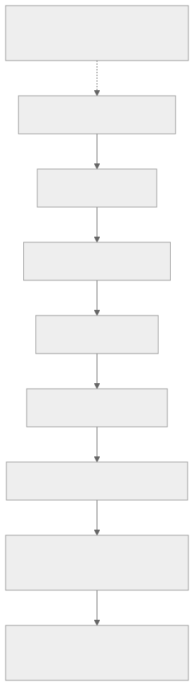

# 集成调试指南

## 依可观测的协议层定位问题

下图显示 MQTT 流程各层的依赖关系，不保证实际网络事件一定依图中的时间顺序发生。请先找出第一个失败的环节，并将该层记录与后续层分开判读。HTTP 使用自己的签名请求流程，详见下方 HTTP 案例。收到 PUBACK 不表示影子已接受更新，也不表示硬件已完成操作。



[开启完整框图](assets/diagnostic-boundaries.zh-CN.svg) · [Mermaid 源文件](assets/diagnostic-boundaries.zh-CN.mmd)

## 目标与前置条件

使用[应用程序与设备示例](app-device-example.zh-CN.md)中的同一测试设备与命名影子，找出第一个可以观测到的失败步骤。保留 UTC 时间戳及各程序角色。请使用私有本地工作目录，不要在共用主控台开启会输出凭证的详细请求日志。

[开启时序图](assets/diagnostic-read.zh-CN.html)

## 检查配置，不输出机密内容

```bash
date -u '+%Y-%m-%dT%H:%M:%SZ'
jq -e '(.access_token | type == "string" and length > 0) and (.mqtt.username | type == "string" and length > 0) and (.mqtt.client_id | type == "string" and length > 0)'   "$TUTORIAL_DIR/device-token.json" > /dev/null
openssl x509 -in "$DEVICE_CERT" -noout -dates
```

JSON 检查以状态 0 结束，只能证明字段存在，不代表签名、scope 或有效期限正确。证书日期也无法证明私钥匹配或签发者受信任；请依[密钥比对步骤](credential-setup.zh-CN.md)确认。调查主题问题前，先检查实际主机名称、该角色应使用的 origin、CA 及时钟同步。

## 案例 1：登录成功，但 MQTT CONNECT 失败

账户登录成功不代表运行时验证成功。请确认 MQTT 密码来自 `device-token.json` 或 `app-token.json`，username 与 Client ID 也取自同一次响应，且同时连接各自使用不同、符合规则的后缀。正常流程是 TLS → CONNACK 成功 → SUBACK 成功。连接遭拒时，示例会显示 `MQTT CONNECT rejected`；TLS 例外则发生在更早的步骤。

检查设备是否启用，以及是否具备 `mqtt` 功能。不要通过停用 TLS 验证或修改已签名的身份来绕过问题。两个连接交替被断开，可能表示 Client ID 重复。若客户端能取得断线原因或代码，请保留记录，但不要假设所有部署都使用相同的 Broker 错误码。

## 案例 2：收到 PUBACK，却没有影子响应

PUBACK 只确认与 MQTT Broker 的传输交换，不确认影子请求已被接受。发布前，检查是否订阅完整的 `/get/accepted` 与 `/get/rejected`，并确认 SUBACK。比对请求与响应的根路径、clientToken 及命名影子名称。能访问广泛的通配符主题，不代表已完成所需的精确主题订阅。

对新影子执行 GET，正常情况可能收到 404。期限内没有响应表示结果未知，不可自行当成 404。请检查目标权限、`iot_shadow`、请求 JSON，以及管理员可查阅的 Broker／服务诊断记录。缺少功能授权时的拒绝行为仍需列入验证；未授权流量若成功，应上报缺陷。

## 案例 3：desired 已被接受，但设备状态没有同步

应用程序会先显示 `APP desired accepted; waiting for reported state`；只有新的 GET 确认状态一致后，才会显示 `PASS: desired=reported=on`。请检查实际 GET 结果：

```json
{
  "state": {
    "desired": {
      "power": "on"
    },
    "reported": {
      "power": "off"
    },
    "delta": {
      "power": "on"
    }
  },
  "version": 8,
  "timestamp": 1788480001
}
```

这是一份有效的状态示例，表示设备尚未完成操作，不代表云端更新失败。请确认设备程序正在执行、已订阅 `/update/delta`、启动后会读取当前状态、能处理 `power`，并且只在操作完成后上报。检查固件自行定义的操作失败状态。若 desired 已等于 reported，就不需要新的 delta。不要通过虚报 reported 来消调试误。

## 案例 4：HTTP 与 MQTT 行为不同

确认两者使用同一个运行时设备 ID 与影子名称。HTTP 使用返回的自定义 endpoint、region、SigV4 服务名称 `iotdevicegateway` 及 会话令牌；MQTT 使用返回的 username／Client ID 与运行时密码。HTTP 401 表示可能有签名或身份验证问题；HTTP 409 表示条件版本已过期，应 GET 最新状态后重新计算更新内容。即使 HTTP 更新返回 200，也不表示硬件已完成。

使用[已签名的 HTTP 辅助函数](shadow-interfaces.zh-CN.md)独立读取状态，并将响应保存在私有位置。不要把 Authorization 请求头、已签名请求的完整内容、私钥、令牌凭证或完整客户 payload 粘贴到支持工单。

## 支持报告范本

复制下列范本并填入已移除敏感信息的内容。识别值不允许公开时，改用一致的代称；必要时再通过核准的私有支持渠道提供真实识别值。

```text
Environment/profile and deployed version:
UTC start/end:
Client role and client/library version:
Device alias / Shadow name:
Operation, method/path or exact topic:
Last successful layer:
First failing layer and HTTP/MQTT/Shadow code:
Request correlation ID (non-secret):
Expected result / observed result:
Reproduction steps and frequency:
Recent network, permission or firmware changes:
Local validation performed:
Sanitized logs attached (no keys, tokens, passwords or private state):
```

本指南不保证提供一般客户可调用的服务器日志查询 API。若与设备接入有关，请附上 operation ID，并请管理员依时间、目标及请求比对服务日志。浏览器文档页的错误应循网站流程处理，与设备 MQTT 问题分开调查。

下一步：[症状检查表](troubleshooting.zh-CN.md)、[更新与恢复](credential-recovery.zh-CN.md)、[版本兼容性](compatibility-releases.zh-CN.md)。

延伸阅读：[执行集成检查](integration-test-kit.zh-CN.md)。
