# 整合除錯

## 可觀察的診斷邊界

請將此視為MQTT路徑的依賴關係圖，而不是保證的網路時間序列。檢查第一個失敗的邊界，並將其證據與後續層分開。HTTP遵循其自己的已簽名的請求路徑，如下面的HTTP案例中描述。PUBACK不會建立影子接受或硬體執行。



[全尺寸方塊圖](assets/diagnostic-boundaries.zh-TW.svg) · [Mermaid 原始檔](assets/diagnostic-boundaries.zh-TW.mmd)

## 目標和先決條件

使用相同的測試裝置，將名為Shadow的影子定位到第一次失敗的可觀察互動中[兩個主要示例](app-device-example.zh-TW.md)。保留UTC時間戳和處理角色。使用一個私人本地工作目錄；不要在共享控制檯中啟用帶有詳細憑證的請求日誌記錄。

[開啟重新設計的序列圖](assets/diagnostic-read.zh-TW.html)

## 檢查配置，無需列印秘密

```bash
date -u '+%Y-%m-%dT%H:%M:%SZ'
jq -e '(.access_token | type == "string" and length > 0) and (.mqtt.username | type == "string" and length > 0) and (.mqtt.client_id | type == "string" and length > 0)'   "$TUTORIAL_DIR/device-token.json" > /dev/null
openssl x509 -in "$DEVICE_CERT" -noout -dates
```

JSON檢查中的零退出程式僅證明欄位存在，而不證明簽名、範圍或到期有效。證書日期不能證明匹配的金鑰或受信任的發布端；使用[關鍵比較](credential-setup.zh-TW.md)在調查主題之前，請驗證真實主機名稱、特定角色來源、CA和同步時鐘。

## 案例1：登入成功，但MQTT CONNECT失敗

帳戶登入成功不是執行時身份驗證。請檢查MQTT密碼是否來自`device-token.json`或者`app-token.json`，使用者名稱和客戶端ID來自同一響應，並同時連線具有不同的允許字尾。正常進展是TLS→CONNACK成功→SUBACK成功。演示報告`MQTT CONNECT rejected`當連線被拒絕時；TLS例外情況會提前發生。

檢查裝置啟動和`mqtt`；不要透過刪除TLS驗證或更改已簽名身份來解決此問題。交替斷開連線模式可能表明存在重複的客戶端ID。捕獲客戶端暴露的斷開連線原因/程式，但不要推斷跨部署的通用代理服務錯誤程式。

## 案例2：PUBACK但沒有影子響應

PUBACK確認了代理服務運輸交換。它沒有確認影子請求是否已接受。請核實準確性`/get/accepted`與`/get/rejected`在釋出前進行訂閱和SUBACK。將請求的根和clientToken與響應進行比較，包括名稱中的Shadow。廣泛的萬用字元訪問並不等同於精確的訂閱。

在新Shadow上進行正常的GET可能會產生程式404。在截止日期前沒有響應是未知的結果，而不是合成404。檢查目標許可權，`iot_shadow`，請求向您的運營商提供JSON和代理服務/服務診斷。缺少能力執法仍然是一個資格門檻；成功未經授權的流量是一個需要報告的缺陷。

## 案例3：期望接受，但裝置沒有收斂

預期應用程式輸出首先顯示`APP desired accepted; waiting for reported state`；只有新鮮的聚合GET列印`PASS: desired=reported=on`.檢查實際的GET：

```json
{
  "state": {
    "desired": {
      "power": "on"
    },
    "reported": {
      "power": "off"
    },
    "delta": {
      "power": "on"
    }
  },
  "version": 8,
  "timestamp": 1788480001
}
```

這是一個有效的說明狀態，顯示未完成的工作，而不是雲更新失敗。請驗證裝置流程是否正在執行，訂閱`/update/delta`，在啟動後讀取當前狀態，理解`power`，並僅在應用後報告。檢查韌體的應用定義的故障狀態。如果希望已等於報告的狀態，則不需要新增差異。不要透過偽造報告狀態來清除錯誤。

## 案例4：HTTP與MQTT的工作方式不同

確認兩者都使用相同的執行時裝置和影子名稱。HTTP使用返回的自定義端點、區域、SigV4服務`iotdevicegateway`和會話令牌。MQTT使用返回的使用者名稱/客戶端ID和執行時密碼。HTTP 401表明簽名/身份失敗；HTTP 409表示過時的條件版本，並呼叫GET/協調。HTTP 200變異仍然並不意味著硬體已完成。

使用[簽名的助手](shadow-interfaces.zh-TW.md)要進行獨立閱讀，請私下儲存響應。不要將授權標頭、已簽名的請求資料夾、私鑰、令牌捆綁包或完整的客戶有效負載貼上到票據中。

## 支援報告模板

複製並填寫此經過消毒的文字。在不允許披露的情況下，將識別符號替換為穩定的別名；如有必要，透過經批准的私人支援渠道提供真實的識別符號。

```text
Environment/profile and deployed version:
UTC start/end:
Client role and client/library version:
Device alias / Shadow name:
Operation, method/path or exact topic:
Last successful layer:
First failing layer and HTTP/MQTT/Shadow code:
Request correlation ID (non-secret):
Expected result / observed result:
Reproduction steps and frequency:
Recent network, permission or firmware changes:
Local validation performed:
Sanitized logs attached (no keys, tokens, passwords or private state):
```

這裡沒有承諾提供一般客戶可訪問的伺服器日誌查詢API。在相關情況下，包括入職時的操作ID，並要求操作員按時間、目標和請求對照服務日誌。瀏覽器檔案錯誤屬於網站路徑，與裝置MQTT分開。

下一個：[症狀清單](troubleshooting.zh-TW.md), [更新和恢復](credential-recovery.zh-TW.md), [釋出相容性](compatibility-releases.zh-TW.md).

繼續：[執行整合探測器](integration-test-kit.zh-TW.md).
