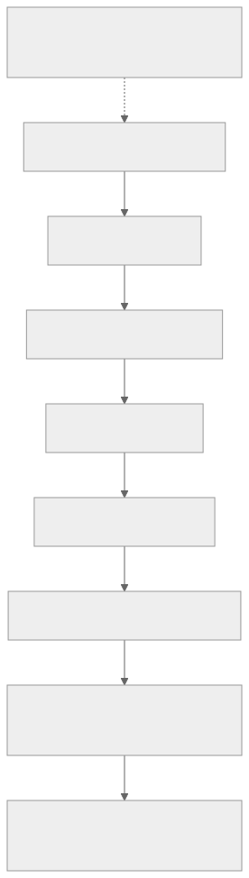

# 整合除錯指南

## 依可觀測的協定層定位問題

下圖顯示 MQTT 流程各層的依賴關係，不保證實際網路事件一定依圖中的時間順序發生。請先找出第一個失敗的環節，並將該層紀錄與後續層分開判讀。HTTP 使用自己的簽署請求流程，詳見下方 HTTP 案例。收到 PUBACK 不表示影子已接受更新，也不表示硬體已完成操作。



[開啟完整方塊圖](assets/diagnostic-boundaries.zh-TW.svg) · [Mermaid 原始檔](assets/diagnostic-boundaries.zh-TW.mmd)

## 目標與前置條件

使用[應用程式與裝置範例](app-device-example.zh-TW.md)中的同一測試裝置與具名影子，找出第一個可以觀測到的失敗步驟。保留 UTC 時間戳記及各程序角色。請使用私人本機工作目錄，不要在共用主控台開啟會輸出驗證資訊的詳細請求日誌。

[開啟時序圖](assets/diagnostic-read.zh-TW.html)

## 檢查設定，不輸出機密內容

```bash
date -u '+%Y-%m-%dT%H:%M:%SZ'
jq -e '(.access_token | type == "string" and length > 0) and (.mqtt.username | type == "string" and length > 0) and (.mqtt.client_id | type == "string" and length > 0)'   "$TUTORIAL_DIR/device-token.json" > /dev/null
openssl x509 -in "$DEVICE_CERT" -noout -dates
```

JSON 檢查以狀態 0 結束，只能證明欄位存在，不代表簽章、scope 或有效期限正確。憑證日期也無法證明私鑰匹配或簽發者受信任；請依[金鑰比對步驟](credential-setup.zh-TW.md)確認。調查主題問題前，先檢查實際主機名稱、該角色應使用的 origin、CA 及時鐘同步。

## 案例 1：登入成功，但 MQTT CONNECT 失敗

帳戶登入成功不代表執行階段驗證成功。請確認 MQTT 密碼來自 `device-token.json` 或 `app-token.json`，username 與 Client ID 也取自同一次回應，且同時連線各自使用不同、符合規則的後綴。正常流程是 TLS → CONNACK 成功 → SUBACK 成功。連線遭拒時，範例會顯示 `MQTT CONNECT rejected`；TLS 例外則發生在更早的步驟。

檢查裝置是否啟用，以及是否具備 `mqtt` 功能。不要透過停用 TLS 驗證或修改已簽署的身分來繞過問題。兩個連線交替被斷開，可能表示 Client ID 重複。若用戶端能取得斷線原因或代碼，請保留紀錄，但不要假設所有部署都使用相同的 Broker 錯誤碼。

## 案例 2：收到 PUBACK，卻沒有影子回應

PUBACK 只確認與 MQTT Broker 的傳輸交換，不確認影子請求已被接受。發布前，檢查是否訂閱完整的 `/get/accepted` 與 `/get/rejected`，並確認 SUBACK。比對請求與回應的根路徑、clientToken 及具名影子名稱。能存取廣泛的萬用字元主題，不代表已完成所需的精確主題訂閱。

對新影子執行 GET，正常情況可能收到 404。期限內沒有回應表示結果未知，不可自行當成 404。請檢查目標權限、`iot_shadow`、請求 JSON，以及管理員可查閱的 Broker／服務診斷紀錄。缺少功能授權時的拒絕行為仍需列入驗證；未授權流量若成功，應回報缺陷。

## 案例 3：desired 已被接受，但裝置狀態沒有同步

應用程式會先顯示 `APP desired accepted; waiting for reported state`；只有新的 GET 確認狀態一致後，才會顯示 `PASS: desired=reported=on`。請檢查實際 GET 結果：

```json
{
  "state": {
    "desired": {
      "power": "on"
    },
    "reported": {
      "power": "off"
    },
    "delta": {
      "power": "on"
    }
  },
  "version": 8,
  "timestamp": 1788480001
}
```

這是一份有效的狀態範例，表示裝置尚未完成操作，不代表雲端更新失敗。請確認裝置程序正在執行、已訂閱 `/update/delta`、啟動後會讀取目前狀態、能處理 `power`，並且只在操作完成後回報。檢查韌體自行定義的操作失敗狀態。若 desired 已等於 reported，就不需要新的 delta。不要透過虛報 reported 來消除錯誤。

## 案例 4：HTTP 與 MQTT 行為不同

確認兩者使用同一個執行階段裝置 ID 與影子名稱。HTTP 使用回傳的自訂 endpoint、region、SigV4 服務名稱 `iotdevicegateway` 及 session token；MQTT 使用回傳的 username／Client ID 與執行階段密碼。HTTP 401 表示可能有簽章或身分驗證問題；HTTP 409 表示條件版本已過期，應 GET 最新狀態後重新計算更新內容。即使 HTTP 更新回傳 200，也不表示硬體已完成。

使用[已簽署的 HTTP 輔助函式](shadow-interfaces.zh-TW.md)獨立讀取狀態，並將回應保存在私人位置。不要把 Authorization 標頭、已簽署請求的完整內容、私鑰、token 驗證資訊或完整客戶 payload 貼進支援單。

## 支援報告範本

複製下列範本並填入已移除敏感資訊的內容。識別值不允許公開時，改用一致的代稱；必要時再透過核准的私人支援管道提供真實識別值。

```text
Environment/profile and deployed version:
UTC start/end:
Client role and client/library version:
Device alias / Shadow name:
Operation, method/path or exact topic:
Last successful layer:
First failing layer and HTTP/MQTT/Shadow code:
Request correlation ID (non-secret):
Expected result / observed result:
Reproduction steps and frequency:
Recent network, permission or firmware changes:
Local validation performed:
Sanitized logs attached (no keys, tokens, passwords or private state):
```

本指南不保證提供一般客戶可呼叫的伺服器日誌查詢 API。若與裝置接入有關，請附上 operation ID，並請管理員依時間、目標及請求比對服務日誌。瀏覽器文件頁的錯誤應循網站流程處理，與裝置 MQTT 問題分開調查。

下一步：[症狀檢查表](troubleshooting.zh-TW.md)、[更新與恢復](credential-recovery.zh-TW.md)、[版本相容性](compatibility-releases.zh-TW.md)。

延伸閱讀：[執行整合檢查](integration-test-kit.zh-TW.md)。
