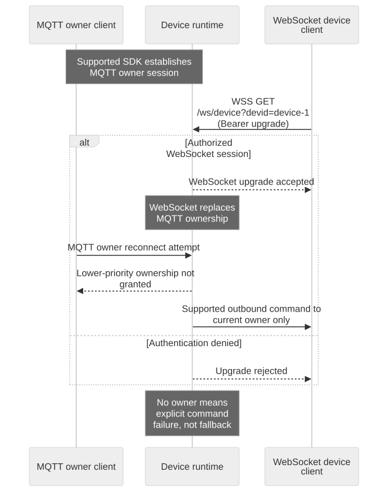

# Device Presence and Lifecycle

## Goal and prerequisites

Explain why a device can exchange MQTT messages while Fleet still appears offline. Read [Cloud Service Overview](overview.en.md) and use a supported device SDK from [ChipSet & SDK](/console/chipset-sdk). The tutorial simulator implements Shadow interactions; it does not implement the full owner-transport lifecycle.

## Architecture and responsibility boundaries

[Full-size block diagram](assets/lifecycle-layers.svg) · [Mermaid source](assets/lifecycle-layers.mmd)

[Full-size block diagram](assets/control-topology.svg) · [Mermaid source](assets/control-topology.mmd)

## Observe the correct layer

| Observation | What it proves | What it does not prove |
| --- | --- | --- |
| Registry device exists | Account-side registration/binding exists | Cloud activation or network connection |
| Provisioning succeeded | The activation operation completed | Device is currently reachable |
| MQTT CONNACK | Broker accepted this MQTT connection | Owner session registered or hardware healthy |
| Shadow accepted | State mutation was accepted | Device executed it or Fleet is online |
| Active owner transport | Service can route supported device commands to that owner | Every hardware capability works |
| Truthful reported state | Firmware reported observed/applied state | Device remains reachable forever after that report |

Keep last-observed timestamps and source alongside status. A cached `reported.power` is not a heartbeat. Do not derive Fleet status from your App's MQTT connection or from a generic topic subscription. Account readiness and runtime presence are separate projections and can change at different times.

## One replaceable owner transport

[Full-size diagram](assets/presence-owner.svg) · [Mermaid source](assets/presence-owner.mmd)

The canonical device transport contract permits at most one active owner per device. WebSocket has priority over MQTT. A new WebSocket owner can replace an MQTT owner; a new MQTT session must not replace an existing WebSocket owner. Reconnect within the same transport replaces the previous session. These are owner-transport rules, not a ban on separate authorized Shadow observer connections.

Commands route only to the current owner. The service does not fan out to both transports or silently fall back to a non-owner. Without an owner, command delivery fails explicitly. If the active owner lacks a required capability, a second non-owner connection is not a workaround.

The device WebSocket upgrade is `GET /ws/device?devid={devid}` with `Authorization: Bearer <runtime token>` when transport auth is required. Use the published secure WebSocket origin; never put the token in the query string. This endpoint is a device protocol, not MQTT over WebSocket. Use the SDK to perform its full supported lifecycle rather than constructing arbitrary heartbeat frames.

## Liveness, disconnect and network changes

MQTT Keep Alive and WebSocket ping establish transport liveness only. The current WebSocket protocol treats ping as keepalive, not an application business command. A successful WebSocket JSON acknowledgement confirms frame handling, not every downstream hardware result.

When a connection is replaced, the old session must not clear or overwrite the new owner's status. The inspected session-registry tests cover stale-session deletion and priority. Network loss can be detected after broker, transport and projection delays; the contract does not establish one universal number of seconds for Fleet to display offline.

After a network change, reconnect using current credentials and the supported SDK. Independently restore Shadow subscriptions and GET current desired as explained in [recovery](credential-recovery.en.md). Do not rely on owner replacement to replay every missed message.

## Lifecycle diagnosis

1. Confirm the correct organization, registry device and mapped runtime ID.
2. Inspect provisioning outcome and account readiness before investigating presence.
3. Check runtime token/transport authentication, then the SDK's owner-session establishment.
4. Record which transport currently owns the device and whether it was replaced.
5. Correlate disconnection and projection timestamps with the operator's runtime evidence.
6. Test a supported, harmless operation and observe its application result; connection status alone is insufficient.

Unprovision, deactivate and registry disable have different effects; see [Ownership and Sharing](ownership-sharing.en.md). Do not fabricate an owner-status endpoint or control frame when your SDK does not expose the needed diagnostic.

## Qualification cases

Record same-transport replacement, MQTT→WebSocket takeover, rejected lower-priority takeover, old-session disconnect after replacement, no-owner command failure and network-loss-to-offline delay. The diagram states the contract; target-environment timings and the full SDK path still need live qualification. Next: [Debugging an Integration](debugging.en.md), [Integration Test Kit](integration-test-kit.en.md).
