# 装置在线状态与生命周期

## 目标和先决条件

解释为什么装置可以在Fleet仍然显示离线的情况下交换MQTT讯息。 阅读[云端服务概览](overview.zh-CN.md)并使用受支援的装置SDK[晶片组和SDK](/console/chipset-sdk)。教学模拟器实现了影子互动；它不实现完整的所有者传输生命周期。

## 架构和责任界限

[全尺寸方块图](assets/lifecycle-layers.zh-CN.svg) · [Mermaid 原始档](assets/lifecycle-layers.zh-CN.mmd)

[全尺寸方块图](assets/control-topology.zh-CN.svg) · [Mermaid 原始档](assets/control-topology.zh-CN.mmd)

## 观察正确的层

|观察|它证明了什么|它没有证明什么|
| --- | --- | --- |
|登记装置存在|存在帐户侧注册/系结|云启动或网路连线|
|配置成功|启动操作已完成|装置目前可以连线|
|MQTT CONNACK|代理服务接受了此MQTT连线|所有者会话已注册或硬体健康|
|Shadow接受了|状态突变被接受了|装置执行了它，或者车队线上|
|活跃的车主运输|服务可以将支援的装置命令路由到该所有者|每项硬体功能都正常工作。|
|真实报告的状态|韧体报告的观察到的/应用状态|在该报告之后，装置将永远保持可访问状态。|

将最后观察到的时间戳和来源与状态一起保留。一个快取的`reported.power`不是心跳。不要从应用程式的MQTT连线或通用主题订阅中推断车队状态。帐户就绪性和执行时存在是独立的预测，可能在不同时间发生变化。

## 一个可更换的车主运输

[开启重新设计的序列图](assets/presence-owner.zh-CN.html)

标准装置传输契约允许每个装置最多有一个主动所有者。WebSocket优先于MQTT。新的WebSocket所有者可以替换MQTT所有者；新的MQTT会话不得替换现有的WebSocket所有者。在同一传输内重新连线会替换之前的会话。这些是所有者传输规则，而不是禁止单独授权的影子观察器连线。

命令仅路由到当前所有者。该服务不会分发到两个传输器，也不会静默地恢复到非所有者。没有所有者，命令传送将会明确失败。如果主动所有者缺乏所需的功能，第二个非所有者连线并非一种工作系结。

装置WebSocket升级是`GET /ws/device?devid={devid}`与`Authorization: Bearer <runtime token>`当需要传输授权时。使用已释出的安全WebSocket来源；切勿将令牌放入查询字串中。此端点是一个装置协议，而不是透过WebSocket的MQTT。使用SDK执行其完全支援的整个生命周期，而不是构建任意的心跳帧。

## 活力、断开连线和网路更改

MQTT保持活度和WebSocket ping仅建立传输活度。当前的WebSocket协议将ping视为保持活度，而不是应用程式业务命令。成功的WebSocket JSON确认确认了帧处理，而不是每个下游硬体结果。

当连线被替换时，旧会话不得清除或覆盖新所有者的状态。检查的会话登入档测试涵盖了过期会话的删除和优先顺序。在代理服务、传输和投影延迟后，可以检测到网路丢失；契约没有为舰队建立一个通用秒数来显示离线。

在更改网路后，使用当前凭据和支援的SDK重新连线。根据说明，独立恢复Shadow订阅并获取当前所需的内容[恢复](credential-recovery.zh-CN.md)。不要依赖所有者更换来重播每条错过的讯息。

## 生命周期诊断

1. 确认正确的组织、登记装置和对映的执行时ID。
2. 在调查存在性之前，检查配置结果和帐户就绪性。
3. 检查执行时令牌/传输身份验证，然后检查SDK的所有者会话建立。
4. 记录目前运输公司拥有该装置的时间，以及该装置是否已更换。
5. 将断开连线和投影时间戳与操作员的执行时证据相关联。
6. 测试一个受支援、无害的操作，并观察其应用结果；仅仅连线状态是不够的。

未配置、停用和登入档储存档案停用具有不同的效果；请参阅[所有权和共享](ownership-sharing.zh-CN.md).当您的SDK没有暴露所需的诊断时，请勿编造所有者状态端点或控制帧。

## 资格案例

记录相同运输更换、MQTT→WebSocket接管、拒绝优先次序较低的接管、更换后旧会话断开连线、无所有者命令失败和网路丢失到离线延迟。图表说明了契约；目标环境时间和完整的SDK路径仍需要即时验证。下一步：[整合除错](debugging.zh-CN.md), [整合测试工具组](integration-test-kit.zh-CN.md).
