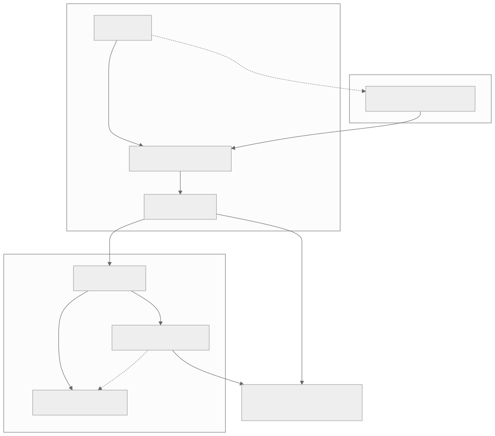
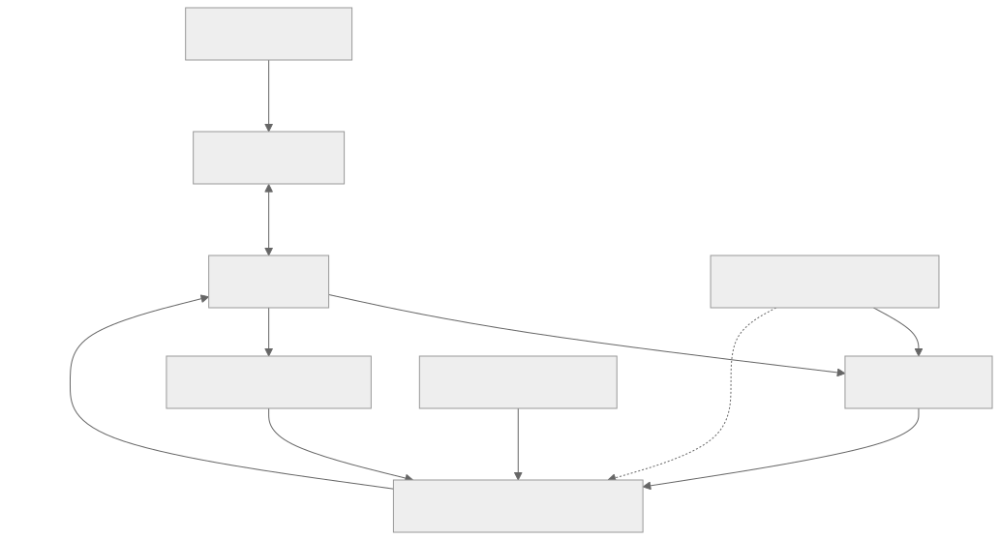

# 设备在线状态与生命周期

## 目标与准备工作

本节说明为何设备已能交换 MQTT 消息，Fleet 却仍显示离线。请先阅读[云服务概览](overview.zh-CN.md)，并使用 [ChipSet & SDK](/console/chipset-sdk) 提供的受支持设备 SDK。教程模拟器仅实现 Shadow 交互，未实现设备主连接（owner transport）的完整生命周期。

## 架构与职责范围

[查看完整架构图](assets/lifecycle-layers.zh-CN.svg) · [Mermaid 源码](assets/lifecycle-layers.zh-CN.mmd)

[查看完整架构图](assets/control-topology.zh-CN.svg) · [Mermaid 源码](assets/control-topology.zh-CN.mmd)

## 分清楚观察的是哪一层

| 观察结果 | 可以证明 | 不能证明 |
| --- | --- | --- |
| 存在设备注册记录 | 账号侧已有注册或绑定 | 云端激活完成，或网络已连接 |
| 预配成功 | 激活操作已完成 | 设备当前可达 |
| MQTT CONNACK | Broker 接受本次 MQTT 连接 | 主连接会话已注册，或硬件运行正常 |
| Shadow accepted | 状态变更已被接受 | 设备已执行，或 Fleet 显示在线 |
| 设备主连接有效 | 服务可以将受支持的设备命令发送至当前主连接 | 所有硬件功能都正常 |
| 如实上报状态 | 固件上报了观察到或已应用的状态 | 设备上报后会一直保持可达 |

请将最后观察时间与数据来源一并保存在状态旁。缓存的 `reported.power` 不是心跳信号。不要从 App 的 MQTT 连接或普通主题订阅推导 Fleet 状态。账号就绪状态与运行时在线状态是不同的数据投影，更新时间也可能不同。

## 唯一且可被替换的设备主连接

[打开设备主连接时序图](assets/presence-owner.zh-CN.html)

规范定义的设备传输规则规定，每个设备最多只有一个有效主连接。WebSocket 优先于 MQTT：新的 WebSocket 主连接可以替换 MQTT 主连接，但新的 MQTT 会话不可替换已有 WebSocket 主连接。同一种传输重新连接时，会替换此前的会话。这些规则仅针对设备主连接，不禁止另外建立已授权的 Shadow 观察连接。

命令仅发送至当前主连接。服务不会同时发送到两种传输，也不会自动改发至非主连接。没有主连接时，命令传递会明确失败。如果主连接缺少必要功能，建立第二条非主连接也无法绕过此限制。

设备 WebSocket 升级请求为 `GET /ws/device?devid={devid}`；需要传输验证时，须携带 `Authorization: Bearer <runtime token>`。请使用环境公布的安全 WebSocket 源地址，不可将令牌放入查询字符串。此端点使用设备协议，不是 MQTT over WebSocket。请通过 SDK 完成支持的完整生命周期，不要自行编造心跳帧。

## 连接存活、断开与网络变更

MQTT Keep Alive 与 WebSocket ping 只能确认传输连接仍存活。当前 WebSocket 协议将 ping 视为保活信号，不是应用业务命令。WebSocket JSON 确认响应成功，仅表示帧已处理，不代表下游每项硬件操作都已完成。

连接被替换后，旧会话不可清除或覆盖新主连接的状态。已检查的会话注册测试涵盖旧会话删除与优先级。网络中断可能要经过 Broker、传输层与数据投影的延迟才会被检测到；规范未规定 Fleet 必须在统一的秒数内显示离线。

网络变更后，请使用当前有效的凭证与受支持 SDK 重新连接。另外按照[恢复指南](credential-recovery.zh-CN.md)恢复 Shadow 订阅，并以 GET 获取当前期望状态。不要依赖主连接替换来重放所有错过的消息。

## 生命周期诊断

1. 确认组织、设备注册记录与对应的运行时 ID 正确。
2. 检查在线状态前，先检查预配结果与账号就绪状态。
3. 检查运行时令牌与传输验证，再确认 SDK 建立主连接会话的结果。
4. 记录当前哪种传输是设备主连接，以及是否发生替换。
5. 将断开连接与数据投影的时间戳，与运维人员提供的运行记录对照。
6. 测试一项受支持且不造成损害的操作，并观察应用结果；仅看连接状态并不足够。

Unprovision、deactivate 与禁用注册记录的效果不同，请参阅[所有权与共享](ownership-sharing.zh-CN.md)。如果 SDK 未提供所需诊断功能，不要自行编造主连接状态端点或控制帧。

## 验证场景

请记录同种传输替换、MQTT→WebSocket 接管、低优先级接管被拒绝、替换后旧会话断开、无主连接时命令失败，以及断网到显示离线的延迟。图表描述的是规范；目标环境的实际时间与完整 SDK 流程，仍需在实际环境验证。下一步：[集成调试](debugging.zh-CN.md)、[集成测试工具包](integration-test-kit.zh-CN.md)。
