# 裝置在線狀態與生命週期

## 目標和先決條件

解釋為什麼裝置可以在Fleet仍然顯示離線的情況下交換MQTT訊息。 閱讀[雲端服務概覽](overview.zh-TW.md)並使用受支援的裝置SDK[晶片組和SDK](/console/chipset-sdk)。教學模擬器實現了影子互動；它不實現完整的所有者傳輸生命週期。

## 架構和責任界限

[全尺寸方塊圖](assets/lifecycle-layers.zh-TW.svg) · [Mermaid 原始檔](assets/lifecycle-layers.zh-TW.mmd)

[全尺寸方塊圖](assets/control-topology.zh-TW.svg) · [Mermaid 原始檔](assets/control-topology.zh-TW.mmd)

## 觀察正確的層

|觀察|它證明瞭什麼|它沒有證明什麼|
| --- | --- | --- |
|登記裝置存在|存在帳戶側註冊/繫結|雲啟動或網路連線|
|配置成功|啟動操作已完成|裝置目前可以連線|
|MQTT CONNACK|代理服務接受了此MQTT連線|所有者會話已註冊或硬體健康|
|Shadow接受了|狀態突變被接受了|裝置執行了它，或者車隊線上|
|活躍的車主運輸|服務可以將支援的裝置命令路由到該所有者|每項硬體功能都正常工作。|
|真實報告的狀態|韌體報告的觀察到的/應用狀態|在該報告之後，裝置將永遠保持可訪問狀態。|

將最後觀察到的時間戳和來源與狀態一起保留。一個快取的`reported.power`不是心跳。不要從應用程式的MQTT連線或通用主題訂閱中推斷車隊狀態。帳戶就緒性和執行時存在是獨立的預測，可能在不同時間發生變化。

## 一個可更換的車主運輸

[開啟重新設計的序列圖](assets/presence-owner.zh-TW.html)

標準裝置傳輸契約允許每個裝置最多有一個主動所有者。WebSocket優先於MQTT。新的WebSocket所有者可以替換MQTT所有者；新的MQTT會話不得替換現有的WebSocket所有者。在同一傳輸內重新連線會替換之前的會話。這些是所有者傳輸規則，而不是禁止單獨授權的影子觀察器連線。

命令僅路由到當前所有者。該服務不會分發到兩個傳輸器，也不會靜默地恢復到非所有者。沒有所有者，命令傳送將會明確失敗。如果主動所有者缺乏所需的功能，第二個非所有者連線並非一種工作繫結。

裝置WebSocket升級是`GET /ws/device?devid={devid}`與`Authorization: Bearer <runtime token>`當需要傳輸授權時。使用已釋出的安全WebSocket來源；切勿將令牌放入查詢字串中。此端點是一個裝置協議，而不是透過WebSocket的MQTT。使用SDK執行其完全支援的整個生命週期，而不是構建任意的心跳幀。

## 活力、斷開連線和網路更改

MQTT保持活度和WebSocket ping僅建立傳輸活度。當前的WebSocket協議將ping視為保持活度，而不是應用程式業務命令。成功的WebSocket JSON確認確認了幀處理，而不是每個下游硬體結果。

當連線被替換時，舊會話不得清除或覆蓋新所有者的狀態。檢查的會話登入檔測試涵蓋了過期會話的刪除和優先順序。在代理服務、傳輸和投影延遲後，可以檢測到網路丟失；契約沒有為艦隊建立一個通用秒數來顯示離線。

在更改網路後，使用當前憑據和支援的SDK重新連線。根據說明，獨立恢復Shadow訂閱並獲取當前所需的內容[恢復](credential-recovery.zh-TW.md)。不要依賴所有者更換來重播每條錯過的訊息。

## 生命週期診斷

1. 確認正確的組織、登記裝置和對映的執行時ID。
2. 在調查存在性之前，檢查配置結果和帳戶就緒性。
3. 檢查執行時令牌/傳輸身份驗證，然後檢查SDK的所有者會話建立。
4. 記錄目前運輸公司擁有該裝置的時間，以及該裝置是否已更換。
5. 將斷開連線和投影時間戳與操作員的執行時證據相關聯。
6. 測試一個受支援、無害的操作，並觀察其應用結果；僅僅連線狀態是不夠的。

未配置、停用和登入檔儲存檔案停用具有不同的效果；請參閱[所有權和共享](ownership-sharing.zh-TW.md).當您的SDK沒有暴露所需的診斷時，請勿編造所有者狀態端點或控制幀。

## 資格案例

記錄相同運輸更換、MQTT→WebSocket接管、拒絕優先次序較低的接管、更換後舊會話斷開連線、無所有者命令失敗和網路丟失到離線延遲。圖表說明瞭契約；目標環境時間和完整的SDK路徑仍需要即時驗證。下一步：[整合除錯](debugging.zh-TW.md), [整合測試工具組](integration-test-kit.zh-TW.md).
