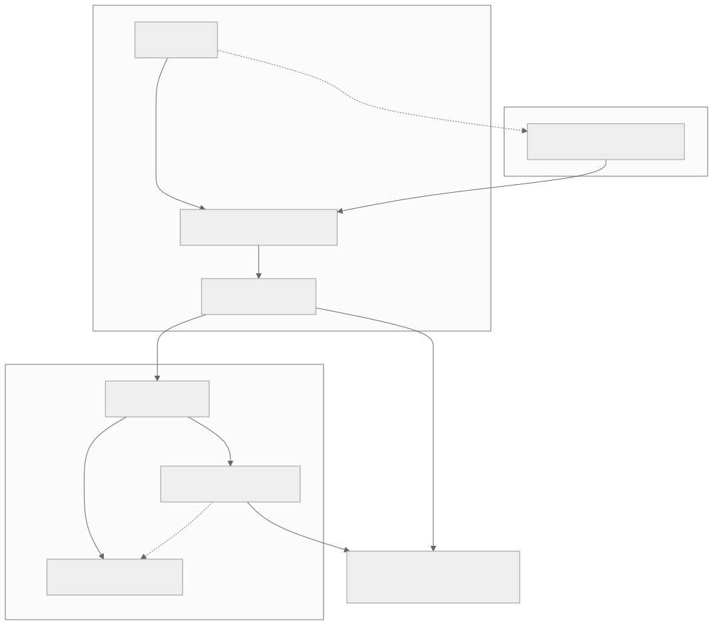
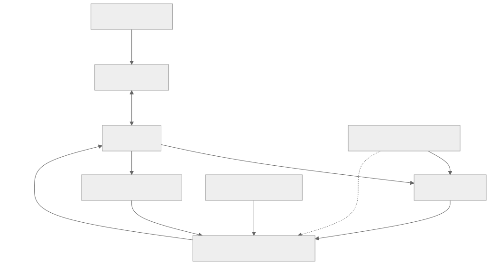

# 裝置線上狀態與生命週期

## 目標與事前準備

本節說明為何裝置已能交換 MQTT 訊息，Fleet 卻仍顯示離線。請先閱讀[雲端服務概覽](overview.zh-TW.md)，並使用 [ChipSet & SDK](/console/chipset-sdk) 提供的受支援裝置 SDK。教學模擬器只實作 Shadow 互動，未實作裝置主連線（owner transport）的完整生命週期。

## 架構與責任範圍

[檢視完整架構圖](assets/lifecycle-layers.zh-TW.svg) · [Mermaid 原始碼](assets/lifecycle-layers.zh-TW.mmd)

[檢視完整架構圖](assets/control-topology.zh-TW.svg) · [Mermaid 原始碼](assets/control-topology.zh-TW.mmd)

## 分清楚觀察的是哪一層

| 觀察結果 | 可以證明 | 不能證明 |
| --- | --- | --- |
| 存在裝置註冊記錄 | 帳號端已有註冊或綁定 | 雲端啟用完成，或網路已連線 |
| 佈建成功 | 啟用操作已完成 | 裝置目前可連線 |
| MQTT CONNACK | Broker 接受此次 MQTT 連線 | 主連線工作階段已註冊，或硬體運作正常 |
| Shadow accepted | 狀態變更已被接受 | 裝置已執行，或 Fleet 顯示線上 |
| 裝置主連線有效 | 服務可以將受支援的裝置命令送至目前主連線 | 所有硬體功能都正常 |
| 如實回報狀態 | 韌體回報了觀察到或已套用的狀態 | 裝置回報後會一直保持可連線 |

請將最後觀察時間與資料來源一起保存在狀態旁。快取的 `reported.power` 不是心跳訊號。不要從 App 的 MQTT 連線或一般主題訂閱推導 Fleet 狀態。帳號就緒狀態與執行階段線上狀態是不同的資料投影，更新時間也可能不同。

## 唯一且可被取代的裝置主連線

[開啟裝置主連線時序圖](assets/presence-owner.zh-TW.html)

正式裝置傳輸規格規定，每個裝置最多只有一個有效主連線。WebSocket 優先於 MQTT：新的 WebSocket 主連線可以取代 MQTT 主連線，但新的 MQTT 工作階段不可取代既有 WebSocket 主連線。同一種傳輸重新連線時，會取代先前的工作階段。這些規則只針對裝置主連線，不禁止另外建立已授權的 Shadow 觀察連線。

命令只會送至目前主連線。服務不會同時送到兩種傳輸，也不會自動改送至非主連線。沒有主連線時，命令傳遞會明確失敗。若主連線缺少必要功能，建立第二條非主連線也無法繞過此限制。

裝置 WebSocket 升級請求是 `GET /ws/device?devid={devid}`；需要傳輸驗證時，須帶入 `Authorization: Bearer <runtime token>`。請使用環境公布的安全 WebSocket 來源位址，不可將 token 放在查詢字串中。此端點使用裝置協定，不是 MQTT over WebSocket。請透過 SDK 完成支援的完整生命週期，不要自行編造心跳訊框。

## 連線存活、斷線與網路變更

MQTT Keep Alive 與 WebSocket ping 只能確認傳輸連線仍存活。目前的 WebSocket 協定將 ping 視為保活訊號，不是應用程式業務命令。WebSocket JSON 確認回應成功，只代表訊框已處理，不代表下游每項硬體操作都已完成。

連線被取代後，舊工作階段不可清除或覆寫新主連線的狀態。已檢查的工作階段註冊測試涵蓋舊工作階段刪除與優先順序。網路中斷可能要經過 Broker、傳輸層與資料投影的延遲才會被偵測到；規格未規定 Fleet 必須在統一的秒數內顯示離線。

網路變更後，請使用目前有效的驗證資訊與受支援 SDK 重新連線。另依[復原指南](credential-recovery.zh-TW.md)恢復 Shadow 訂閱，並以 GET 取得目前預期狀態。不要依賴主連線替換來重播所有錯過的訊息。

## 生命週期診斷

1. 確認組織、裝置註冊記錄與對應的執行階段 ID 正確。
2. 檢查線上狀態前，先檢查佈建結果與帳號就緒狀態。
3. 檢查執行階段 token 與傳輸驗證，再確認 SDK 建立主連線工作階段的結果。
4. 記錄目前哪種傳輸是裝置主連線，以及是否發生替換。
5. 將斷線與資料投影的時間戳記，和維運人員提供的執行紀錄對照。
6. 測試一項受支援且不造成損害的操作，並觀察應用程式結果；只看連線狀態並不足夠。

Unprovision、deactivate 與停用註冊記錄的效果不同，請參閱[所有權與分享](ownership-sharing.zh-TW.md)。若 SDK 未提供所需診斷功能，不要自行編造主連線狀態端點或控制訊框。

## 驗證案例

請記錄同種傳輸替換、MQTT→WebSocket 接管、低優先序接管遭拒、替換後舊工作階段斷線、無主連線時命令失敗，以及網路中斷到顯示離線的延遲。圖表描述的是規格；目標環境的實際時間與完整 SDK 流程，仍需在實際環境驗證。下一步：[整合除錯](debugging.zh-TW.md)、[整合測試工具組](integration-test-kit.zh-TW.md)。
