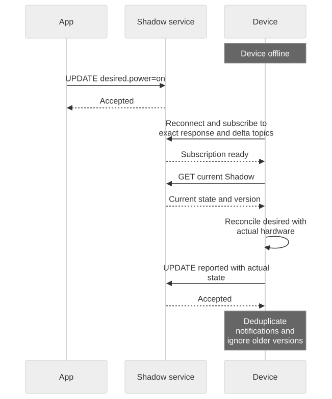
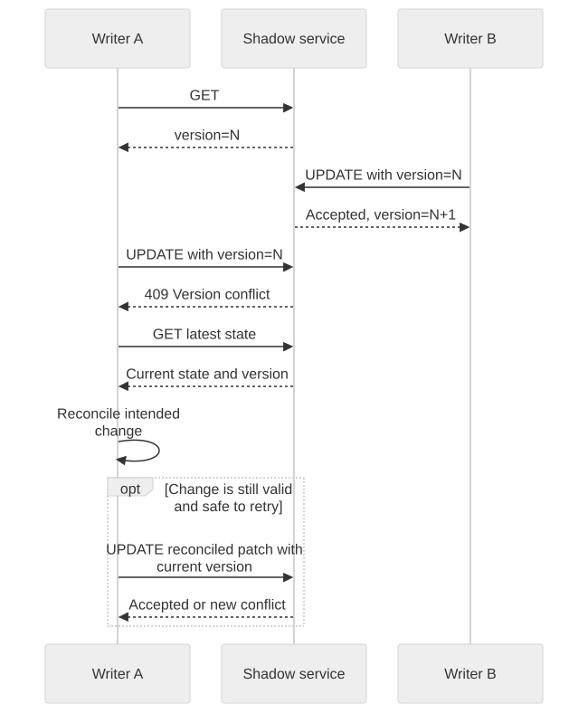

# Integration Recipes

## Reconcile after startup or disconnection

Prerequisites: current credentials, authorized exact subscriptions, and firmware that can read actual hardware state.



[Open full-size diagram](assets/shadow-offline.svg) · [Mermaid source](assets/shadow-offline.mmd)

1. Connect and subscribe before reading state.
2. GET the named or unnamed Shadow you use. Treat 404 as missing state, not a transport failure.
3. Compare desired state with actual hardware. Apply only supported settings.
4. Report what the device actually applied, then confirm the accepted response.
5. Process notifications using version and event type. Re-read on uncertainty or a gap.

Reproduce this with the [Shadow Quickstart](shadow-quickstart.en.md): stop the observer, change app desired power to `off`, restart the observer, GET current state, simulate applying `off`, and report it. GET should then show desired and reported power `off`. The test succeeds without assuming an offline delta replay.

## Handle version conflicts



[Open full-size diagram](assets/shadow-conflict.svg) · [Mermaid source](assets/shadow-conflict.mmd)

Read a current version and send two updates with that same version. The first must succeed and the second must return 409. For the HTTP helper from [the interface guide](shadow-interfaces.en.md):

```bash
CURRENT_VERSION="$(shadow_http "$SHADOW_URL" | jq -er '.version')"
PATCH="$(jq -nc --argjson version "$CURRENT_VERSION" \
  '{state:{desired:{power:"on"}},version:$version,clientToken:"tutorial-conflict"}')"
shadow_http -X POST -H 'Content-Type: application/json' --data-binary "$PATCH" "$SHADOW_URL"
# Deliberately stale: expect HTTP 409 and a nonzero curl exit status.
shadow_http -X POST -H 'Content-Type: application/json' --data-binary "$PATCH" "$SHADOW_URL"
```

After 409, GET and decide whether the original intent still applies. Construct a new patch against the latest version. Do not automatically retry non-idempotent actions. If another writer changed power intentionally, blindly repeating an old desired value can undo that work.

## Handle duplicate and same-version events

Keep the highest processed state version for each device/Shadow lifecycle. Ignore older state notifications and deduplicate already-applied events. Do not use one global version across Shadows. Do not discard every event equal to the highest version: accepted, delta, and documents can describe the same mutation and serve different consumers.

Process request correlation separately from device action. Apply a setting such as `power=on` idempotently so duplicate delivery cannot repeat a one-time physical operation. `clientToken` is not a server idempotency key. After a long-lived delete/recreate, use explicit lifecycle knowledge and a fresh GET to establish a new baseline rather than silently applying arbitrary older events.

## Choose state or commands

Use Shadow for a persistent target such as desired power or configuration. A one-time action such as dispensing a dose or unlocking once needs a command protocol with its own action identity, acknowledgement, and safety rules; a replayable desired state is not sufficient.

When an operation times out, distinguish an unknown result from a known failure. GET state before issuing a replacement mutation. Use a bounded wait and surface a diagnostic instead of looping forever waiting for a delta that may not exist.

Next: [Troubleshooting and Compatibility](troubleshooting.en.md).
