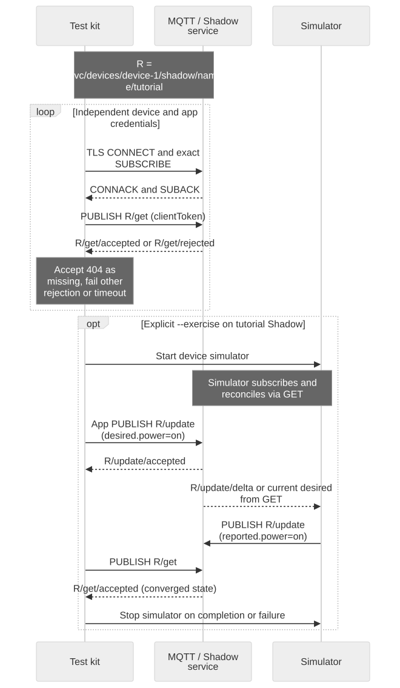

# Integration Test Kit

## Goal and prerequisites

Turn an integration into reproducible evidence. [Download the test/example package](assets/shadow-demo.zip), install `requirements.txt`, and prepare independent app/device token files plus the environment settings from [Before You Start](before-you-start.en.md). `verify.py` uses the pinned MQTT client and exact topics. It never acquires privileged credentials or changes account ownership.



[Full-size diagram](assets/integration-checks.svg) · [Mermaid source](assets/integration-checks.mmd)

## Architecture and responsibility boundaries



[Full-size block diagram](assets/kit-architecture.svg) · [Mermaid source](assets/kit-architecture.mmd)


## 1. Run the read-only probe

```bash
python verify.py --device-token "$TUTORIAL_DIR/device-token.json"   --app-token "$TUTORIAL_DIR/app-token.json"
```

For each identity, the probe connects with a distinct validation Client ID, subscribes to exact response topics, sends a correlated GET and waits at most 15 seconds for its response. It prints only role, result and version, not token or state contents. A missing Shadow (404) is an accepted preflight outcome; any other rejected code or timeout fails the probe. Read-only success does not verify write permission or absence of excessive permission.

Illustrative output:

```text
CHECK device: GET accepted, version=8
CHECK app: GET accepted, version=8
PASS: read-only probes completed
```

Versions can differ if another writer is active. Do not require equality as an authorization test. Keep an otherwise idle test device for repeatable results.

## 2. Opt in to simulated control

This changes desired/reported power on the dedicated named Shadow `tutorial`. Use a disposable test device without a real actuator subscribed to this Shadow. The test does not delete existing state afterward.

```bash
export SHADOW_NAME=tutorial
python verify.py --device-token "$TUTORIAL_DIR/device-token.json"   --app-token "$TUTORIAL_DIR/app-token.json" --exercise
```

The kit starts the existing device simulator and runs the App requesting power `on`. It succeeds only when the App observes accepted intent and sufficiently fresh desired/reported convergence. It stops the simulator on completion or interruption. The simulator can apply pre-existing desired values; review test state before starting. For a real device, run your firmware instead and use [the App example](app-device-example.en.md).

## 3. Complete the environment qualification matrix

| Case | Procedure | Required evidence |
| --- | --- | --- |
| New Shadow | Select a fresh authorized named Shadow and run GET, then the manual creation quickstart | GET 404, accepted creation, subsequent GET |
| MQTT control | Opt-in simulator exercise | App acceptance, device report, converged GET |
| HTTP parity | Run signed GET/update from the interface guide on the same device/name | HTTP and MQTT observe the same state/version evolution |
| Offline recovery | Stop device, change desired, restart | GET reconciliation without assuming offline replay |
| Version conflict | Run the two guarded updates in Integration Recipes | First commits; stale request returns 409 |
| Duplicates | Replay supported intent in a controlled test | No repeated one-time hardware operation; truthful reporting |
| Expiry/reissue | Run recovery supervisor beyond issued lifetime | New token, reconnect, restored subscription/GET |
| Cross-device denial | Use a separately authorized negative-test target with the wrong credential | Denial at intended boundary; no returned private state |
| Missing capability | Test without `mqtt` or `iot_shadow` as applicable | Required denial; record current enforcement gaps as failures |
| Ownership release | Dedicated lifecycle test from Ownership and Sharing | Old owner loses access; next owner must claim |
| Presence replacement | Supported SDK owner-session tests | Priority, replacement and no-owner behavior match contract |

The CLI automates the first read probes and optional control exercise only. Other rows remain explicit procedures, not implied passes. Links: [HTTP interface](shadow-interfaces.en.md), [conflict recipes](integration-recipes.en.md), [recovery](credential-recovery.en.md), [ownership](ownership-sharing.en.md), [presence](device-presence.en.md).

## 4. Record and clean up

Use a result ledger with case, UTC time, environment/service version, client version, sanitized target alias, expected outcome, observed code, pass/fail/not-run and evidence location. A nonzero process exit fails the automated run. A timeout is unknown outcome, not proof that a write did not happen. Re-read before repeating an uncertain mutation.

Stop all clients and remove only the named test Shadow using the documented deletion procedure when no real device depends on it. Remove local token files according to your development credential policy. Do not unprovision or deactivate a device merely to clean up a Shadow test.

Local policy tests for this package do not prove live authentication, ownership enforcement or physical hardware behavior. Unexecuted matrix rows must remain not-run. Next: [Debugging an Integration](debugging.en.md), [Production evidence and compatibility](compatibility-releases.en.md).
