# 整合测试工具组

## 目标和先决条件

将整合变成可重复的证据。[下载测试/示例包](assets/shadow-demo.zip)，安装`requirements.txt`，并准备独立的应用程式/装置令牌档案以及环境设定[开始之前](before-you-start.zh-CN.md). `verify.py`使用固定MQTT客户端和精确主题。它从未获取特权凭据或更改帐户所有权。

[开启重新设计的序列图](assets/integration-checks.zh-CN.html)

## 架构和责任界限



[全尺寸方块图](assets/kit-architecture.zh-CN.svg) · [Mermaid 原始档](assets/kit-architecture.zh-CN.mmd)


## 1. 执行只读探头

```bash
python verify.py --device-token "$TUTORIAL_DIR/device-token.json"   --app-token "$TUTORIAL_DIR/app-token.json"
```

对于每个身份，探测器连线到唯一的验证客户端ID，订阅精确的响应主题，传送相关的GET并最多等待15秒以获取响应。它只列印角色、结果和版本，不列印令牌或状态内容。缺失的影子（404）是接受的飞行前结果；任何其他被拒绝的程式或超时都会导致探测器失败。只读成功不会验证写入许可权或没有过度许可权。

说明性输出：

```text
CHECK device: GET accepted, version=8
CHECK app: GET accepted, version=8
PASS: read-only probes completed
```

如果另一位作家活跃，版本可能会有所不同。不需要用等效性作为授权测试。为了获得可重复的结果，请保留一个否则处于休眠状态的测试装置。

## 2.选择加入模拟控制

这会改变专用名为Shadow的专用电路的所需/报告功率。`tutorial`。使用没有订阅此影子的真实执行器的一次性测试装置。测试之后不会删除现有状态。

```bash
export SHADOW_NAME=tutorial
python verify.py --device-token "$TUTORIAL_DIR/device-token.json"   --app-token "$TUTORIAL_DIR/app-token.json" --exercise
```

该套件启动现有的装置模拟器并执行请求电源的应用程式`on`。只有当应用程式观察到接受的意图和足够新鲜的所需/报告的收敛时，它才会成功。在完成或中断时停止模拟器。模拟器可以应用现有的所需值；在开始前检视测试状态。对于真实装置，请改用您的韧体并使用[应用程式示例](app-device-example.zh-CN.md).

## 3. 完成环境资格矩阵

|案例|程式|所需证据|
| --- | --- | --- |
|新阴影|选择一个新的授权名为Shadow的帐户，然后执行GET，然后执行手动建立快速入门。|获取404，接受建立，随后获取|
|MQTT控制|选择加入模拟器练习|应用程式接受、装置报告、聚合GET|
|HTTP 校验|从同一装置/名称上的介面指南中执行已签名的GET/更新|HTTP和MQTT遵循相同的状态/版本演变|
|离线恢复|停止装置，更改所需设定，重新启动|获得对账，而不需要假设离线重播|
|版本冲突|在整合食谱中执行两个受保护的更新|第一次提交；过时的请求返回409|
|重复|在受控测试中重复支援的意图|不重复一次性硬体操作；真实报告|
|到期/重新发行|在发行寿命之外执行恢复主管|新令牌，重新连线，恢复订阅/GET|
|跨装置拒绝|使用一个单独授权的带有错误凭证的阴性测试目标|在预期边界处拒绝；没有返回的私有状态|
|缺少能力|没有...的测试`mqtt`或者`iot_shadow`如适用|强制拒绝；将当前的执法差距记录为失败|
|所有权释放|从所有权和共享开始的专门的整个生命周期测试|旧业主失去访问许可权；下一个业主必须申请|
|替代出席|支援的SDK所有者会话测试|优先、更换和无所有者行为符合契约|

CLI仅自动执行第一次读取探头和可选控制练习。其他行仍然是明确的程式，而不是隐含的透过。连结：[HTTP介面](shadow-interfaces.zh-CN.md), [冲突食谱](integration-recipes.zh-CN.md), [恢复](credential-recovery.zh-CN.md), [所有权](ownership-sharing.zh-CN.md), [存在](device-presence.zh-CN.md).

## 4.记录和清理

使用带有案例、UTC时间、环境/服务版本、客户端版本、经过验证的目标别名、预期结果、观察到的程式、透过/失败/未执行和证据位置的结果日志。非零的过程退出会导致自动执行失败。超时是未知结果，而不是写入没有发生的事实证明。在重复不确定的突变之前，请重新阅读。

当没有真正的装置依赖它时，请使用档案中描述的删除程式停止所有客户端，并仅删除指定的测试影子。根据您的开发凭证策略删除本地令牌档案。不要仅仅为了清理影子测试而解除配置或停用装置。

此软体包的本地策略测试不能证明即时身份验证、所有权执法或物理硬体行为。未执行的矩阵行必须保持未执行状态。下一步：[整合除错](debugging.zh-CN.md), [生产证据和相容性](compatibility-releases.zh-CN.md).
