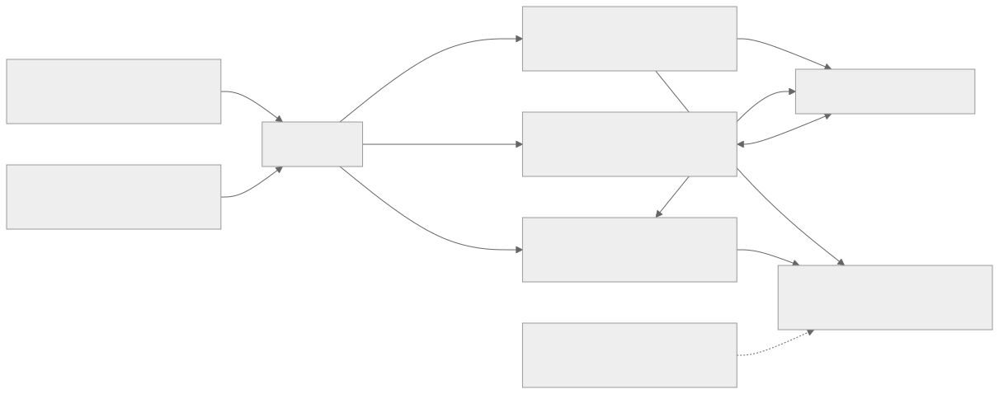

# 集成测试工具包

## 目标与前置条件

把集成结果整理成可重现的验证记录。[下载测试与示例软件包](assets/shadow-demo.zip)，安装 `requirements.txt`，分别备妥应用程序与设备的令牌文件，并完成[事前准备](before-you-start.zh-CN.md)中的环境配置。`verify.py` 使用指定版本的 MQTT 客户端与完整主题，不会取得特权凭证，也不会变更账户所有权。

[开启时序图](assets/integration-checks.zh-CN.html)

## 架构与责任范围



[开启完整框图](assets/kit-architecture.zh-CN.svg) · [Mermaid 源文件](assets/kit-architecture.zh-CN.mmd)


## 1. 执行只读检查

```bash
python verify.py --device-token "$TUTORIAL_DIR/device-token.json"   --app-token "$TUTORIAL_DIR/app-token.json"
```

检查程序会为每个身份使用不同的验证用 Client ID 连接，订阅完整响应主题，传送可对应响应的 GET，并最多等待 15 秒。只输出角色、结果与版本，不输出令牌或状态内容。影子不存在（404）属于可接受的事前检查结果；其他 rejected 代码或超时都会让检查失败。只读检查成功，不代表已验证写入权限，也不代表没有过度授权。

输出示例：

```text
CHECK device: GET accepted, version=8
CHECK app: GET accepted, version=8
PASS: read-only probes completed
```

若另有写入方正在操作，版本可能不同。不可把版本相等当成授权测试。为取得可重现的结果，请使用没有其他操作的测试设备。

## 2. 明确启用模拟控制

此步骤会修改专用命名影子 `tutorial` 的 desired/reported 电源状态。请使用可丢弃的测试设备，且不要让真实致动器订阅此影子。测试结束后不会自动删除既有状态。

```bash
export SHADOW_NAME=tutorial
python verify.py --device-token "$TUTORIAL_DIR/device-token.json"   --app-token "$TUTORIAL_DIR/app-token.json" --exercise
```

软件包会启动既有设备模拟器，并执行要求电源 `on` 的应用程序。只有应用程序确认请求已被接受，且足够新的 desired/reported 已一致时，才算成功。完成或中断时，软件包会停止模拟器。模拟器可能应用原本就存在的 desired，启动前请检查测试状态。若使用真实设备，请改为执行你的固件，并搭配[应用程序示例](app-device-example.zh-CN.md)。

## 3. 完成环境验证矩阵

| 情境 | 操作方式 | 必须确认的结果 |
| --- | --- | --- |
| 新影子 | 选择有权限且尚不存在的命名影子，GET 后执行快速入门的手动创建流程 | GET 404、创建被接受、后续 GET 成功 |
| MQTT 控制 | 明确启用模拟器操作测试 | 应用程序请求被接受、设备上报、GET 确认状态一致 |
| HTTP 与 MQTT 一致性 | 依接口指南，对同一设备与影子名称执行已签名 GET／更新 | HTTP 与 MQTT 观察到相同的状态与版本变化 |
| 离线恢复 | 停止设备、修改 desired、重新启动 | 通过 GET 同步，不依赖离线消息重播 |
| 版本冲突 | 执行集成实现示例中的两次条件更新 | 第一次提交成功；过期请求返回 409 |
| 重复事件 | 在受控测试中重送支持的预期配置 | 不重复执行一次性硬件操作，并如实上报 |
| 过期／重新签发 | 让恢复管理程序执行超过签发的有效期间 | 取得新令牌、重连、恢复订阅并 GET |
| 拒绝跨设备访问 | 对另行授权的负向测试目标，使用不符的凭证 | 在预期环节拒绝，不返回私人状态 |
| 缺少功能授权 | 依情境测试未启用 `mqtt` 或 `iot_shadow` | 必须拒绝；当前尚未落实的拒绝规则应记为失败 |
| 解除所有权 | 执行所有权与分享指南中的专用生命周期测试 | 旧拥有者失去访问权；新拥有者必须重新认领 |
| 连接接替 | 执行支持的 SDK owner 会话测试 | 优先顺序、接替与无 owner 行为符合规格 |

CLI 只自动执行前述只读检查与选用的控制测试；其他项目仍须逐项操作，不代表已通过。相关说明：[HTTP 接口](shadow-interfaces.zh-CN.md)、[冲突处理](integration-recipes.zh-CN.md)、[恢复](credential-recovery.zh-CN.md)、[所有权](ownership-sharing.zh-CN.md)、[连接状态](device-presence.zh-CN.md)。

## 4. 记录结果与清理

记录测试情境、UTC 时间、环境／服务版本、客户端版本、不含敏感信息的目标代称、预期结果、实际代码、通过／失败／未执行，以及验证记录位置。程序以非零状态结束表示自动化测试失败。超时表示结果未知，不能证明写入未发生。不确定更新结果时，重新读取后再决定是否重试。

停止所有客户端，确认没有真实设备依赖该测试影子后，按文档中的删除流程只移除命名测试影子。本地令牌文件依开发凭证政策清理。不要只为清理影子测试，就解除设备配置或停用设备。

软件包的本地规则测试，不能证明实际环境的身份验证、所有权限制或真实硬件行为。未执行的项目必须保留为「未执行」。下一步：[集成调试指南](debugging.zh-CN.md)、[正式环境验证与兼容性](compatibility-releases.zh-CN.md)。
