# 整合測試工具組

## 目標和先決條件

將整合變成可重複的證據。[下載測試/示例包](assets/shadow-demo.zip)，安裝`requirements.txt`，並準備獨立的應用程式/裝置令牌檔案以及環境設定[開始之前](before-you-start.zh-TW.md). `verify.py`使用固定MQTT客戶端和精確主題。它從未獲取特權憑據或更改帳戶所有權。

[開啟重新設計的序列圖](assets/integration-checks.zh-TW.html)

## 架構和責任界限



[全尺寸方塊圖](assets/kit-architecture.zh-TW.svg) · [Mermaid 原始檔](assets/kit-architecture.zh-TW.mmd)


## 1. 執行只讀探頭

```bash
python verify.py --device-token "$TUTORIAL_DIR/device-token.json"   --app-token "$TUTORIAL_DIR/app-token.json"
```

對於每個身份，探測器連線到唯一的驗證客戶端ID，訂閱精確的響應主題，傳送相關的GET並最多等待15秒以獲取響應。它只列印角色、結果和版本，不列印令牌或狀態內容。缺失的影子（404）是接受的飛行前結果；任何其他被拒絕的程式或超時都會導致探測器失敗。只讀成功不會驗證寫入許可權或沒有過度許可權。

說明性輸出：

```text
CHECK device: GET accepted, version=8
CHECK app: GET accepted, version=8
PASS: read-only probes completed
```

如果另一位作家活躍，版本可能會有所不同。不需要用等效性作為授權測試。為了獲得可重複的結果，請保留一個否則處於休眠狀態的測試裝置。

## 2.選擇加入模擬控制

這會改變專用名為Shadow的專用電路的所需/報告功率。`tutorial`。使用沒有訂閱此影子的真實執行器的一次性測試裝置。測試之後不會刪除現有狀態。

```bash
export SHADOW_NAME=tutorial
python verify.py --device-token "$TUTORIAL_DIR/device-token.json"   --app-token "$TUTORIAL_DIR/app-token.json" --exercise
```

該套件啟動現有的裝置模擬器並執行請求電源的應用程式`on`。只有當應用程式觀察到接受的意圖和足夠新鮮的所需/報告的收斂時，它才會成功。在完成或中斷時停止模擬器。模擬器可以應用現有的所需值；在開始前檢視測試狀態。對於真實裝置，請改用您的韌體並使用[應用程式示例](app-device-example.zh-TW.md).

## 3. 完成環境資格矩陣

|案例|程式|所需證據|
| --- | --- | --- |
|新陰影|選擇一個新的授權名為Shadow的帳戶，然後執行GET，然後執行手動建立快速入門。|獲取404，接受建立，隨後獲取|
|MQTT控制|選擇加入模擬器練習|應用程式接受、裝置報告、聚合GET|
|HTTP 校驗|從同一裝置/名稱上的介面指南中執行已簽名的GET/更新|HTTP和MQTT遵循相同的狀態/版本演變|
|離線恢復|停止裝置，更改所需設定，重新啟動|獲得對賬，而不需要假設離線重播|
|版本衝突|在整合食譜中執行兩個受保護的更新|第一次提交；過時的請求返回409|
|重複|在受控測試中重複支援的意圖|不重複一次性硬體操作；真實報告|
|到期/重新發行|在發行壽命之外執行恢復主管|新令牌，重新連線，恢復訂閱/GET|
|跨裝置拒絕|使用一個單獨授權的帶有錯誤憑證的陰性測試目標|在預期邊界處拒絕；沒有返回的私有狀態|
|缺少能力|沒有...的測試`mqtt`或者`iot_shadow`如適用|強制拒絕；將當前的執法差距記錄為失敗|
|所有權釋放|從所有權和共享開始的專門的整個生命週期測試|舊業主失去訪問許可權；下一個業主必須申請|
|替代出席|支援的SDK所有者會話測試|優先、更換和無所有者行為符合契約|

CLI僅自動執行第一次讀取探頭和可選控制練習。其他行仍然是明確的程式，而不是隱含的透過。連結：[HTTP介面](shadow-interfaces.zh-TW.md), [衝突食譜](integration-recipes.zh-TW.md), [恢復](credential-recovery.zh-TW.md), [所有權](ownership-sharing.zh-TW.md), [存在](device-presence.zh-TW.md).

## 4.記錄和清理

使用帶有案例、UTC時間、環境/服務版本、客戶端版本、經過驗證的目標別名、預期結果、觀察到的程式、透過/失敗/未執行和證據位置的結果日誌。非零的過程退出會導致自動執行失敗。超時是未知結果，而不是寫入沒有發生的事實證明。在重複不確定的突變之前，請重新閱讀。

當沒有真正的裝置依賴它時，請使用檔案中描述的刪除程式停止所有客戶端，並僅刪除指定的測試影子。根據您的開發憑證策略刪除本地令牌檔案。不要僅僅為了清理影子測試而解除配置或停用裝置。

此軟體包的本地策略測試不能證明即時身份驗證、所有權執法或物理硬體行為。未執行的矩陣行必須保持未執行狀態。下一步：[整合除錯](debugging.zh-TW.md), [生產證據和相容性](compatibility-releases.zh-TW.md).
