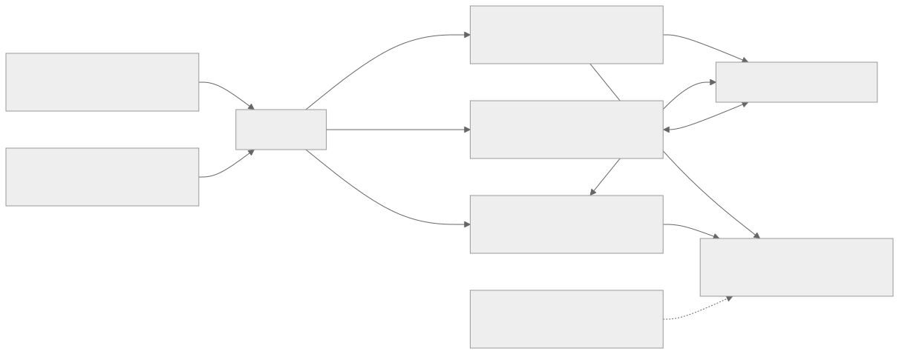

# 整合測試套件

## 目標與前置條件

把整合結果整理成可重現的驗證紀錄。[下載測試與範例套件](assets/shadow-demo.zip)，安裝 `requirements.txt`，分別備妥應用程式與裝置的 token 檔案，並完成[事前準備](before-you-start.zh-TW.md)中的環境設定。`verify.py` 使用指定版本的 MQTT 用戶端與完整主題，不會取得特權驗證資訊，也不會變更帳戶所有權。

[開啟時序圖](assets/integration-checks.zh-TW.html)

## 架構與責任範圍



[開啟完整方塊圖](assets/kit-architecture.zh-TW.svg) · [Mermaid 原始檔](assets/kit-architecture.zh-TW.mmd)


## 1. 執行唯讀檢查

```bash
python verify.py --device-token "$TUTORIAL_DIR/device-token.json"   --app-token "$TUTORIAL_DIR/app-token.json"
```

檢查程式會為每個身分使用不同的驗證用 Client ID 連線，訂閱完整回應主題，傳送可對應回應的 GET，並最多等待 15 秒。只輸出角色、結果與版本，不輸出 token 或狀態內容。影子不存在（404）屬於可接受的事前檢查結果；其他 rejected 代碼或逾時都會讓檢查失敗。唯讀檢查成功，不代表已驗證寫入權限，也不代表沒有過度授權。

輸出範例：

```text
CHECK device: GET accepted, version=8
CHECK app: GET accepted, version=8
PASS: read-only probes completed
```

若另有寫入端正在操作，版本可能不同。不可把版本相等當成授權測試。為取得可重現的結果，請使用沒有其他操作的測試裝置。

## 2. 明確啟用模擬控制

此步驟會修改專用具名影子 `tutorial` 的 desired/reported 電源狀態。請使用可拋棄的測試裝置，且不要讓真實致動器訂閱此影子。測試結束後不會自動刪除既有狀態。

```bash
export SHADOW_NAME=tutorial
python verify.py --device-token "$TUTORIAL_DIR/device-token.json"   --app-token "$TUTORIAL_DIR/app-token.json" --exercise
```

套件會啟動既有裝置模擬器，並執行要求電源 `on` 的應用程式。只有應用程式確認請求已被接受，且足夠新的 desired/reported 已一致時，才算成功。完成或中斷時，套件會停止模擬器。模擬器可能套用原本就存在的 desired，啟動前請檢查測試狀態。若使用真實裝置，請改為執行你的韌體，並搭配[應用程式範例](app-device-example.zh-TW.md)。

## 3. 完成環境驗證矩陣

| 情境 | 操作方式 | 必須確認的結果 |
| --- | --- | --- |
| 新影子 | 選擇有權限且尚不存在的具名影子，GET 後執行快速入門的手動建立流程 | GET 404、建立被接受、後續 GET 成功 |
| MQTT 控制 | 明確啟用模擬器操作測試 | 應用程式請求被接受、裝置回報、GET 確認狀態一致 |
| HTTP 與 MQTT 一致性 | 依介面指南，對同一裝置與影子名稱執行已簽署 GET／更新 | HTTP 與 MQTT 觀察到相同的狀態與版本變化 |
| 離線恢復 | 停止裝置、修改 desired、重新啟動 | 透過 GET 同步，不依賴離線訊息重播 |
| 版本衝突 | 執行整合實作範例中的兩次條件更新 | 第一次提交成功；過期請求回傳 409 |
| 重複事件 | 在受控測試中重送支援的預期設定 | 不重複執行一次性硬體操作，並如實回報 |
| 過期／重新簽發 | 讓恢復管理程式執行超過簽發的有效期間 | 取得新 token、重連、恢復訂閱並 GET |
| 拒絕跨裝置存取 | 對另行授權的負向測試目標，使用不符的驗證資訊 | 在預期環節拒絕，不回傳私人狀態 |
| 缺少功能授權 | 依情境測試未啟用 `mqtt` 或 `iot_shadow` | 必須拒絕；目前尚未落實的拒絕規則應記為失敗 |
| 解除所有權 | 執行所有權與分享指南中的專用生命週期測試 | 舊擁有者失去存取權；新擁有者必須重新認領 |
| 連線接替 | 執行支援的 SDK owner 工作階段測試 | 優先順序、接替與無 owner 行為符合規格 |

CLI 只自動執行前述唯讀檢查與選用的控制測試；其他項目仍須逐項操作，不代表已通過。相關說明：[HTTP 介面](shadow-interfaces.zh-TW.md)、[衝突處理](integration-recipes.zh-TW.md)、[恢復](credential-recovery.zh-TW.md)、[所有權](ownership-sharing.zh-TW.md)、[連線狀態](device-presence.zh-TW.md)。

## 4. 記錄結果與清理

記錄測試情境、UTC 時間、環境／服務版本、用戶端版本、不含敏感資訊的目標代稱、預期結果、實際代碼、通過／失敗／未執行，以及驗證紀錄位置。程序以非零狀態結束表示自動化測試失敗。逾時表示結果未知，不能證明寫入未發生。不確定更新結果時，重新讀取後再決定是否重試。

停止所有用戶端，確認沒有真實裝置依賴該測試影子後，依文件中的刪除流程只移除具名測試影子。本機 token 檔案依開發驗證資訊政策清理。不要只為清理影子測試，就解除裝置配置或停用裝置。

套件的本機規則測試，不能證明實際環境的身分驗證、所有權限制或真實硬體行為。未執行的項目必須保留為「未執行」。下一步：[整合除錯指南](debugging.zh-TW.md)、[正式環境驗證與相容性](compatibility-releases.zh-TW.md)。
