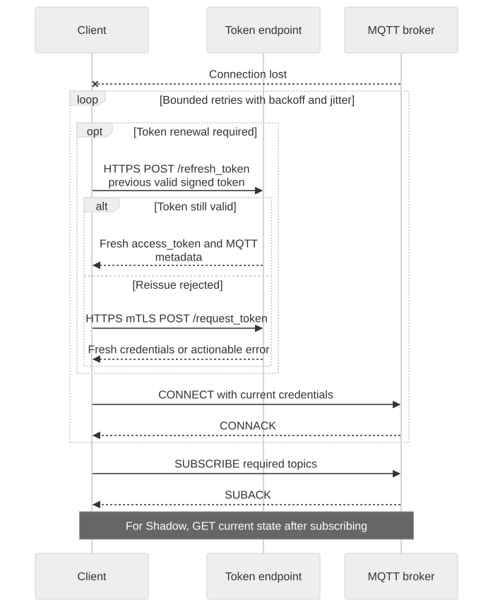

# MQTT Connection Guide

Use the public MQTT TLS listener supplied by your environment. The token response supplies username and Client ID metadata, not the host, port, or CA trust bundle. Validate the server certificate and hostname.

[Open full-size diagram](assets/mqtt-reconnect.svg) · [Mermaid source](assets/mqtt-reconnect.mmd)

## Connection settings

| Setting | Tutorial choice | Meaning |
| --- | --- | --- |
| Protocol | MQTT 3.1.1 (`-V mqttv311`) | Explicit client choice, not a claim that this is the only supported protocol |
| Keep Alive | 60 seconds (`-k 60`) | Example client setting; confirm deployment limits |
| Session | Mosquitto default clean session | Resubscribe after reconnect; no offline replay assumption |
| QoS | 1 | At-least-once transport behavior; application processing may repeat |
| Retain | Off; no `-r` | Tutorial publications are not retained |
| Client ID | Returned base plus `-watch` or `-send` | Prevent one tutorial connection from replacing another |

The reviewed public transport contract does not specify one universal Keep Alive limit, session persistence policy, retained-message policy, or general-topic QoS mandate. Obtain these deployment settings before designing an offline queue. Runtime logs have their own QoS 1 contract; do not generalize it to every topic.

## Recovery procedure

1. Pause dependent operations when disconnected; do not report a publish as completed merely because it was queued locally.
2. Check expiry and renew credentials when necessary. Stop repeated retries for invalid credentials or permissions and surface an actionable error.
3. Retry temporary connection failures using bounded exponential backoff with jitter.
4. Reconnect with current username, password, and Client ID metadata.
5. Subscribe to required topics and wait for successful SUBACK.
6. For Shadow, GET current state and reconcile it with the actual device state before acting on queued notifications.

Keep connection identity stable for the intended role while its credentials remain valid. Do not reuse an identical Client ID for simultaneous connections. The short-lived publisher in the tutorials may reuse `-send` only after the preceding publisher has exited.

## Three different acknowledgements

**PUBACK** confirms QoS 1 transport receipt. **Shadow `update/accepted`** confirms a successful Shadow mutation. **An actual reported value** represents what firmware says it has applied. Only firmware verification or an application-level result can establish hardware success.

Do not retry a non-idempotent operation solely because the connection dropped before you saw its result. Read current state or use the application's operation identity first. Shadow `clientToken` correlates a request; it is not a server-side deduplication guarantee.

Next: [offline and conflict recipes](integration-recipes.en.md).

Continue: [Run the credential recovery supervisor](credential-recovery.en.md).

Continue: [Device presence and owner transport](device-presence.en.md).
