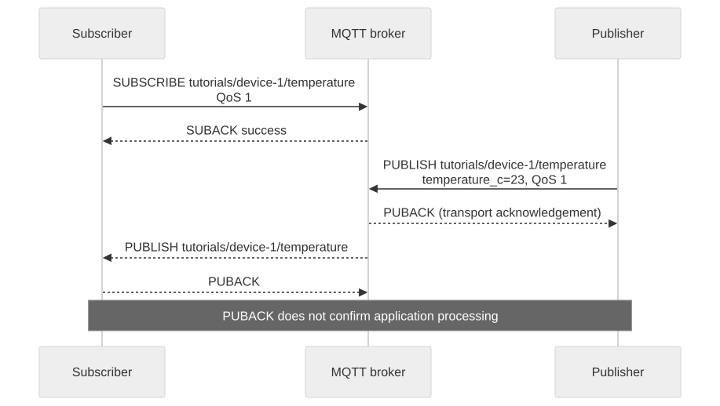

# Quickstart: Connect and Exchange Messages

Goal: receive `{"temperature_c":23}` on an application-defined topic. Complete [authentication](authentication.en.md) first. Both connections below use the test device token and distinct role suffixes; this isolates MQTT mechanics before adding a second principal in the Shadow tutorial.



[Open full-size diagram](assets/mqtt-exchange.svg) · [Mermaid source](assets/mqtt-exchange.mmd)

## 1. Start a subscriber

Run in terminal A with the prerequisite variables set:

```bash
mosquitto_sub -h "$MQTT_HOST" -p "$MQTT_PORT" --cafile "$CA_FILE" \
  -u "$(jq -er '.mqtt.username' "$TUTORIAL_DIR/device-token.json")" \
  -P "$(jq -er '.access_token' "$TUTORIAL_DIR/device-token.json")" \
  -i "$(jq -er '.mqtt.client_id' "$TUTORIAL_DIR/device-token.json")-watch" \
  -V mqttv311 -k 60 -q 1 -d -v \
  -t "tutorials/$DEVICE_ID/temperature"
```

Wait for the debug output to show a successful SUBACK before publishing. A running process alone does not prove the subscription succeeded. These local test commands pass credentials as process arguments; use an isolated development machine and avoid capturing command invocations in shared logs.

## 2. Publish a message

In terminal B, using the same environment and `TUTORIAL_DIR`:

```bash
mosquitto_pub -h "$MQTT_HOST" -p "$MQTT_PORT" --cafile "$CA_FILE" \
  -u "$(jq -er '.mqtt.username' "$TUTORIAL_DIR/device-token.json")" \
  -P "$(jq -er '.access_token' "$TUTORIAL_DIR/device-token.json")" \
  -i "$(jq -er '.mqtt.client_id' "$TUTORIAL_DIR/device-token.json")-send" \
  -V mqttv311 -k 60 -q 1 \
  -t "tutorials/$DEVICE_ID/temperature" -m '{"temperature_c":23}'
```

## 3. Verify delivery

Terminal A should print:

```text
tutorials/device-1/temperature {"temperature_c":23}
```

The JSON is your application's example schema; the broker does not turn it into Shadow state. The publish command finishing at QoS 1 acknowledges transport receipt, not subscriber business logic. Duplicate deliveries remain possible. Stop the subscriber with Ctrl-C when finished.

## If no message arrives

Check successful SUBACK, matching topic spelling, matching Brand Cloud identities, and distinct Client IDs. Do not expect an earlier non-retained message to replay when you subscribe later. A general topic succeeding does not demonstrate Shadow permission.

Next: [connection behavior](mqtt-connection.en.md), [Topic reference](mqtt-topics.en.md), or [Shadow Quickstart](shadow-quickstart.en.md).

Architecture: [MQTT topic architecture](mqtt-topics.en.md).
