# MQTT Topics and Message Reference

## Topic families and destinations

These are logical protocol families behind the authenticated broker. General application topics, device transport envelopes, runtime logs and reserved Shadow messages have different contracts. Their placement in one broker does not make their schemas or permissions interchangeable. The diagram omits reverse device-command arrows for clarity; the direction table below remains the reference.

[Full-size block diagram](assets/mqtt-topic-families.svg) · [Mermaid source](assets/mqtt-topic-families.mmd)

## Namespace rules

| Topic | Direction and purpose | Payload |
| --- | --- | --- |
| `tutorials/{devid}/temperature` | Application publisher to subscribers in the same Brand Cloud | Tutorial-defined JSON, for example `{"temperature_c":23}` |
| `devices/{devid}/up/messages` | Device to service, configured device transport root | Device transport envelope; not a Shadow document |
| `devices/{devid}/down/commands` | Service to device | Device command/event envelope; not raw desired state |
| `devices/{devid}/logs` | Device to log ingestion | Dedicated runtime-log schema |
| `$vc/devices/{devid}/shadow/...` | Client requests and service responses/notifications | [Shadow reference](shadow-reference.en.md) |

General non-reserved topics are relative to your authenticated Brand Cloud namespace. The tutorial topic is an example you control, not a built-in telemetry ingestion API. General namespace isolation is by Brand Cloud; do not infer per-device isolation from a device ID placed in a topic string.

Do not publish application data under `$vc`. Do not add a tenant prefix. `_bc` is server-only, `$aws/things/...` is not an RTK alias, and other `$` roots require an explicit service contract.

## Shadow permissions

Publish only to authorized `get`, `update`, and `delete` request topics. Subscribe to the exact operation response and notification topics for your subject-bound device. Do not publish accepted/rejected/delta/documents messages as if you were the service. Avoid broad `$vc/.../shadow/#` subscriptions; the inspected broker policy denies them even where individual response topics are allowed.

MQTT Shadow requires both `mqtt` and `iot_shadow`, plus policy authorizing the principal and target. Device and app identity do not themselves impose a desired-only or reported-only document rule. Subscriber-oriented credentials must not be treated as general publishing credentials.

## Message handling

General MQTT data does not have a universal service JSON response or error envelope. If your application needs a request/response protocol on custom topics, define its schema, correlation, timeout, and idempotency explicitly.

Shadow requests have their own application response topics. Subscribe before requesting and match `clientToken` when that response supplies it. A broker authorization failure happens before the Shadow service and need not produce a Shadow `rejected` message.

See [message exchange sequence](mqtt-quickstart.en.md), [Shadow request sequence](shadow-interfaces.en.md), and [failure boundaries](troubleshooting.en.md). Device transport, streaming payloads, and runtime-log integration are outside this first edition; use the [SDK workflows](/console/chipset-sdk) for supported higher-level integrations.
