# MQTT 主题与讯息参考

## 主题家庭和目的地

这些是身份验证代理服务背后的逻辑协议家族。通用应用程式主题、装置传输信封、执行时日志和保留的影子讯息具有不同的契约。它们在一个代理服务中的放置并不使它们的模式或许可权相互交换。图表为了清晰起见省略了反向装置命令箭头；下面的方向表仍然是参考。

[全尺寸方块图](assets/mqtt-topic-families.zh-CN.svg) · [Mermaid 原始档](assets/mqtt-topic-families.zh-CN.mmd)

## 名称空间规则

|主题|方向和目的|有效载荷|
| --- | --- | --- |
| `tutorials/{devid}/temperature` |应用程式发布端向同一品牌云中的订阅者传送|教学定义的JSON，例如`{"temperature_c":23}` |
| `devices/{devid}/up/messages` |服务装置，配置装置传输根|装置运输信封；不是影子档案|
| `devices/{devid}/down/commands` |对装置的服务|装置命令/事件信封；不是原始所需状态|
| `devices/{devid}/logs` |记录摄入的装置|专用的执行时日志模式|
| `$vc/devices/{devid}/shadow/...` |客户请求和服务响应/通知| [阴影参考](shadow-reference.zh-CN.md) |

一般非保留主题与您的身份验证品牌云名称空间有关。教学主题是一个您控制的示例，而不是内建的远端监测汇入API。一般名称空间隔离由品牌云进行；不要从放置在主题字串中的装置ID中推断每个装置的隔离。

请勿在以下情况下释出应用程式资料`$vc`。不要新增租户字首。`_bc`仅限伺服器，`$aws/things/...`不是RTK别名，还有其他`$`根部需要明确的服务契约。

## 影子许可权

仅向授权人员发布`get`, `update`，和`delete`请求主题。订阅您受主题约束的装置的确切操作响应和通知主题。不要释出已接受/拒绝/差异/档案讯息，就像您是服务一样。避免广泛的`$vc/.../shadow/#`订阅；即使允许个别响应主题，经检查的代理服务政策也会拒绝它们。

MQTT Shadow需要这两个`mqtt`与`iot_shadow`，外加授权主机和目标的策略。装置和应用程式身份本身不会强制执行仅期望或仅报告的档案规则。以订阅者为导向的凭据不得被视为通用释出凭据。

## 讯息处理

一般的MQTT资料没有通用服务JSON响应或错误信封。如果您的应用程式需要在自定义主题上使用请求/响应协议，请明确定义其模式、相关性、超时和同构性。

影子请求有自己的应用程式响应主题。请求和匹配之前请订阅`clientToken`当该响应提供它时。在影子服务之前发生代理服务授权失败，无需产生影子`rejected`讯息。

看到[讯息交换序列](mqtt-quickstart.zh-CN.md), [影子请求序列](shadow-interfaces.zh-CN.md)，和[故障边界](troubleshooting.zh-CN.md). 装置传输、流式传输有效载荷和执行时日志整合不在第一版之外；请使用[SDK工作流程](/console/chipset-sdk)用于支援的高阶整合。
