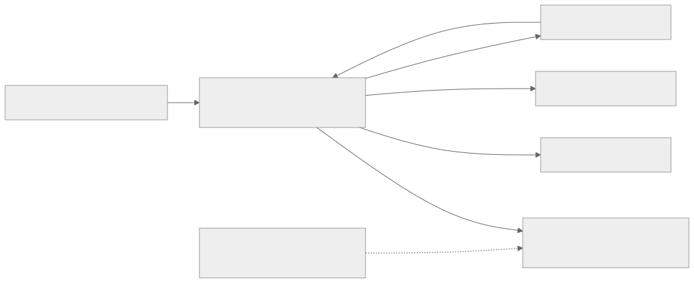

# MQTT 主题与消息参考

## 主题类型与消息流向

以下是受身份验证保护的 Broker 所承载的不同协议类型。普通应用主题、设备传输消息、运行时日志与 Shadow 保留消息，各有不同的规范。即使使用同一个 Broker，数据格式与权限也不能互换。为清晰展示，图中省略了反向的设备命令箭头；实际方向以下方表格为准。

[查看完整架构图](assets/mqtt-topic-families.zh-CN.svg) · [Mermaid 源码](assets/mqtt-topic-families.zh-CN.mmd)

## 命名空间规则

| 主题 | 方向与用途 | 消息内容 |
| --- | --- | --- |
| `tutorials/{devid}/temperature` | 应用发布端发送给同一 Brand Cloud 的订阅端 | 教程自定义 JSON，例如 `{"temperature_c":23}` |
| `devices/{devid}/up/messages` | 设备发送给服务；使用已配置的设备传输根主题 | 设备传输的封装消息，不是 Shadow 文档 |
| `devices/{devid}/down/commands` | 服务发送给设备 | 设备命令或事件的封装消息，不是原始期望状态 |
| `devices/{devid}/logs` | 设备发送给日志接收服务 | 专用运行时日志格式 |
| `$vc/devices/{devid}/shadow/...` | 客户端请求，以及服务响应或通知 | [Shadow 参考](shadow-reference.zh-CN.md) |

普通非保留主题位于已验证的 Brand Cloud 命名空间中。教程主题是由应用自行定义的示例，不是内置遥测接收 API。普通命名空间按 Brand Cloud 隔离；主题字符串中即使有设备 ID，也不代表具备逐设备隔离。

不要在 `$vc` 下发布应用数据，也不要加入租户前缀。`_bc` 仅供服务器使用，`$aws/things/...` 不是 RTK 的别名；其他 `$` 根主题必须有明确的服务规范才能使用。

## Shadow 权限

只能向已授权的 `get`、`update` 和 `delete` 请求主题发布。请针对绑定至当前身份的设备，订阅具体的操作响应与通知主题。不要冒充服务发布 accepted／rejected／delta／documents 消息。避免使用范围过广的 `$vc/.../shadow/#` 订阅；经检查的 Broker 策略会拒绝此类订阅，即使允许订阅单独的响应主题也一样。

MQTT Shadow 同时需要 `mqtt` 与 `iot_shadow`，且策略必须允许该身份主体操作目标。设备或 App 身份本身，不会自动限制只能写 desired 或 reported。用于订阅的凭证，不可作为普通发布凭证使用。

## 消息处理

普通 MQTT 数据没有通用的服务 JSON 响应或错误封装格式。如果应用需要在自定义主题上实现请求／响应协议，必须明确定义数据格式、请求关联、超时与幂等性。

Shadow 请求有专用的应用层响应主题。请先订阅再发送请求；响应包含 `clientToken` 时，用它匹配请求。Broker 授权失败发生在请求进入 Shadow 服务之前，因此不一定会产生 Shadow `rejected` 消息。

请参阅[消息交换流程](mqtt-quickstart.zh-CN.md)、[Shadow 请求流程](shadow-interfaces.zh-CN.md)与[各层失败场景](troubleshooting.zh-CN.md)。本初版不涵盖设备传输、流媒体数据与运行时日志集成；受支持的高层集成请使用 [SDK 流程](/console/chipset-sdk)。
