# MQTT 主題與訊息參考

## 主題家庭和目的地

這些是身份驗證代理服務背後的邏輯協議家族。通用應用程式主題、裝置傳輸信封、執行時日誌和保留的影子訊息具有不同的契約。它們在一個代理服務中的放置並不使它們的模式或許可權相互交換。圖表為了清晰起見省略了反向裝置命令箭頭；下面的方向表仍然是參考。

[全尺寸方塊圖](assets/mqtt-topic-families.zh-TW.svg) · [Mermaid 原始檔](assets/mqtt-topic-families.zh-TW.mmd)

## 名稱空間規則

|主題|方向和目的|有效載荷|
| --- | --- | --- |
| `tutorials/{devid}/temperature` |應用程式發布端向同一品牌雲中的訂閱者傳送|教學定義的JSON，例如`{"temperature_c":23}` |
| `devices/{devid}/up/messages` |服務裝置，配置裝置傳輸根|裝置運輸信封；不是影子檔案|
| `devices/{devid}/down/commands` |對裝置的服務|裝置命令/事件信封；不是原始所需狀態|
| `devices/{devid}/logs` |記錄攝入的裝置|專用的執行時日誌模式|
| `$vc/devices/{devid}/shadow/...` |客戶請求和服務響應/通知| [陰影參考](shadow-reference.zh-TW.md) |

一般非保留主題與您的身份驗證品牌雲名稱空間有關。教學主題是一個您控制的示例，而不是內建的遠端監測匯入API。一般名稱空間隔離由品牌雲進行；不要從放置在主題字串中的裝置ID中推斷每個裝置的隔離。

請勿在以下情況下釋出應用程式資料`$vc`。不要新增租戶字首。`_bc`僅限伺服器，`$aws/things/...`不是RTK別名，還有其他`$`根部需要明確的服務契約。

## 影子許可權

僅向授權人員發布`get`, `update`，和`delete`請求主題。訂閱您受主題約束的裝置的確切操作響應和通知主題。不要釋出已接受/拒絕/差異/檔案訊息，就像您是服務一樣。避免廣泛的`$vc/.../shadow/#`訂閱；即使允許個別響應主題，經檢查的代理服務政策也會拒絕它們。

MQTT Shadow需要這兩個`mqtt`與`iot_shadow`，外加授權主機和目標的策略。裝置和應用程式身份本身不會強制執行僅期望或僅報告的檔案規則。以訂閱者為導向的憑據不得被視為通用釋出憑據。

## 訊息處理

一般的MQTT資料沒有通用服務JSON響應或錯誤信封。如果您的應用程式需要在自定義主題上使用請求/響應協議，請明確定義其模式、相關性、超時和同構性。

影子請求有自己的應用程式響應主題。請求和匹配之前請訂閱`clientToken`當該響應提供它時。在影子服務之前發生代理服務授權失敗，無需產生影子`rejected`訊息。

看到[訊息交換序列](mqtt-quickstart.zh-TW.md), [影子請求序列](shadow-interfaces.zh-TW.md)，和[故障邊界](troubleshooting.zh-TW.md). 裝置傳輸、流式傳輸有效載荷和執行時日誌整合不在第一版之外；請使用[SDK工作流程](/console/chipset-sdk)用於支援的高階整合。
