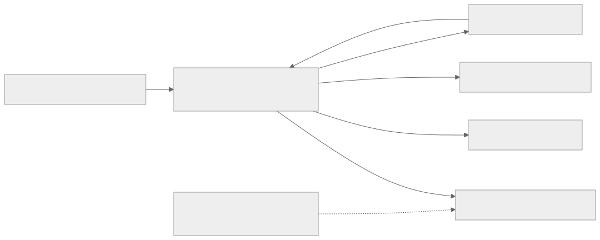

# MQTT 主題與訊息參考

## 主題類型與訊息流向

下列是受身分驗證保護的 Broker 所承載的不同協定類型。一般應用程式主題、裝置傳輸訊息、執行階段日誌與 Shadow 保留訊息，各有不同的規格。即使使用同一個 Broker，資料格式與權限也不能互換。為了清楚呈現，圖中省略反向的裝置命令箭頭；實際方向以下方表格為準。

[檢視完整架構圖](assets/mqtt-topic-families.zh-TW.svg) · [Mermaid 原始碼](assets/mqtt-topic-families.zh-TW.mmd)

## 命名空間規則

| 主題 | 方向與用途 | 訊息內容 |
| --- | --- | --- |
| `tutorials/{devid}/temperature` | 應用程式發布端傳給同一 Brand Cloud 的訂閱端 | 教學自訂 JSON，例如 `{"temperature_c":23}` |
| `devices/{devid}/up/messages` | 裝置傳給服務；使用設定的裝置傳輸根主題 | 裝置傳輸的封裝訊息，不是 Shadow 文件 |
| `devices/{devid}/down/commands` | 服務傳給裝置 | 裝置命令或事件的封裝訊息，不是原始預期狀態 |
| `devices/{devid}/logs` | 裝置傳給日誌接收服務 | 專用執行階段日誌格式 |
| `$vc/devices/{devid}/shadow/...` | 用戶端請求，以及服務回應或通知 | [Shadow 參考](shadow-reference.zh-TW.md) |

一般非保留主題位於已驗證的 Brand Cloud 命名空間中。教學主題是由應用程式自行定義的範例，不是內建遙測接收 API。一般命名空間以 Brand Cloud 隔離；主題字串中即使有裝置 ID，也不代表具備逐裝置隔離。

不要在 `$vc` 下發布應用程式資料，也不要加入租戶前綴。`_bc` 僅供伺服器使用，`$aws/things/...` 不是 RTK 的別名；其他 `$` 根主題必須有明確的服務規格才能使用。

## Shadow 權限

只能向已授權的 `get`、`update` 與 `delete` 請求主題發布。請針對綁定至目前身分的裝置，訂閱確切的操作回應與通知主題。不要冒充服務發布 accepted／rejected／delta／documents 訊息。避免使用範圍過廣的 `$vc/.../shadow/#` 訂閱；經檢查的 Broker 政策會拒絕這類訂閱，即使個別回應主題允許訂閱也一樣。

MQTT Shadow 同時需要 `mqtt` 與 `iot_shadow`，且政策必須允許該身分主體操作目標。裝置或 App 身分本身，不會自動限制只能寫 desired 或 reported。供訂閱使用的驗證資訊，不可當作一般發布驗證資訊使用。

## 訊息處理

一般 MQTT 資料沒有通用的服務 JSON 回應或錯誤封裝格式。若應用程式需要在自訂主題上實作請求／回應協定，必須明確定義資料格式、請求關聯、逾時與冪等性。

Shadow 請求有專用的應用層回應主題。請先訂閱再送出請求；回應包含 `clientToken` 時，用它比對請求。Broker 授權失敗發生在請求進入 Shadow 服務之前，因此不一定會產生 Shadow `rejected` 訊息。

請參閱[訊息交換流程](mqtt-quickstart.zh-TW.md)、[Shadow 請求流程](shadow-interfaces.zh-TW.md)與[各層失敗情境](troubleshooting.zh-TW.md)。本初版不涵蓋裝置傳輸、串流資料與執行階段日誌整合；受支援的高階整合請使用 [SDK 流程](/console/chipset-sdk)。
