# Cloud Service Overview

RTK Cloud connects device firmware, applications, and backend services. MQTT provides topic-based message exchange. Device Shadow stores a device's requested and reported state so applications and devices can reconcile even when they are not online at the same time.

[Open full-size diagram](assets/service-overview.svg) · [Mermaid source](assets/service-overview.mmd)

## Choose an interface

| Goal | Interface |
| --- | --- |
| Exchange application-defined messages | General MQTT topics |
| Keep a requested configuration and actual device state | Device Shadow over MQTT or HTTP |
| Read or change Shadow from an HTTP backend | Signed Shadow HTTP API |
| Integrate a supported client package | [Chipset and SDK manual](/console/chipset-sdk) |

Device firmware normally applies desired settings and reports actual state. Apps and backends normally request changes and observe convergence. This is an application convention, not a built-in desired/reported access restriction: permissions come from the principal and product policy.

## Capabilities are independent

| Enabled capabilities | General MQTT | HTTP Shadow | MQTT Shadow |
| --- | --- | --- | --- |
| `mqtt` | Yes | No | No |
| `iot_shadow` | No | Yes | No |
| Both | Yes | Yes | Yes |

Configure these capabilities through your product's service setup. A token cannot enable a capability that the product/device is not entitled to use. Credentials and policy must also authorize the action.

Public device identity is `devid`; the Shadow HTTP API calls the same value `thingName`. Examples use `device-1` and a named Shadow `tutorial` to keep tutorial state separate from the unnamed Shadow.

## Learning path

Start with [Before You Start](before-you-start.en.md), complete [MQTT message exchange](mqtt-quickstart.en.md), then follow [Shadow state synchronization](shadow-quickstart.en.md). Streaming, OTA, and telemetry service guides are planned for a later edition.
