# 云端服务概览

RTK Cloud 串连装置韧体、应用程式与后端服务。MQTT 提供依主题交换讯息的机制。装置影子储存装置的预期状态与回报状态，因此即使应用程式与装置未同时线上，也能协调状态。

[开启全尺寸图表](assets/service-overview.zh-CN.svg) · [Mermaid 原始档](assets/service-overview.zh-CN.mmd)

## 选择一个介面

|目标|介面|
| --- | --- |
|交换应用程式定义的讯息|MQTT通用主题|
|保留请求的配置和实际装置状态|MQTT或HTTP上的装置影子|
|从HTTP后端读取或更改Shadow|已签名的Shadow HTTP API|
|整合受支援的客户端软体包| [晶片组和SDK手册](/console/chipset-sdk) |

装置韧体通常应用所需的设定并报告实际状态。应用程式和后端通常要求更改并观察收敛。这是一种应用程式惯例，而不是内建的所需/报告访问限制：许可权来自主机和产品策略。

## 能力是独立的

|启用功能| 一般 MQTT |HTTP 影子|MQTT影子|
| --- | --- | --- | --- |
| `mqtt` | 是 | 否 | 否 |
| `iot_shadow` | 否 | 是 | 否 |
| 两者皆是 | 是 | 是 | 是 |

透过产品的服务设定配置这些功能。令牌不能启用产品/装置无权使用的功能。凭据和策略也必须授权该操作。

公共装置身份是`devid`；Shadow HTTP API呼叫相同的值`thingName`。示例用法`device-1`和一个命名的影子`tutorial`将教学状态与无名影子分开。

## 学习路径

先阅读[云/装置设定](setup-cloud-device.zh-CN.md)与[凭证设定](credential-setup.zh-CN.md)，接著[开始之前](before-you-start.zh-CN.md)，完成[MQTT讯息交换](mqtt-quickstart.zh-CN.md)，再阅读[影子状态同步](shadow-quickstart.zh-CN.md). 流媒体、OTA和遥测服务指南计划在后续版本中提供。

要使用完整的双客户端程式，请使用[端到端应用程式与装置范例](app-device-example.zh-CN.md)。伺服器团队应该阅读[后端整合](backend-integration.zh-CN.md)；检查[连线设定与服务限制](connection-settings.zh-CN.md)在选择生产客户端设定之前。

继续：[选择一个开发人员学习途径](documentation-map.zh-CN.md).
