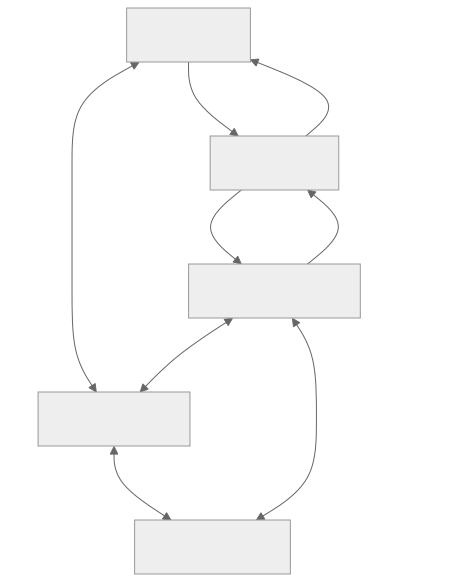

# 云服务概览

RTK Cloud 连接设备固件、应用与后端服务。MQTT 提供基于主题的消息交换机制。设备影子（Device Shadow）存储设备的期望状态与上报状态，让应用和设备即使未同时在线，也能同步状态。

[查看完整架构图](assets/service-overview.zh-CN.svg) · [Mermaid 源码](assets/service-overview.zh-CN.mmd)

## 选择集成接口

| 目标 | 使用接口 |
| --- | --- |
| 交换应用自定义消息 | 普通 MQTT 主题 |
| 保存期望配置与设备实际状态 | 通过 MQTT 或 HTTP 使用设备影子 |
| 从 HTTP 后端读取或修改 Shadow | 使用签名的 Shadow HTTP API |
| 集成受支持的客户端软件包 | [Chipset 与 SDK 手册](/console/chipset-sdk) |

设备固件通常负责应用期望配置并上报实际状态；App 与后端则提出变更，并观察设备是否达到期望状态。这是应用的分工约定，不是内置的 desired／reported 访问限制；实际权限由身份主体与产品策略决定。

## 各项功能分别启用

| 已启用功能 | 普通 MQTT | HTTP Shadow | MQTT Shadow |
| --- | --- | --- | --- |
| `mqtt` | 是 | 否 | 否 |
| `iot_shadow` | 否 | 是 | 否 |
| 两者均启用 | 是 | 是 | 是 |

请通过产品的服务配置启用功能。如果产品或设备未取得某项服务使用权，令牌也无法为其启用该功能。执行操作时，凭证与策略同样必须允许该操作。

公开设备标识符是 `devid`；Shadow HTTP API 将相同的值称为 `thingName`。示例使用 `device-1` 与命名 Shadow `tutorial`，将教程状态和未命名 Shadow 分开。

## 建议阅读顺序

先阅读[云与设备配置](setup-cloud-device.zh-CN.md)及[证书配置](credential-setup.zh-CN.md)，再完成[开始之前](before-you-start.zh-CN.md)的准备，接着实践 [MQTT 消息交换](mqtt-quickstart.zh-CN.md)与 [Shadow 状态同步](shadow-quickstart.zh-CN.md)。流媒体、OTA 与遥测服务指南计划在后续版本提供。

完整的双客户端程序请参阅 [App 与设备端到端示例](app-device-example.zh-CN.md)。服务器开发团队应阅读[后端集成](backend-integration.zh-CN.md)；确定生产客户端配置前，请确认[连接配置与服务限制](connection-settings.zh-CN.md)。

延伸阅读：[选择开发者学习路径](documentation-map.zh-CN.md)。
