# 雲端服務概覽

RTK Cloud 串連裝置韌體、應用程式與後端服務。MQTT 提供依主題交換訊息的機制。裝置影子儲存裝置的預期狀態與回報狀態，因此即使應用程式與裝置未同時線上，也能協調狀態。

[開啟全尺寸圖表](assets/service-overview.zh-TW.svg) · [Mermaid 原始檔](assets/service-overview.zh-TW.mmd)

## 選擇一個介面

|目標|介面|
| --- | --- |
|交換應用程式定義的訊息|MQTT通用主題|
|保留請求的配置和實際裝置狀態|MQTT或HTTP上的裝置影子|
|從HTTP後端讀取或更改Shadow|已簽名的Shadow HTTP API|
|整合受支援的客戶端軟體包| [晶片組和SDK手冊](/console/chipset-sdk) |

裝置韌體通常應用所需的設定並報告實際狀態。應用程式和後端通常要求更改並觀察收斂。這是一種應用程式慣例，而不是內建的所需/報告訪問限制：許可權來自主機和產品策略。

## 能力是獨立的

|啟用功能| 一般 MQTT |HTTP 影子|MQTT影子|
| --- | --- | --- | --- |
| `mqtt` | 是 | 否 | 否 |
| `iot_shadow` | 否 | 是 | 否 |
| 兩者皆是 | 是 | 是 | 是 |

透過產品的服務設定配置這些功能。令牌不能啟用產品/裝置無權使用的功能。憑據和策略也必須授權該操作。

公共裝置身份是`devid`；Shadow HTTP API呼叫相同的值`thingName`。示例用法`device-1`和一個命名的影子`tutorial`將教學狀態與無名影子分開。

## 學習路徑

先閱讀[雲/裝置設定](setup-cloud-device.zh-TW.md)與[憑證設定](credential-setup.zh-TW.md)，接著[開始之前](before-you-start.zh-TW.md)，完成[MQTT訊息交換](mqtt-quickstart.zh-TW.md)，再閱讀[影子狀態同步](shadow-quickstart.zh-TW.md). 流媒體、OTA和遙測服務指南計劃在後續版本中提供。

要使用完整的雙客戶端程式，請使用[端到端應用程式與裝置範例](app-device-example.zh-TW.md)。伺服器團隊應該閱讀[後端整合](backend-integration.zh-TW.md)；檢查[連線設定與服務限制](connection-settings.zh-TW.md)在選擇生產客戶端設定之前。

繼續：[選擇一個開發人員學習途徑](documentation-map.zh-TW.md).
