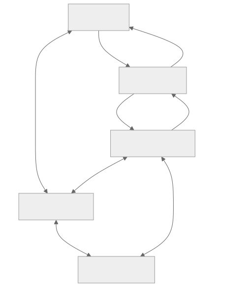

# 雲端服務概覽

RTK Cloud 串連裝置韌體、應用程式與後端服務。MQTT 提供依主題交換訊息的機制。裝置影子（Device Shadow）儲存裝置的預期狀態與回報狀態，讓應用程式和裝置即使未同時在線，也能同步狀態。

[檢視完整架構圖](assets/service-overview.zh-TW.svg) · [Mermaid 原始碼](assets/service-overview.zh-TW.mmd)

## 選擇整合介面

| 目標 | 使用介面 |
| --- | --- |
| 交換應用程式自訂訊息 | 一般 MQTT 主題 |
| 保存預期設定與裝置實際狀態 | 透過 MQTT 或 HTTP 使用裝置影子 |
| 從 HTTP 後端讀取或修改 Shadow | 使用簽章的 Shadow HTTP API |
| 整合受支援的用戶端套件 | [Chipset 與 SDK 手冊](/console/chipset-sdk) |

裝置韌體通常負責套用預期設定並回報實際狀態；App 與後端則提出變更，並觀察裝置是否達到預期狀態。這是應用程式的分工慣例，不是內建的 desired／reported 存取限制；實際權限由身分主體與產品政策決定。

## 各項功能分別啟用

| 已啟用功能 | 一般 MQTT | HTTP Shadow | MQTT Shadow |
| --- | --- | --- | --- |
| `mqtt` | 是 | 否 | 否 |
| `iot_shadow` | 否 | 是 | 否 |
| 兩者皆啟用 | 是 | 是 | 是 |

請透過產品的服務設定啟用功能。產品或裝置若未取得某項服務使用權，token 也無法替它啟用該功能。執行操作時，驗證資訊與政策同樣必須允許該操作。

公開裝置識別碼是 `devid`；Shadow HTTP API 將相同的值稱為 `thingName`。範例使用 `device-1` 與具名 Shadow `tutorial`，將教學狀態和未命名 Shadow 分開。

## 建議閱讀順序

先閱讀[雲端與裝置設定](setup-cloud-device.zh-TW.md)及[憑證設定](credential-setup.zh-TW.md)，再完成[開始之前](before-you-start.zh-TW.md)的準備，接著實作 [MQTT 訊息交換](mqtt-quickstart.zh-TW.md)與 [Shadow 狀態同步](shadow-quickstart.zh-TW.md)。串流、OTA 與遙測服務指南預計在後續版本提供。

完整的雙用戶端程式請參閱 [App 與裝置端到端範例](app-device-example.zh-TW.md)。伺服器開發團隊應閱讀[後端整合](backend-integration.zh-TW.md)；決定正式用戶端設定前，請確認[連線設定與服務限制](connection-settings.zh-TW.md)。

延伸閱讀：[選擇開發者學習路徑](documentation-map.zh-TW.md)。
