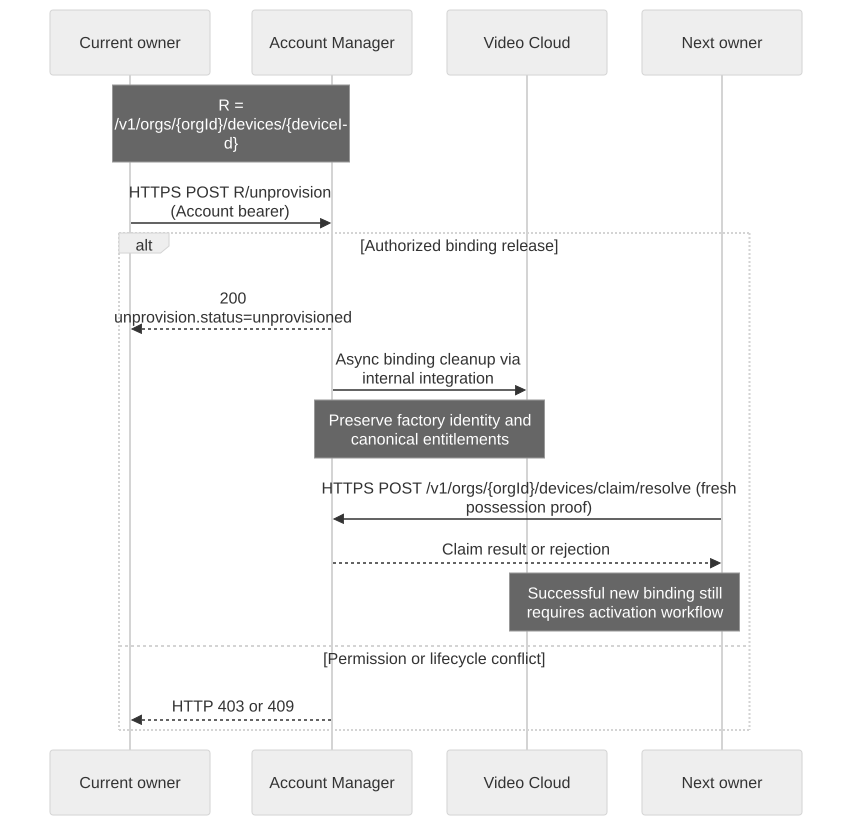

# Device Ownership and Sharing

## Goal and prerequisites

Choose the correct lifecycle for an organization-owned or consumer device. Prepare an authorized test account, registry device ID and runtime `devid` using [Cloud/device setup](setup-cloud-device.en.md). Never infer ownership from a certificate filename, MQTT topic or successful login.

## Architecture and responsibility boundaries



[Full-size block diagram](assets/identity-access.svg) · [Mermaid source](assets/identity-access.mmd)


## Three different kinds of ownership

| Concept | What it controls |
| --- | --- |
| Factory identity | Device certificate, immutable production context and canonical service entitlements |
| Account binding | Which organization/user may manage or operate the device |
| Owner transport | Which active runtime session receives device commands; see [Presence and Lifecycle](device-presence.en.md) |

A console user, consumer APP end user and device certificate are different principals. Organization claim uses `POST /v1/orgs/{orgId}/devices/claim/resolve`. Consumer APP claim uses `POST /v1/app/devices/claim/resolve` with the APP end-user bearer and creates the end-user binding. Do not substitute a console login token for the APP identity. Both use the claim request shape explained in onboarding; activation is a separate step.

## Sharing is an authorization decision

Use the approved Cloud/Product membership and access-scope workflow for developer collaboration. Giving someone a certificate, token file or Claim Token is not sharing. Cloud ownership transfer, Product ownership transfer and a device-claim transfer are distinct operations.

The reviewed public contract does not establish a general consumer device-invitation/share API. Do not invent `/devices/{id}/share`, assume organization membership creates consumer bindings, or copy an owner's credentials to another user. A product requiring household sharing must first confirm its supported binding/permission contract with the service owner.

For any supported grant, verify the recipient can access only intended devices and actions, and test removal with both an existing connection and a fresh credential request. No universal immediate revocation/disconnect latency is qualified in this edition.

## Release a normal device for resale



[Full-size diagram](assets/ownership-release.svg) · [Mermaid source](assets/ownership-release.mmd)

Use unprovision only when the current owner intends to release the device. This command changes ownership; run it only on an explicitly selected disposable test device. It uses an Account Manager token, not a Video Cloud runtime token.

```bash
curl --fail-with-body --silent --show-error --cacert "$CA_FILE"   -H "Authorization: Bearer $(jq -er '.tokens.access_token' "$TUTORIAL_DIR/account-login.json")"   -X POST "$ACCOUNT_BASE/v1/orgs/$ORG_ID/devices/$REGISTRY_DEVICE_ID/unprovision"   > "$TUTORIAL_DIR/unprovision-result.json"
jq -e '.unprovision.status == "unprovisioned"' "$TUTORIAL_DIR/unprovision-result.json"
```

HTTP 200 confirms the account-side binding release. The response includes `device_id`, `organization_id`, `video_cloud_devid`, `status` and RFC 3339 `unprovisioned_at` inside `unprovision`. Cross-service cleanup is delivered asynchronously; the response does not prove every cached session has already stopped. The previous user must lose org-scoped list/inspect/control rights under the contract. Qualify existing MQTT and HTTP access separately and report any enforcement gap.

The next owner must supply fresh possession proof, resolve a claim and provision again. Factory identity, certificate and canonical service options remain intact. This is not permission to hand the old owner's runtime tokens to the buyer.

## Pick the correct destructive operation

| Operation | Intended outcome | Do not assume |
| --- | --- | --- |
| Unprovision | Release current account binding for resale/re-onboarding | Factory identity revoked, cloud payload erased, or hardware reset |
| Deactivate | Block/remove cloud service access for security or teardown | Automatically available for another owner |
| Soft-disable | Disable an account registry/access record | Ownership released or physical device decommissioned |
| Factory reset | Device-local product behavior | Cloud ownership released |
| Admin claim transfer | Support-authorized transfer to another organization | Ordinary customer self-service permission |

`POST /v1/admin/device-claims/{claimId}/transfer` is a platform-admin override requiring explicit reason and evidence. It is not the normal customer resale API. Support flows must not expose raw claim material or private keys. Data erasure and retained Shadow/media handling need an explicit product policy; unprovision is not a blanket data-deletion guarantee.

## Failure checks and acceptance

On 401 re-authenticate in the correct identity system. On 403 inspect active membership, target ownership and unprovision permission. On 409 resolve the lifecycle conflict rather than switching to an admin endpoint. After an uncertain timeout, inspect current binding through the authorized management workflow before repeating the mutation.

Test old-user denial, next-owner claim, preserved factory identity, asynchronous cleanup failure and recovery. Do not test ownership transfer with a production device. Next: [Credential Recovery](credential-recovery.en.md), [Integration Test Kit](integration-test-kit.en.md).
