# 装置所有权与分享

## 目标和先决条件

为组织拥有的或消费者装置选择正确的生命周期。准备一个授权的测试帐户、登入档装置ID和执行时`devid`使用[云/装置设定](setup-cloud-device.zh-CN.md).切勿从证书档名、MQTT主题或成功登入中推断所有权。

## 架构和责任界限



[全尺寸方块图](assets/identity-access.zh-CN.svg) · [Mermaid 原始档](assets/identity-access.zh-CN.mmd)


## 三种不同的所有权

|概念|它控制什么|
| --- | --- |
|工厂身份|装置证书、不可变的生产上下文和规范服务权利|
|帐户系结|哪些组织/使用者可以管理或操作该装置|
|车主运输|哪个活跃的执行时会话接收装置命令；请参阅[存在和生命周期](device-presence.zh-CN.md) |

控制台使用者、消费者APP终端使用者和装置证书是不同的主体。组织索赔使用`POST /v1/orgs/{orgId}/devices/claim/resolve`. 消费者APP索赔使用`POST /v1/app/devices/claim/resolve`使用APP终端使用者承载者并建立终端使用者系结。不要用控制台登入令牌代替APP身份。两者都使用入职中解释的索赔请求形状；启动是一个单独的步骤。

## 分享是一种授权决定

使用已批准的云/产品会员资格和访问范围工作流程进行开发人员协作。给某人发放证书、令牌档案或索取令牌并非分享。云所有权转让、产品所有权转让和装置索取转让是不同的操作。

审查的公共契约没有建立一个通用消费者装置邀请/共享API。不要发明`/devices/{id}/share`，假设组织会员资格会建立消费者系结，或将所有者的凭据复制到另一个使用者。需要家庭共享的产品必须首先与服务所有者确认其支援的系结/许可契约。

对于任何受支援的赠款，请验证收件人只能访问预期的装置和操作，并用现有连线和新的凭据请求测试删除。本版本不符合通用即时撤销/断开连线延迟的条件。

## 释出一个正常装置以进行转售

[开启重新设计的序列图](assets/ownership-release.zh-CN.html)

只有当当前所有者打算释放装置时才使用未配置。此命令更改所有权；仅在明确选择的一次性测试装置上执行。它使用帐户管理器令牌，而不是影片云执行时令牌。

```bash
curl --fail-with-body --silent --show-error --cacert "$CA_FILE"   -H "Authorization: Bearer $(jq -er '.tokens.access_token' "$TUTORIAL_DIR/account-login.json")"   -X POST "$ACCOUNT_BASE/v1/orgs/$ORG_ID/devices/$REGISTRY_DEVICE_ID/unprovision"   > "$TUTORIAL_DIR/unprovision-result.json"
jq -e '.unprovision.status == "unprovisioned"' "$TUTORIAL_DIR/unprovision-result.json"
```

HTTP 200确认了帐户侧的系结释放。响应包括`device_id`, `organization_id`, `video_cloud_devid`, `status`和RFC 3339`unprovisioned_at`里面`unprovision`.跨服务清理是非同步执行的；响应并不能证明每个快取会话都已经停止。根据契约，之前的使用者必须失去组织范围的列表/检视/控制权。单独评估现有的MQTT和HTTP访问资格，并报告任何执法差距。

下一个所有者必须提供新的所有权证明，解决索赔并再次提供。工厂身份、证书和标准服务选项保持完整。这并不允许将旧所有者的执行绪令牌转让给买家。

## 选择正确的破坏操作

|操作|预期结果|不要假设|
| --- | --- | --- |
|未规划|释放当前账户的转售/重新登记系结|工厂身份被撤销、云有效载荷被抹除或硬体重置|
|停用|为了安全或拆解，封锁/移除云服务访问许可权|自动可用于另一个所有者|
|软禁用|停用帐户登入档/访问记录|所有权释放或物理装置停用|
|出厂重置|装置本地产品行为|云所有权释出|
|管理员索赔转让|支援授权转移到另一个组织|普通客户自助服务许可|

`POST /v1/admin/device-claims/{claimId}/transfer`是一个需要明确理由和证据的平台管理员覆盖。它只移动尚未启动影片云启动的索赔。启动后的跨组织移动将返回`409 cloud_lifecycle_bound`；它不会迁移执行时会话或媒体。这不是正常的客户转售API。支援流程不得暴露原始索赔材料或私钥。资料抹除和保留的影子/媒体处理需要明确的产品政策；未配置不是对资料删除的全面保证。

## 故障检查和接受

在401中，在正确的身份系统中重新验证身份。在403中，检查活动会员资格、目标所有权和未配置许可权。在409中，解决生命周期冲突，而不是切换到管理端点。在不确定的超时后，在重复变更之前，透过授权的管理工作流程检查当前的系结。

测试旧使用者拒绝、下一个所有者索赔、保留工厂身份、非同步清理失败和恢复。不要使用生产装置测试所有权转让。下一个：[凭证恢复](credential-recovery.zh-CN.md), [整合测试工具组](integration-test-kit.zh-CN.md).
